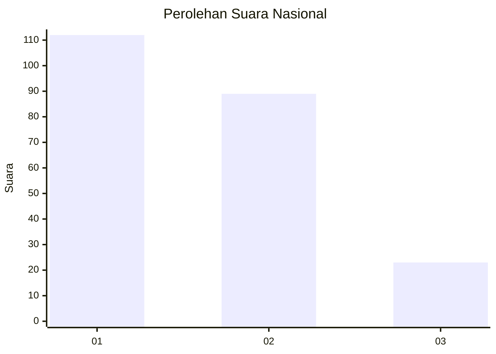
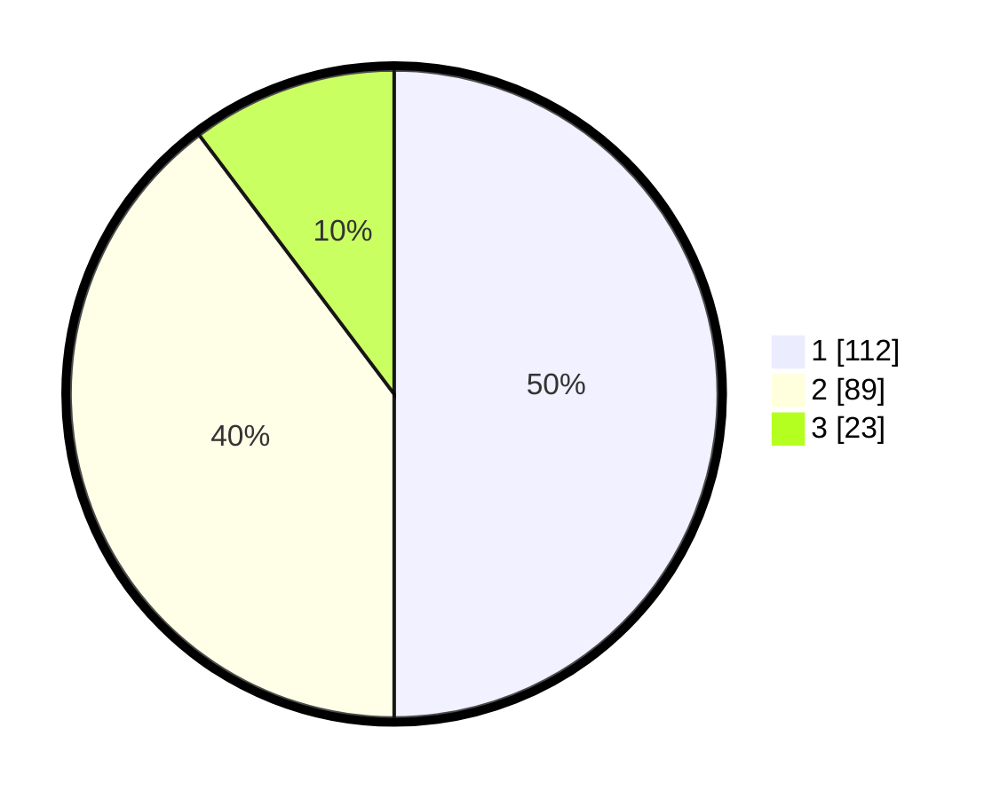

# Hasil

## Grafik

## Tabel

| No.    | Nama Paslon    | Suara | Suara (raw) | Persentase |
|:------ |:-------------- | -----:| -----------:| ----------:|
| 100025 | ANIES MUHAIMIN | 112   | [112][p-1]  | 50,00      |
| 100026 | PRABOWO GIBRAN | 89    | [89][p-2]   | 39,73      |
| 100027 | GANJAR MAHFUD  | 23    | [23][p-3]   | 10,27      |

[p-1]: https://github.com/gigit-pemilu/pemilu-2024/blob/main/pilpres/hitung-suara/sub/31-dki-jakarta/sub/75-jakarta-timur/sub/08-makasar/sub/1003-kebon-pala/sub/049-tps/sub/paslon-1.txt
[p-2]: https://github.com/gigit-pemilu/pemilu-2024/blob/main/pilpres/hitung-suara/sub/31-dki-jakarta/sub/75-jakarta-timur/sub/08-makasar/sub/1003-kebon-pala/sub/049-tps/sub/paslon-2.txt
[p-3]: https://github.com/gigit-pemilu/pemilu-2024/blob/main/pilpres/hitung-suara/sub/31-dki-jakarta/sub/75-jakarta-timur/sub/08-makasar/sub/1003-kebon-pala/sub/049-tps/sub/paslon-3.txt

## Foto C Plano

https://sirekap-obj-formc.kpu.go.id/f61a/pemilu/ppwp/31/75/08/10/03/3175081003049-20240215-070920--9994d5c7-4175-4219-b051-6488d3156cb6.jpg

https://sirekap-obj-formc.kpu.go.id/f61a/pemilu/ppwp/31/75/08/10/03/3175081003049-20240215-071229--65917fb4-9341-4ddf-83ae-3b2d032ade62.jpg

https://sirekap-obj-formc.kpu.go.id/f61a/pemilu/ppwp/31/75/08/10/03/3175081003049-20240215-071405--3407f4f2-10df-425c-ade6-066175fb09ac.jpg

## Metadata

| Key        | Value               |
| ---------- | ------------------- |
| Time Stamp | 2024-02-16 21:01:00 |

