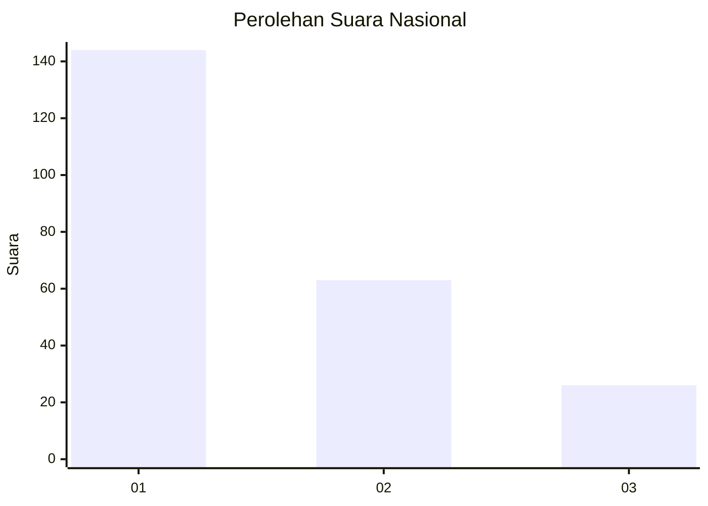
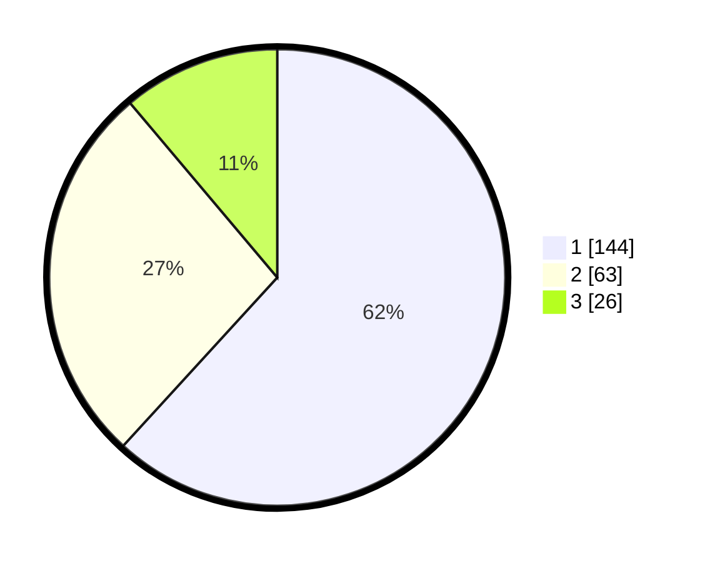

# Hasil

## Grafik

## Tabel

| No.    | Nama Paslon    | Suara | Suara (raw) | Persentase |
|:------ |:-------------- | -----:| -----------:| ----------:|
| 100025 | ANIES MUHAIMIN | 144   | [144][p-1]  | 61,80      |
| 100026 | PRABOWO GIBRAN | 63    | [63][p-2]   | 27,04      |
| 100027 | GANJAR MAHFUD  | 26    | [26][p-3]   | 11,16      |

[p-1]: https://github.com/gigit-pemilu/pemilu-2024/blob/main/pilpres/hitung-suara/sub/31-dki-jakarta/sub/75-jakarta-timur/sub/08-makasar/sub/1003-kebon-pala/sub/051-tps/sub/paslon-1.txt
[p-2]: https://github.com/gigit-pemilu/pemilu-2024/blob/main/pilpres/hitung-suara/sub/31-dki-jakarta/sub/75-jakarta-timur/sub/08-makasar/sub/1003-kebon-pala/sub/051-tps/sub/paslon-2.txt
[p-3]: https://github.com/gigit-pemilu/pemilu-2024/blob/main/pilpres/hitung-suara/sub/31-dki-jakarta/sub/75-jakarta-timur/sub/08-makasar/sub/1003-kebon-pala/sub/051-tps/sub/paslon-3.txt

## Foto C Plano

https://sirekap-obj-formc.kpu.go.id/7e90/pemilu/ppwp/31/75/08/10/03/3175081003051-20240214-225335--6256ac15-1c7f-4056-a3f1-b13a49dd77d8.jpg

https://sirekap-obj-formc.kpu.go.id/7e90/pemilu/ppwp/31/75/08/10/03/3175081003051-20240214-194926--be0507da-a81e-49a6-bef5-4cc1cdc34995.jpg

https://sirekap-obj-formc.kpu.go.id/7e90/pemilu/ppwp/31/75/08/10/03/3175081003051-20240214-225142--50a26328-9417-4a87-8c57-14321193217f.jpg

## Metadata

| Key        | Value               |
| ---------- | ------------------- |
| Time Stamp | 2024-02-15 01:47:43 |

