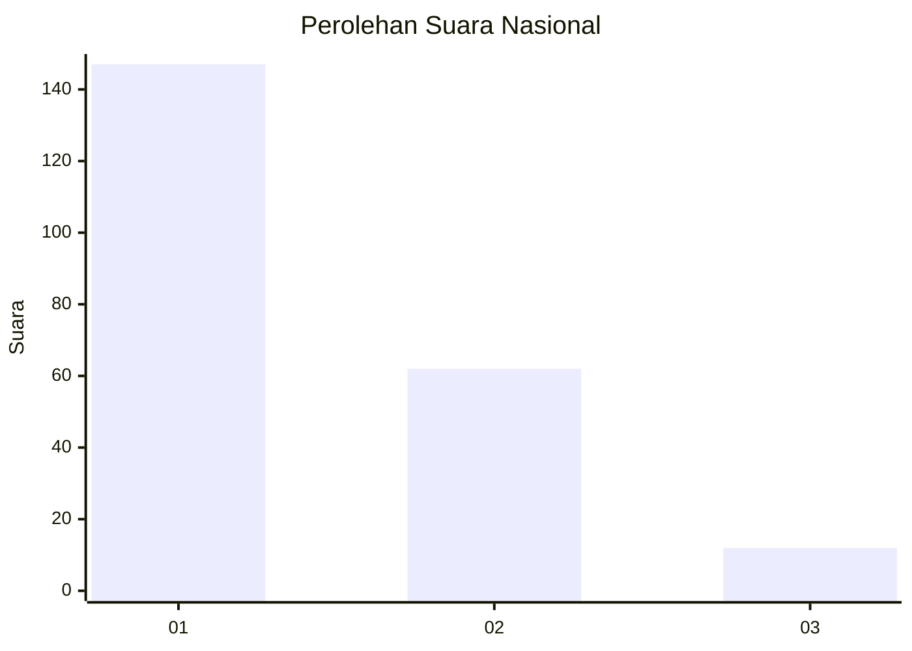
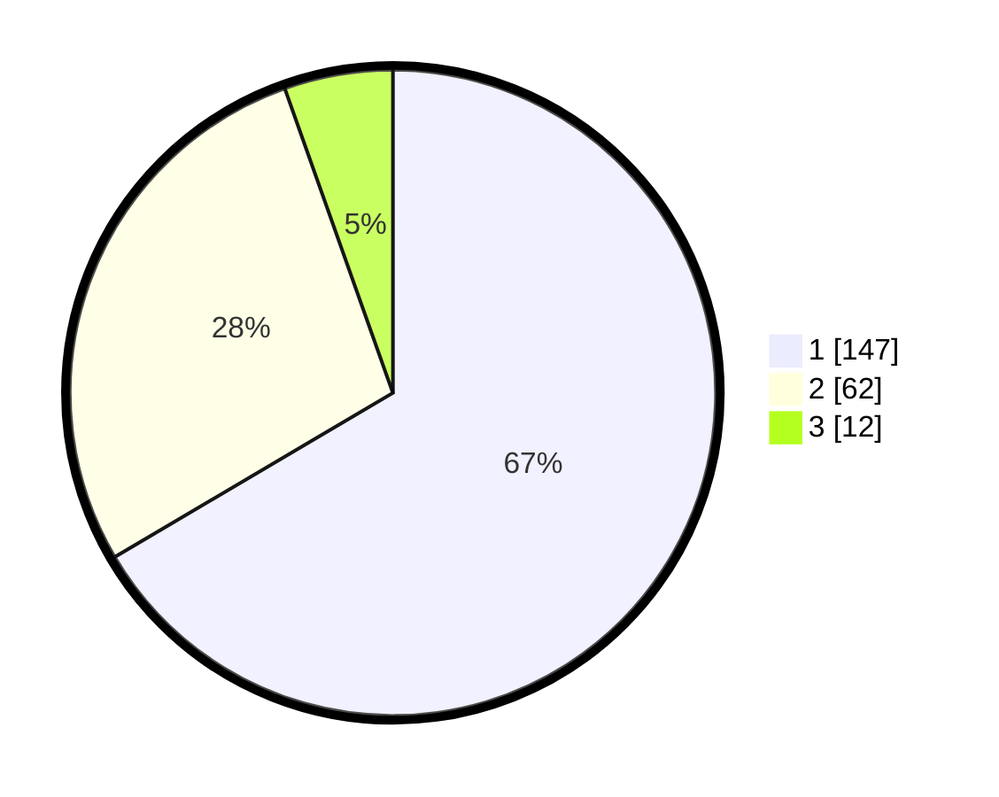

# Hasil

## Grafik

## Tabel

| No.    | Nama Paslon    | Suara | Suara (raw) | Persentase |
|:------ |:-------------- | -----:| -----------:| ----------:|
| 100025 | ANIES MUHAIMIN | 147   | [147][p-1]  | 66,52      |
| 100026 | PRABOWO GIBRAN | 62    | [62][p-2]   | 28,05      |
| 100027 | GANJAR MAHFUD  | 12    | [12][p-3]   | 5,43       |

[p-1]: https://github.com/gigit-pemilu/pemilu-2024/blob/main/pilpres/hitung-suara/sub/31-dki-jakarta/sub/75-jakarta-timur/sub/08-makasar/sub/1003-kebon-pala/sub/056-tps/sub/paslon-1.txt
[p-2]: https://github.com/gigit-pemilu/pemilu-2024/blob/main/pilpres/hitung-suara/sub/31-dki-jakarta/sub/75-jakarta-timur/sub/08-makasar/sub/1003-kebon-pala/sub/056-tps/sub/paslon-2.txt
[p-3]: https://github.com/gigit-pemilu/pemilu-2024/blob/main/pilpres/hitung-suara/sub/31-dki-jakarta/sub/75-jakarta-timur/sub/08-makasar/sub/1003-kebon-pala/sub/056-tps/sub/paslon-3.txt

## Foto C Plano

https://sirekap-obj-formc.kpu.go.id/2fea/pemilu/ppwp/31/75/08/10/03/3175081003056-20240214-232832--46d98f71-b474-42a1-8356-36a9655d359c.jpg

https://sirekap-obj-formc.kpu.go.id/2fea/pemilu/ppwp/31/75/08/10/03/3175081003056-20240214-225237--6ab4d39e-6643-47ba-ac75-48340399e319.jpg

https://sirekap-obj-formc.kpu.go.id/2fea/pemilu/ppwp/31/75/08/10/03/3175081003056-20240214-225319--371edd84-734a-48ea-aea9-e6512fb124e9.jpg

## Metadata

| Key        | Value               |
| ---------- | ------------------- |
| Time Stamp | 2024-02-15 15:00:29 |

