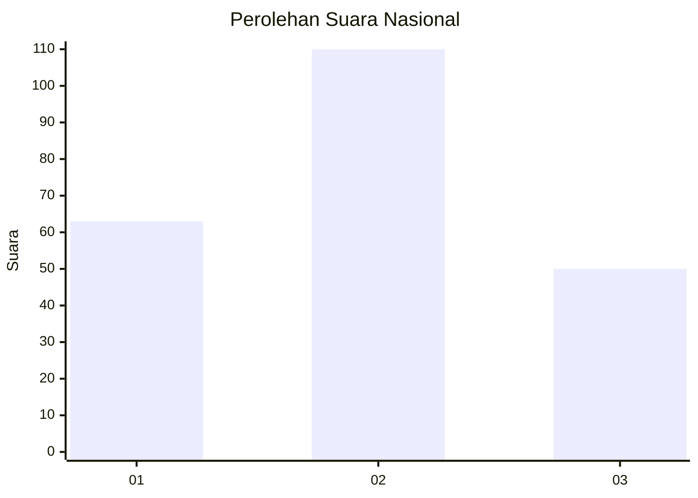
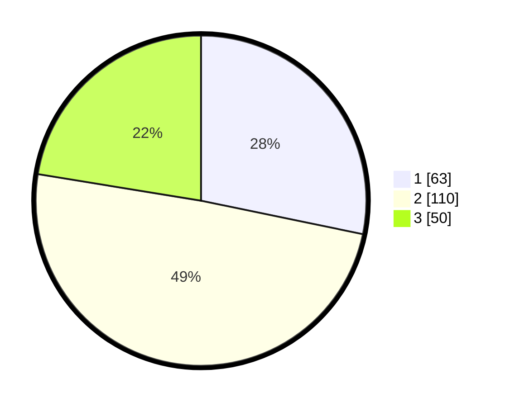

# Hasil

## Grafik

## Tabel

| No.    | Nama Paslon    | Suara | Suara (raw) | Persentase |
|:------ |:-------------- | -----:| -----------:| ----------:|
| 100025 | ANIES MUHAIMIN | 63    | [63][p-1]   | 28,25      |
| 100026 | PRABOWO GIBRAN | 110   | [110][p-2]  | 49,33      |
| 100027 | GANJAR MAHFUD  | 50    | [50][p-3]   | 22,42      |

[p-1]: https://github.com/gigit-pemilu/pemilu-2024/blob/main/pilpres/hitung-suara/sub/31-dki-jakarta/sub/75-jakarta-timur/sub/08-makasar/sub/1003-kebon-pala/sub/066-tps/sub/paslon-1.txt
[p-2]: https://github.com/gigit-pemilu/pemilu-2024/blob/main/pilpres/hitung-suara/sub/31-dki-jakarta/sub/75-jakarta-timur/sub/08-makasar/sub/1003-kebon-pala/sub/066-tps/sub/paslon-2.txt
[p-3]: https://github.com/gigit-pemilu/pemilu-2024/blob/main/pilpres/hitung-suara/sub/31-dki-jakarta/sub/75-jakarta-timur/sub/08-makasar/sub/1003-kebon-pala/sub/066-tps/sub/paslon-3.txt

## Foto C Plano

https://sirekap-obj-formc.kpu.go.id/eb91/pemilu/ppwp/31/75/08/10/03/3175081003066-20240215-011301--57c9775b-bcaf-429e-8b4f-f6a5c4bc2cec.jpg

https://sirekap-obj-formc.kpu.go.id/eb91/pemilu/ppwp/31/75/08/10/03/3175081003066-20240215-011526--44c3fd57-34c5-493e-b3ae-2506493e92cc.jpg

https://sirekap-obj-formc.kpu.go.id/eb91/pemilu/ppwp/31/75/08/10/03/3175081003066-20240215-011732--fd1faf43-3787-4c05-bcf7-c021aebf22c9.jpg

## Metadata

| Key        | Value               |
| ---------- | ------------------- |
| Time Stamp | 2024-02-16 21:01:00 |

