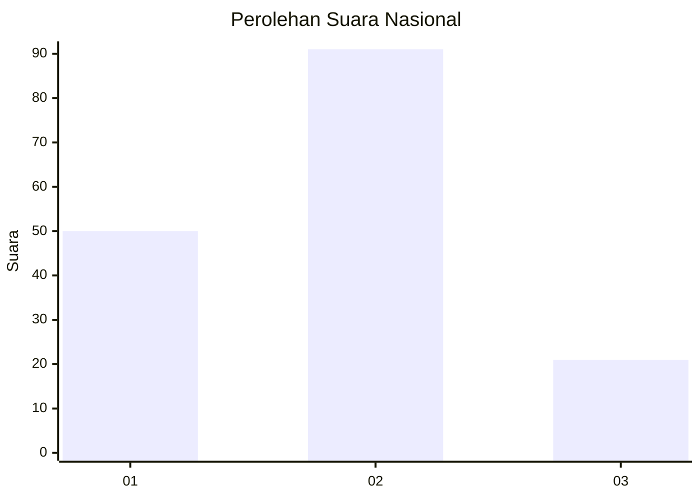
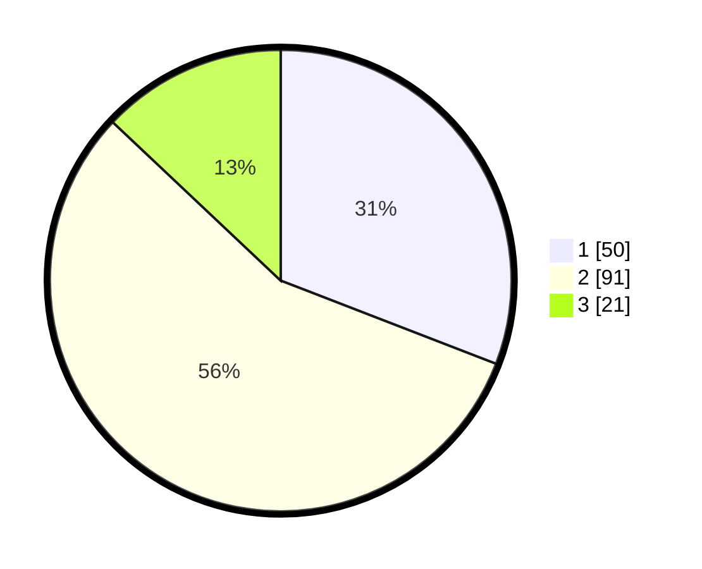

# Hasil

## Grafik

## Tabel

| No.    | Nama Paslon    | Suara | Suara (raw) | Persentase |
|:------ |:-------------- | -----:| -----------:| ----------:|
| 100025 | ANIES MUHAIMIN | 50    | [50][p-1]   | 30,86      |
| 100026 | PRABOWO GIBRAN | 91    | [91][p-2]   | 56,17      |
| 100027 | GANJAR MAHFUD  | 21    | [21][p-3]   | 12,96      |

[p-1]: https://github.com/gigit-pemilu/pemilu-2024/blob/main/pilpres/hitung-suara/sub/31-dki-jakarta/sub/75-jakarta-timur/sub/08-makasar/sub/1003-kebon-pala/sub/072-tps/sub/paslon-1.txt
[p-2]: https://github.com/gigit-pemilu/pemilu-2024/blob/main/pilpres/hitung-suara/sub/31-dki-jakarta/sub/75-jakarta-timur/sub/08-makasar/sub/1003-kebon-pala/sub/072-tps/sub/paslon-2.txt
[p-3]: https://github.com/gigit-pemilu/pemilu-2024/blob/main/pilpres/hitung-suara/sub/31-dki-jakarta/sub/75-jakarta-timur/sub/08-makasar/sub/1003-kebon-pala/sub/072-tps/sub/paslon-3.txt

## Foto C Plano

https://sirekap-obj-formc.kpu.go.id/8a21/pemilu/ppwp/31/75/08/10/03/3175081003072-20240214-232058--febe5711-81a4-4999-9e4b-241d01d75249.jpg

https://sirekap-obj-formc.kpu.go.id/8a21/pemilu/ppwp/31/75/08/10/03/3175081003072-20240214-232345--9d01b291-886b-405e-9764-0d0147ea7620.jpg

https://sirekap-obj-formc.kpu.go.id/8a21/pemilu/ppwp/31/75/08/10/03/3175081003072-20240214-232436--97ee478c-3b39-4380-a22c-0f19f9b0cb60.jpg

## Metadata

| Key        | Value               |
| ---------- | ------------------- |
| Time Stamp | 2024-02-15 15:00:29 |

