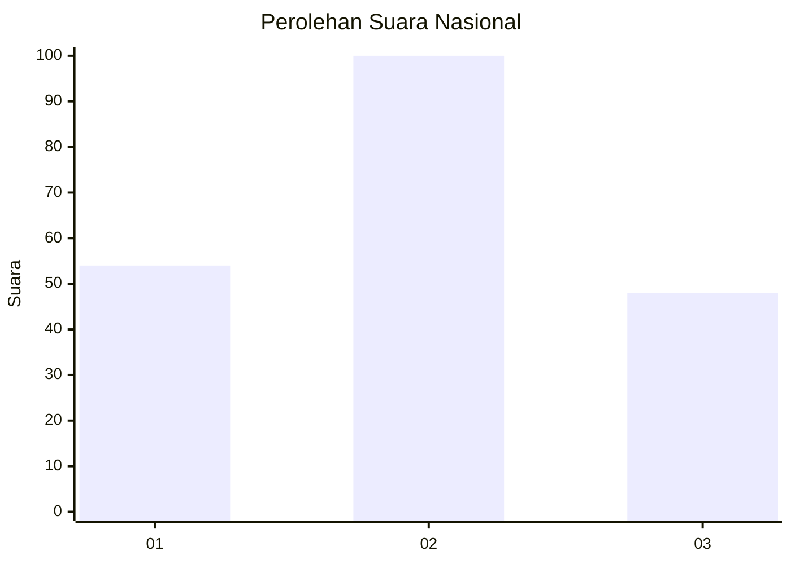
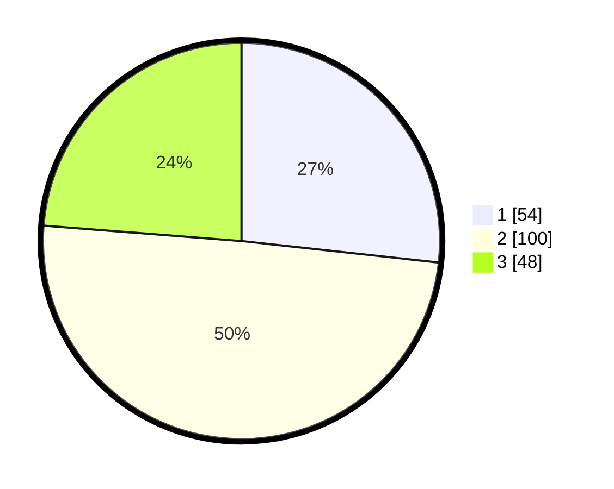

# Hasil

## Grafik

## Tabel

| No.    | Nama Paslon    | Suara | Suara (raw) | Persentase |
|:------ |:-------------- | -----:| -----------:| ----------:|
| 100025 | ANIES MUHAIMIN | 54    | [54][p-1]   | 26,73      |
| 100026 | PRABOWO GIBRAN | 100   | [100][p-2]  | 49,50      |
| 100027 | GANJAR MAHFUD  | 48    | [48][p-3]   | 23,76      |

[p-1]: https://github.com/gigit-pemilu/pemilu-2024/blob/main/pilpres/hitung-suara/sub/31-dki-jakarta/sub/75-jakarta-timur/sub/08-makasar/sub/1003-kebon-pala/sub/079-tps/sub/paslon-1.txt
[p-2]: https://github.com/gigit-pemilu/pemilu-2024/blob/main/pilpres/hitung-suara/sub/31-dki-jakarta/sub/75-jakarta-timur/sub/08-makasar/sub/1003-kebon-pala/sub/079-tps/sub/paslon-2.txt
[p-3]: https://github.com/gigit-pemilu/pemilu-2024/blob/main/pilpres/hitung-suara/sub/31-dki-jakarta/sub/75-jakarta-timur/sub/08-makasar/sub/1003-kebon-pala/sub/079-tps/sub/paslon-3.txt

## Foto C Plano

https://sirekap-obj-formc.kpu.go.id/0a29/pemilu/ppwp/31/75/08/10/03/3175081003079-20240214-231223--5acd929f-1ac9-4955-aa40-9a79a9d0ea25.jpg

https://sirekap-obj-formc.kpu.go.id/0a29/pemilu/ppwp/31/75/08/10/03/3175081003079-20240214-231506--1878aaf6-57cd-4cbc-87d7-22102e26fb22.jpg

https://sirekap-obj-formc.kpu.go.id/0a29/pemilu/ppwp/31/75/08/10/03/3175081003079-20240214-231156--27b58456-396b-48a4-88bc-a69245b5b926.jpg

## Metadata

| Key        | Value               |
| ---------- | ------------------- |
| Time Stamp | 2024-02-15 15:00:29 |

