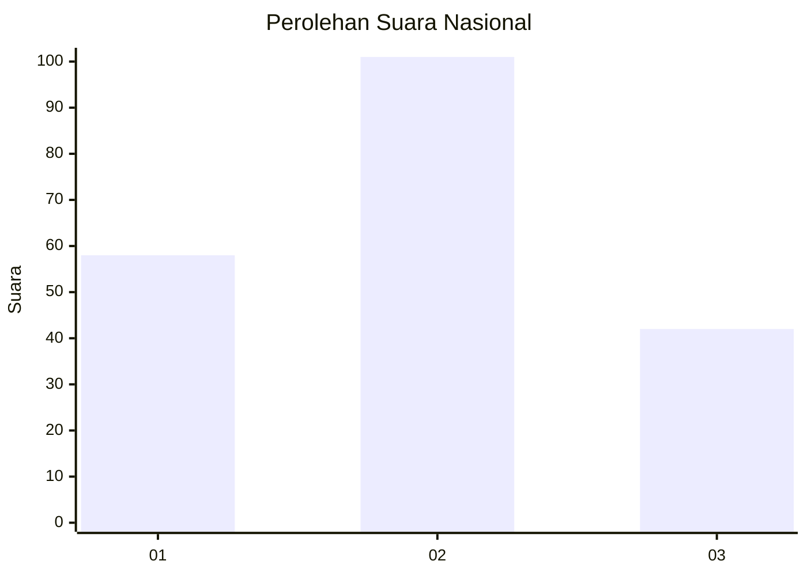
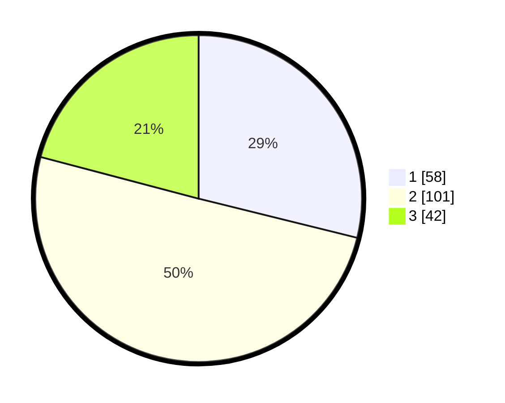

# Hasil

## Grafik

## Tabel

| No.    | Nama Paslon    | Suara | Suara (raw) | Persentase |
|:------ |:-------------- | -----:| -----------:| ----------:|
| 100025 | ANIES MUHAIMIN | 58    | [58][p-1]   | 28,86      |
| 100026 | PRABOWO GIBRAN | 101   | [101][p-2]  | 50,25      |
| 100027 | GANJAR MAHFUD  | 42    | [42][p-3]   | 20,90      |

[p-1]: https://github.com/gigit-pemilu/pemilu-2024/blob/main/pilpres/hitung-suara/sub/31-dki-jakarta/sub/75-jakarta-timur/sub/08-makasar/sub/1003-kebon-pala/sub/086-tps/sub/paslon-1.txt
[p-2]: https://github.com/gigit-pemilu/pemilu-2024/blob/main/pilpres/hitung-suara/sub/31-dki-jakarta/sub/75-jakarta-timur/sub/08-makasar/sub/1003-kebon-pala/sub/086-tps/sub/paslon-2.txt
[p-3]: https://github.com/gigit-pemilu/pemilu-2024/blob/main/pilpres/hitung-suara/sub/31-dki-jakarta/sub/75-jakarta-timur/sub/08-makasar/sub/1003-kebon-pala/sub/086-tps/sub/paslon-3.txt

## Foto C Plano

https://sirekap-obj-formc.kpu.go.id/2bdf/pemilu/ppwp/31/75/08/10/03/3175081003086-20240214-231558--cd09d606-2cbf-4267-9e32-5b482a3e9386.jpg

https://sirekap-obj-formc.kpu.go.id/2bdf/pemilu/ppwp/31/75/08/10/03/3175081003086-20240214-232111--947404f3-e7e7-4b61-a813-c5e1e648a88b.jpg

https://sirekap-obj-formc.kpu.go.id/2bdf/pemilu/ppwp/31/75/08/10/03/3175081003086-20240214-232240--079194d4-d87c-46a4-ab74-ff0dfb46b5d6.jpg

## Metadata

| Key        | Value               |
| ---------- | ------------------- |
| Time Stamp | 2024-02-16 21:01:00 |

