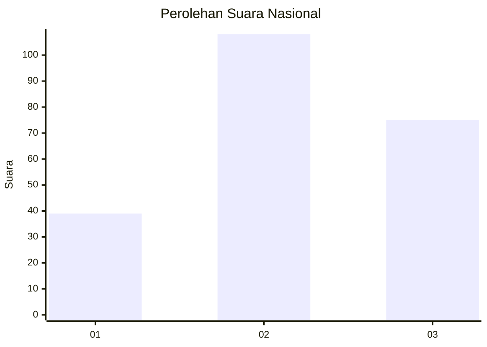
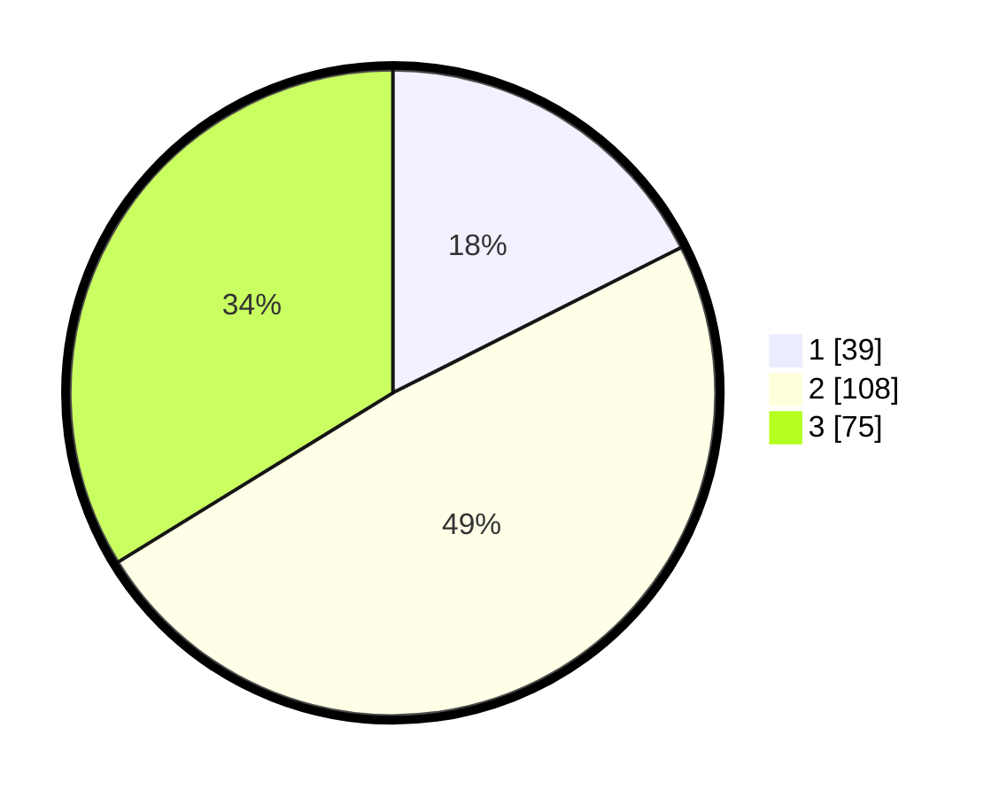

# Hasil

## Grafik

## Tabel

| No.    | Nama Paslon    | Suara | Suara (raw) | Persentase |
|:------ |:-------------- | -----:| -----------:| ----------:|
| 100025 | ANIES MUHAIMIN | 39    | [39][p-1]   | 17,57      |
| 100026 | PRABOWO GIBRAN | 108   | [108][p-2]  | 48,65      |
| 100027 | GANJAR MAHFUD  | 75    | [75][p-3]   | 33,78      |

[p-1]: https://github.com/gigit-pemilu/pemilu-2024/blob/main/pilpres/hitung-suara/sub/31-dki-jakarta/sub/75-jakarta-timur/sub/08-makasar/sub/1003-kebon-pala/sub/088-tps/sub/paslon-1.txt
[p-2]: https://github.com/gigit-pemilu/pemilu-2024/blob/main/pilpres/hitung-suara/sub/31-dki-jakarta/sub/75-jakarta-timur/sub/08-makasar/sub/1003-kebon-pala/sub/088-tps/sub/paslon-2.txt
[p-3]: https://github.com/gigit-pemilu/pemilu-2024/blob/main/pilpres/hitung-suara/sub/31-dki-jakarta/sub/75-jakarta-timur/sub/08-makasar/sub/1003-kebon-pala/sub/088-tps/sub/paslon-3.txt

## Foto C Plano

https://sirekap-obj-formc.kpu.go.id/e75e/pemilu/ppwp/31/75/08/10/03/3175081003088-20240215-044341--2f127549-661c-4df9-9d44-56a4a79b6a1f.jpg

https://sirekap-obj-formc.kpu.go.id/e75e/pemilu/ppwp/31/75/08/10/03/3175081003088-20240215-044528--f1947db9-472f-453c-9e81-c70d718d263c.jpg

https://sirekap-obj-formc.kpu.go.id/e75e/pemilu/ppwp/31/75/08/10/03/3175081003088-20240215-044441--79c0f633-eee7-4ed5-99c2-01072963c079.jpg

## Metadata

| Key        | Value               |
| ---------- | ------------------- |
| Time Stamp | 2024-02-15 16:00:26 |

