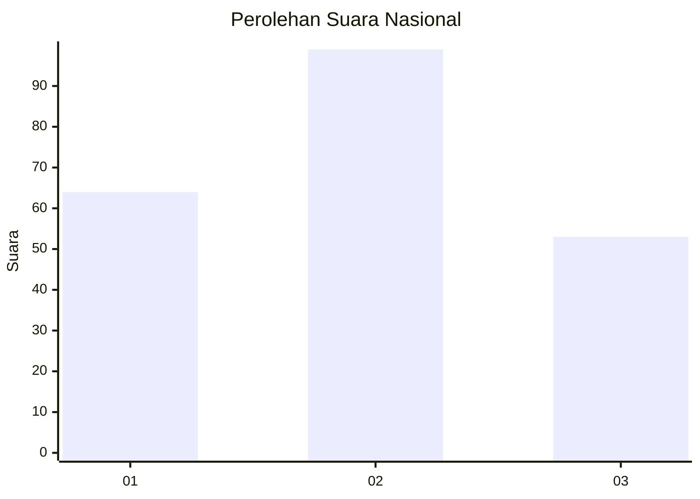
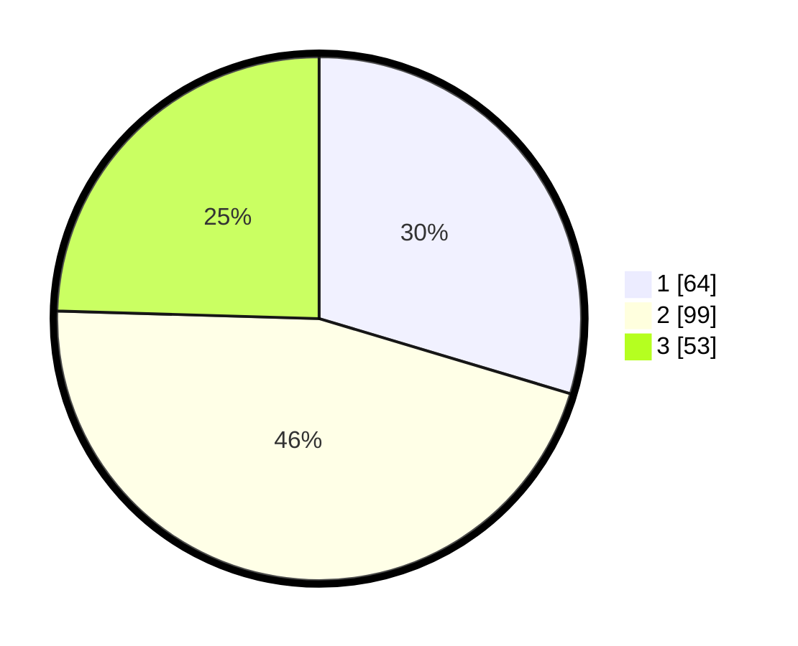

# Hasil

## Grafik

## Tabel

| No.    | Nama Paslon    | Suara | Suara (raw) | Persentase |
|:------ |:-------------- | -----:| -----------:| ----------:|
| 100025 | ANIES MUHAIMIN | 64    | [64][p-1]   | 29,63      |
| 100026 | PRABOWO GIBRAN | 99    | [99][p-2]   | 45,83      |
| 100027 | GANJAR MAHFUD  | 53    | [53][p-3]   | 24,54      |

[p-1]: https://github.com/gigit-pemilu/pemilu-2024/blob/main/pilpres/hitung-suara/sub/31-dki-jakarta/sub/75-jakarta-timur/sub/08-makasar/sub/1003-kebon-pala/sub/099-tps/sub/paslon-1.txt
[p-2]: https://github.com/gigit-pemilu/pemilu-2024/blob/main/pilpres/hitung-suara/sub/31-dki-jakarta/sub/75-jakarta-timur/sub/08-makasar/sub/1003-kebon-pala/sub/099-tps/sub/paslon-2.txt
[p-3]: https://github.com/gigit-pemilu/pemilu-2024/blob/main/pilpres/hitung-suara/sub/31-dki-jakarta/sub/75-jakarta-timur/sub/08-makasar/sub/1003-kebon-pala/sub/099-tps/sub/paslon-3.txt

## Foto C Plano

https://sirekap-obj-formc.kpu.go.id/c61c/pemilu/ppwp/31/75/08/10/03/3175081003099-20240214-221719--4ada306b-b4de-45bb-a503-c65af1b70e0e.jpg

https://sirekap-obj-formc.kpu.go.id/c61c/pemilu/ppwp/31/75/08/10/03/3175081003099-20240214-215219--8d4f84b1-9d01-488c-8fa3-ec83429fcde4.jpg

https://sirekap-obj-formc.kpu.go.id/c61c/pemilu/ppwp/31/75/08/10/03/3175081003099-20240214-215424--c23e83b4-eb8f-406e-a1d5-aec8b8d42fa4.jpg

## Metadata

| Key        | Value               |
| ---------- | ------------------- |
| Time Stamp | 2024-02-16 21:01:00 |

