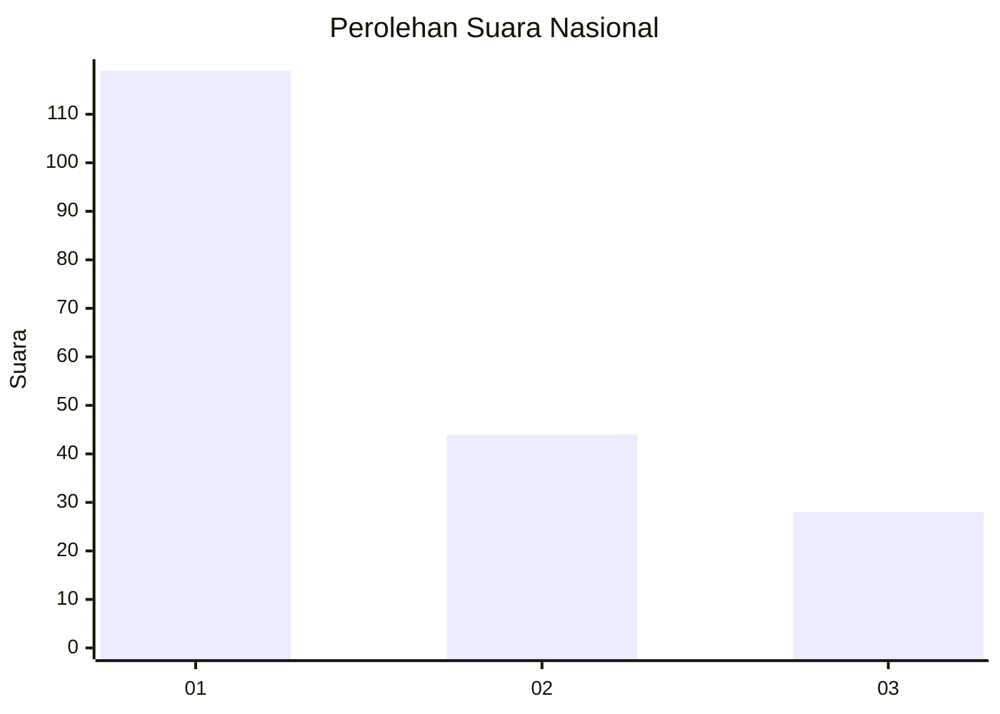
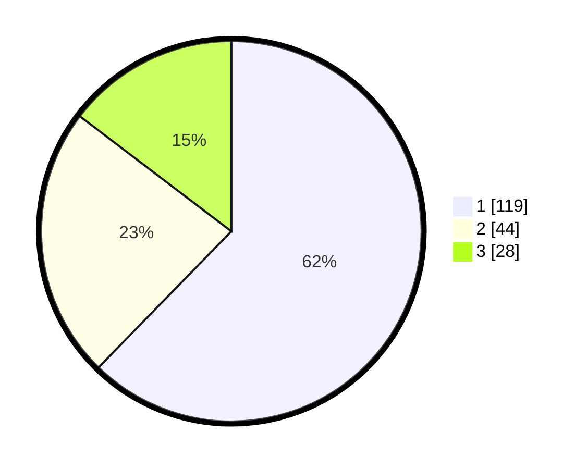

# Hasil

## Grafik

## Tabel

| No.    | Nama Paslon    | Suara | Suara (raw) | Persentase |
|:------ |:-------------- | -----:| -----------:| ----------:|
| 100025 | ANIES MUHAIMIN | 119   | [119][p-1]  | 62,30      |
| 100026 | PRABOWO GIBRAN | 44    | [44][p-2]   | 23,04      |
| 100027 | GANJAR MAHFUD  | 28    | [28][p-3]   | 14,66      |

[p-1]: https://github.com/gigit-pemilu/pemilu-2024/blob/main/pilpres/hitung-suara/sub/31-dki-jakarta/sub/75-jakarta-timur/sub/08-makasar/sub/1003-kebon-pala/sub/105-tps/sub/paslon-1.txt
[p-2]: https://github.com/gigit-pemilu/pemilu-2024/blob/main/pilpres/hitung-suara/sub/31-dki-jakarta/sub/75-jakarta-timur/sub/08-makasar/sub/1003-kebon-pala/sub/105-tps/sub/paslon-2.txt
[p-3]: https://github.com/gigit-pemilu/pemilu-2024/blob/main/pilpres/hitung-suara/sub/31-dki-jakarta/sub/75-jakarta-timur/sub/08-makasar/sub/1003-kebon-pala/sub/105-tps/sub/paslon-3.txt

## Foto C Plano

https://sirekap-obj-formc.kpu.go.id/6ce7/pemilu/ppwp/31/75/08/10/03/3175081003105-20240214-231021--ca38de58-919f-4724-90be-27feaf232358.jpg

https://sirekap-obj-formc.kpu.go.id/6ce7/pemilu/ppwp/31/75/08/10/03/3175081003105-20240214-231137--fa0e2635-0e8f-4619-b5b5-633760ce09c7.jpg

https://sirekap-obj-formc.kpu.go.id/6ce7/pemilu/ppwp/31/75/08/10/03/3175081003105-20240214-231250--9e18e10a-bd05-487f-9be1-fafb40783c5a.jpg

## Metadata

| Key        | Value               |
| ---------- | ------------------- |
| Time Stamp | 2024-02-16 21:01:00 |

