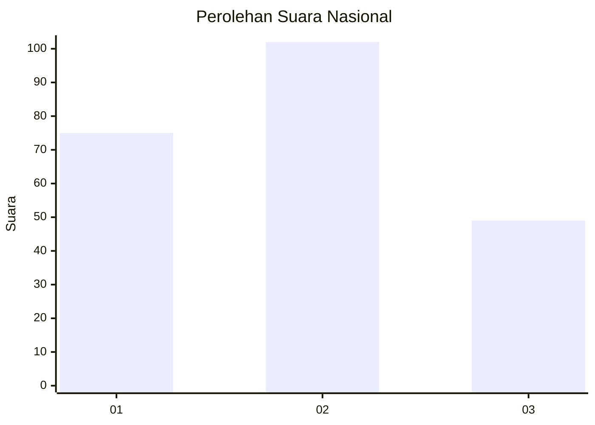
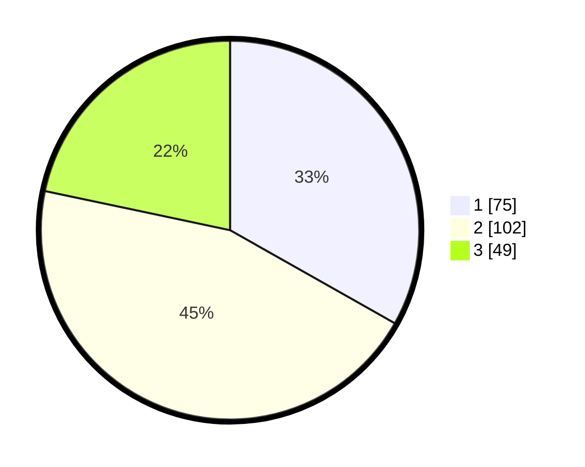

# Hasil

## Grafik

## Tabel

| No.    | Nama Paslon    | Suara | Suara (raw) | Persentase |
|:------ |:-------------- | -----:| -----------:| ----------:|
| 100025 | ANIES MUHAIMIN | 75    | [75][p-1]   | 33,19      |
| 100026 | PRABOWO GIBRAN | 102   | [102][p-2]  | 45,13      |
| 100027 | GANJAR MAHFUD  | 49    | [49][p-3]   | 21,68      |

[p-1]: https://github.com/gigit-pemilu/pemilu-2024/blob/main/pilpres/hitung-suara/sub/31-dki-jakarta/sub/75-jakarta-timur/sub/08-makasar/sub/1003-kebon-pala/sub/106-tps/sub/paslon-1.txt
[p-2]: https://github.com/gigit-pemilu/pemilu-2024/blob/main/pilpres/hitung-suara/sub/31-dki-jakarta/sub/75-jakarta-timur/sub/08-makasar/sub/1003-kebon-pala/sub/106-tps/sub/paslon-2.txt
[p-3]: https://github.com/gigit-pemilu/pemilu-2024/blob/main/pilpres/hitung-suara/sub/31-dki-jakarta/sub/75-jakarta-timur/sub/08-makasar/sub/1003-kebon-pala/sub/106-tps/sub/paslon-3.txt

## Foto C Plano

https://sirekap-obj-formc.kpu.go.id/c6fb/pemilu/ppwp/31/75/08/10/03/3175081003106-20240214-230749--8f0767b3-6e34-4e93-83a0-afb385ee2689.jpg

https://sirekap-obj-formc.kpu.go.id/c6fb/pemilu/ppwp/31/75/08/10/03/3175081003106-20240214-230846--f2177dd3-5dc2-4ccb-935f-3267a5f83730.jpg

https://sirekap-obj-formc.kpu.go.id/c6fb/pemilu/ppwp/31/75/08/10/03/3175081003106-20240214-231028--7da946e5-dd4f-459a-9bc6-877598cc64fa.jpg

## Metadata

| Key        | Value               |
| ---------- | ------------------- |
| Time Stamp | 2024-02-16 21:01:00 |

