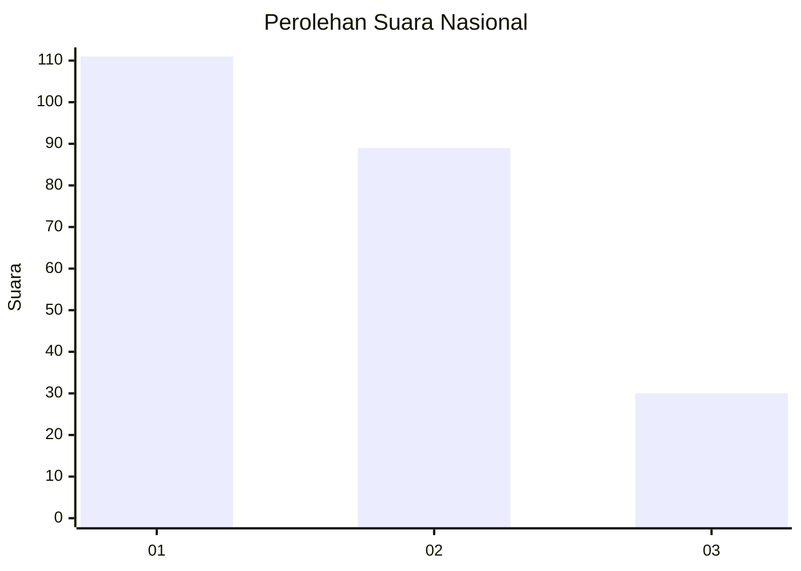
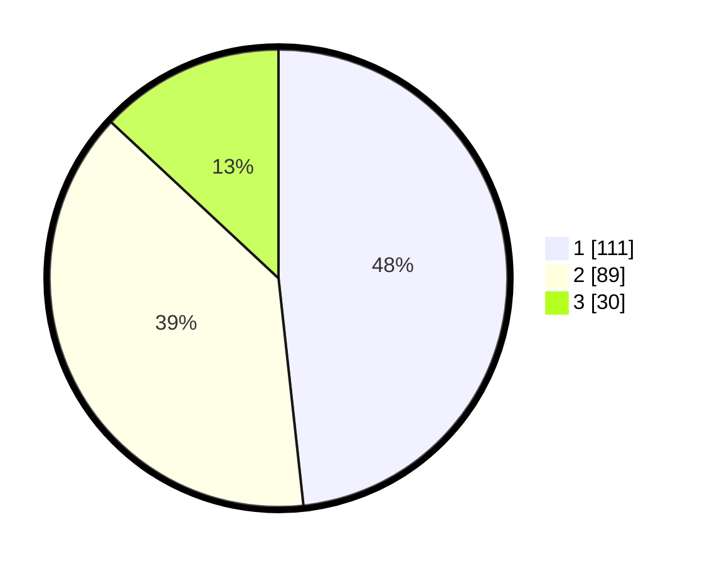

# Hasil

## Grafik

## Tabel

| No.    | Nama Paslon    | Suara | Suara (raw) | Persentase |
|:------ |:-------------- | -----:| -----------:| ----------:|
| 100025 | ANIES MUHAIMIN | 111   | [111][p-1]  | 48,26      |
| 100026 | PRABOWO GIBRAN | 89    | [89][p-2]   | 38,70      |
| 100027 | GANJAR MAHFUD  | 30    | [30][p-3]   | 13,04      |

[p-1]: https://github.com/gigit-pemilu/pemilu-2024/blob/main/pilpres/hitung-suara/sub/31-dki-jakarta/sub/75-jakarta-timur/sub/08-makasar/sub/1003-kebon-pala/sub/110-tps/sub/paslon-1.txt
[p-2]: https://github.com/gigit-pemilu/pemilu-2024/blob/main/pilpres/hitung-suara/sub/31-dki-jakarta/sub/75-jakarta-timur/sub/08-makasar/sub/1003-kebon-pala/sub/110-tps/sub/paslon-2.txt
[p-3]: https://github.com/gigit-pemilu/pemilu-2024/blob/main/pilpres/hitung-suara/sub/31-dki-jakarta/sub/75-jakarta-timur/sub/08-makasar/sub/1003-kebon-pala/sub/110-tps/sub/paslon-3.txt

## Foto C Plano

https://sirekap-obj-formc.kpu.go.id/9e68/pemilu/ppwp/31/75/08/10/03/3175081003110-20240214-221726--f4c13b33-bffe-4d70-a4d9-2ab1d92a63f7.jpg

https://sirekap-obj-formc.kpu.go.id/9e68/pemilu/ppwp/31/75/08/10/03/3175081003110-20240214-221733--7eae11d7-4432-4b12-9695-a04284d2350f.jpg

https://sirekap-obj-formc.kpu.go.id/9e68/pemilu/ppwp/31/75/08/10/03/3175081003110-20240214-221736--9879e07b-63ef-4399-a2c4-f829d665fedb.jpg

## Metadata

| Key        | Value               |
| ---------- | ------------------- |
| Time Stamp | 2024-02-16 21:01:00 |

