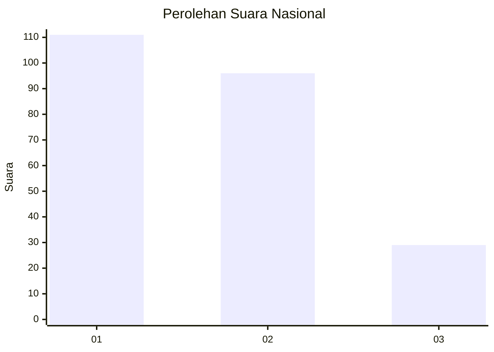
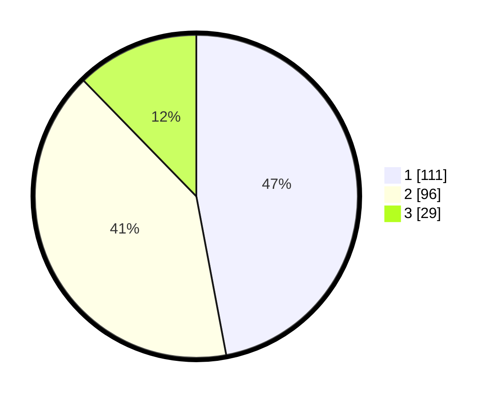

# Hasil

## Grafik

## Tabel

| No.    | Nama Paslon    | Suara | Suara (raw) | Persentase |
|:------ |:-------------- | -----:| -----------:| ----------:|
| 100025 | ANIES MUHAIMIN | 111   | [111][p-1]  | 47,03      |
| 100026 | PRABOWO GIBRAN | 96    | [96][p-2]   | 40,68      |
| 100027 | GANJAR MAHFUD  | 29    | [29][p-3]   | 12,29      |

[p-1]: https://github.com/gigit-pemilu/pemilu-2024/blob/main/pilpres/hitung-suara/sub/31-dki-jakarta/sub/75-jakarta-timur/sub/08-makasar/sub/1003-kebon-pala/sub/114-tps/sub/paslon-1.txt
[p-2]: https://github.com/gigit-pemilu/pemilu-2024/blob/main/pilpres/hitung-suara/sub/31-dki-jakarta/sub/75-jakarta-timur/sub/08-makasar/sub/1003-kebon-pala/sub/114-tps/sub/paslon-2.txt
[p-3]: https://github.com/gigit-pemilu/pemilu-2024/blob/main/pilpres/hitung-suara/sub/31-dki-jakarta/sub/75-jakarta-timur/sub/08-makasar/sub/1003-kebon-pala/sub/114-tps/sub/paslon-3.txt

## Foto C Plano

https://sirekap-obj-formc.kpu.go.id/6980/pemilu/ppwp/31/75/08/10/03/3175081003114-20240214-231206--08ebd447-dcf0-4016-b2bf-e4878de186cd.jpg

https://sirekap-obj-formc.kpu.go.id/6980/pemilu/ppwp/31/75/08/10/03/3175081003114-20240214-231457--f8757362-01c3-46ec-8f8d-c14327f1336b.jpg

https://sirekap-obj-formc.kpu.go.id/6980/pemilu/ppwp/31/75/08/10/03/3175081003114-20240214-231706--c3c5ec43-4890-49f8-8484-6f273628ffcd.jpg

## Metadata

| Key        | Value               |
| ---------- | ------------------- |
| Time Stamp | 2024-02-16 21:01:00 |

