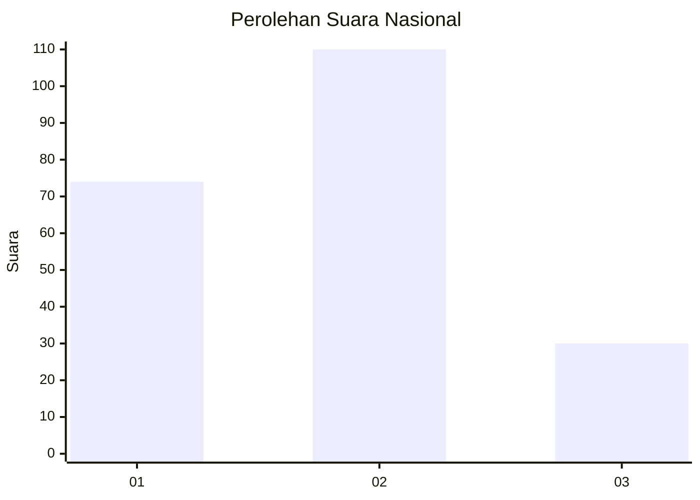
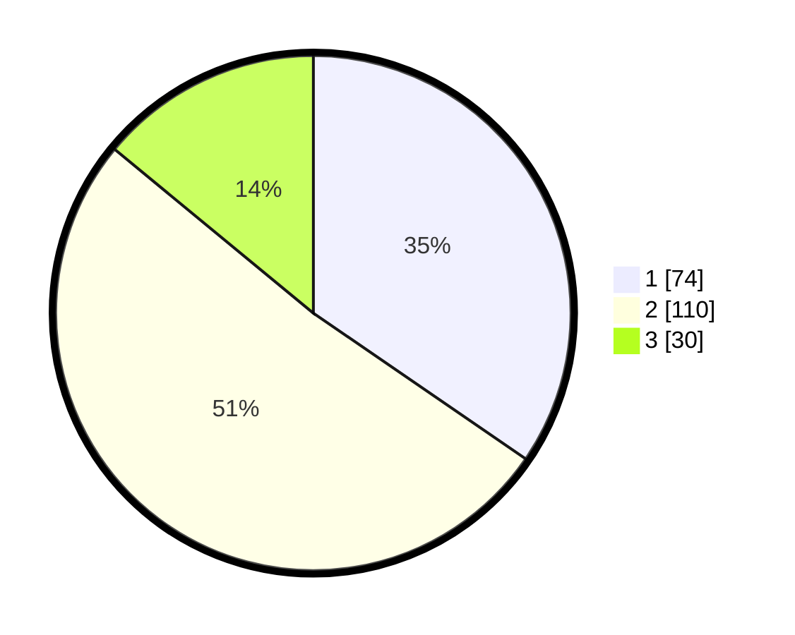

# Hasil

## Grafik

## Tabel

| No.    | Nama Paslon    | Suara | Suara (raw) | Persentase |
|:------ |:-------------- | -----:| -----------:| ----------:|
| 100025 | ANIES MUHAIMIN | 74    | [74][p-1]   | 34,58      |
| 100026 | PRABOWO GIBRAN | 110   | [110][p-2]  | 51,40      |
| 100027 | GANJAR MAHFUD  | 30    | [30][p-3]   | 14,02      |

[p-1]: https://github.com/gigit-pemilu/pemilu-2024/blob/main/pilpres/hitung-suara/sub/31-dki-jakarta/sub/75-jakarta-timur/sub/08-makasar/sub/1003-kebon-pala/sub/145-tps/sub/paslon-1.txt
[p-2]: https://github.com/gigit-pemilu/pemilu-2024/blob/main/pilpres/hitung-suara/sub/31-dki-jakarta/sub/75-jakarta-timur/sub/08-makasar/sub/1003-kebon-pala/sub/145-tps/sub/paslon-2.txt
[p-3]: https://github.com/gigit-pemilu/pemilu-2024/blob/main/pilpres/hitung-suara/sub/31-dki-jakarta/sub/75-jakarta-timur/sub/08-makasar/sub/1003-kebon-pala/sub/145-tps/sub/paslon-3.txt

## Foto C Plano

https://sirekap-obj-formc.kpu.go.id/777b/pemilu/ppwp/31/75/08/10/03/3175081003145-20240215-024801--837617f0-eb11-40e9-a4c7-023e3eef67ee.jpg

https://sirekap-obj-formc.kpu.go.id/777b/pemilu/ppwp/31/75/08/10/03/3175081003145-20240215-024838--3492baf8-e832-4684-aacf-eaa5c33ed797.jpg

https://sirekap-obj-formc.kpu.go.id/777b/pemilu/ppwp/31/75/08/10/03/3175081003145-20240215-024927--fc67655b-87fa-4eb8-9e35-7a2b9b817791.jpg

## Metadata

| Key        | Value               |
| ---------- | ------------------- |
| Time Stamp | 2024-02-15 15:00:29 |

