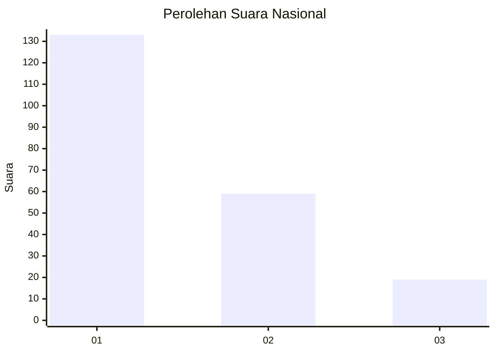
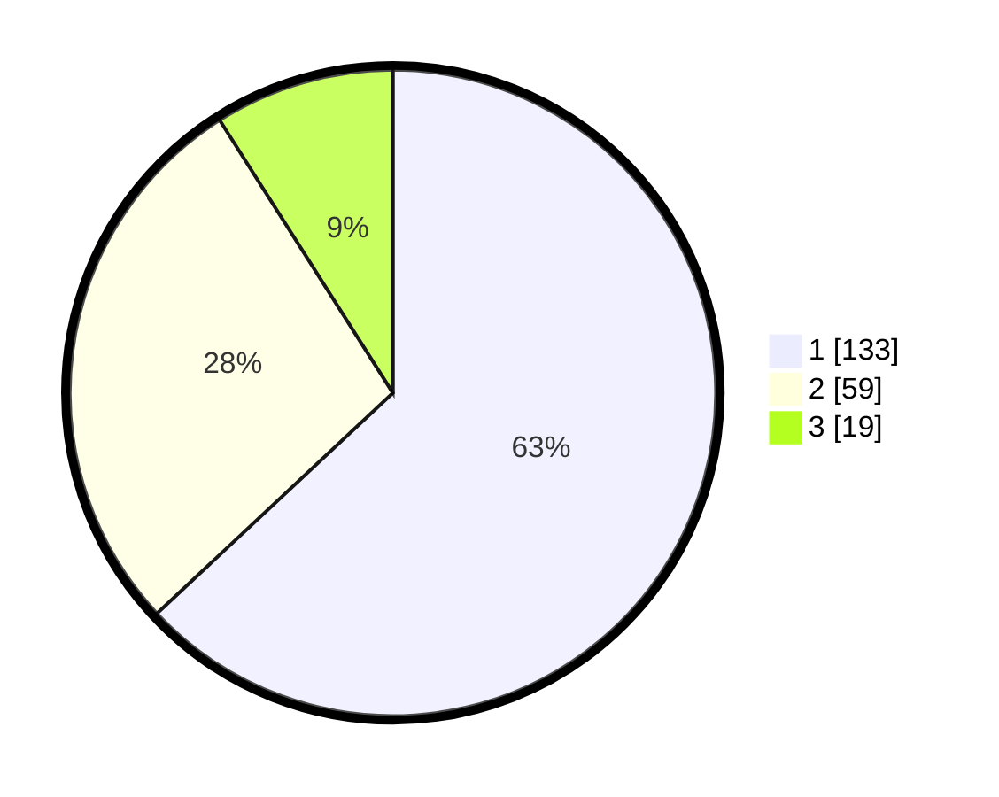

# Hasil

## Grafik

## Tabel

| No.    | Nama Paslon    | Suara | Suara (raw) | Persentase |
|:------ |:-------------- | -----:| -----------:| ----------:|
| 100025 | ANIES MUHAIMIN | 133   | [133][p-1]  | 63,03      |
| 100026 | PRABOWO GIBRAN | 59    | [59][p-2]   | 27,96      |
| 100027 | GANJAR MAHFUD  | 19    | [19][p-3]   | 9,00       |

[p-1]: https://github.com/gigit-pemilu/pemilu-2024/blob/main/pilpres/hitung-suara/sub/31-dki-jakarta/sub/75-jakarta-timur/sub/08-makasar/sub/1003-kebon-pala/sub/150-tps/sub/paslon-1.txt
[p-2]: https://github.com/gigit-pemilu/pemilu-2024/blob/main/pilpres/hitung-suara/sub/31-dki-jakarta/sub/75-jakarta-timur/sub/08-makasar/sub/1003-kebon-pala/sub/150-tps/sub/paslon-2.txt
[p-3]: https://github.com/gigit-pemilu/pemilu-2024/blob/main/pilpres/hitung-suara/sub/31-dki-jakarta/sub/75-jakarta-timur/sub/08-makasar/sub/1003-kebon-pala/sub/150-tps/sub/paslon-3.txt

## Foto C Plano

https://sirekap-obj-formc.kpu.go.id/7478/pemilu/ppwp/31/75/08/10/03/3175081003150-20240214-155652--8f9d3a67-1006-47cf-8334-a32877dda269.jpg

https://sirekap-obj-formc.kpu.go.id/7478/pemilu/ppwp/31/75/08/10/03/3175081003150-20240214-155523--04d98624-ad9e-4316-9272-b4b2b973323d.jpg

https://sirekap-obj-formc.kpu.go.id/7478/pemilu/ppwp/31/75/08/10/03/3175081003150-20240214-160155--7f24886e-48f6-4eb6-baba-24a31ee29529.jpg

## Metadata

| Key        | Value               |
| ---------- | ------------------- |
| Time Stamp | 2024-02-14 21:46:01 |

