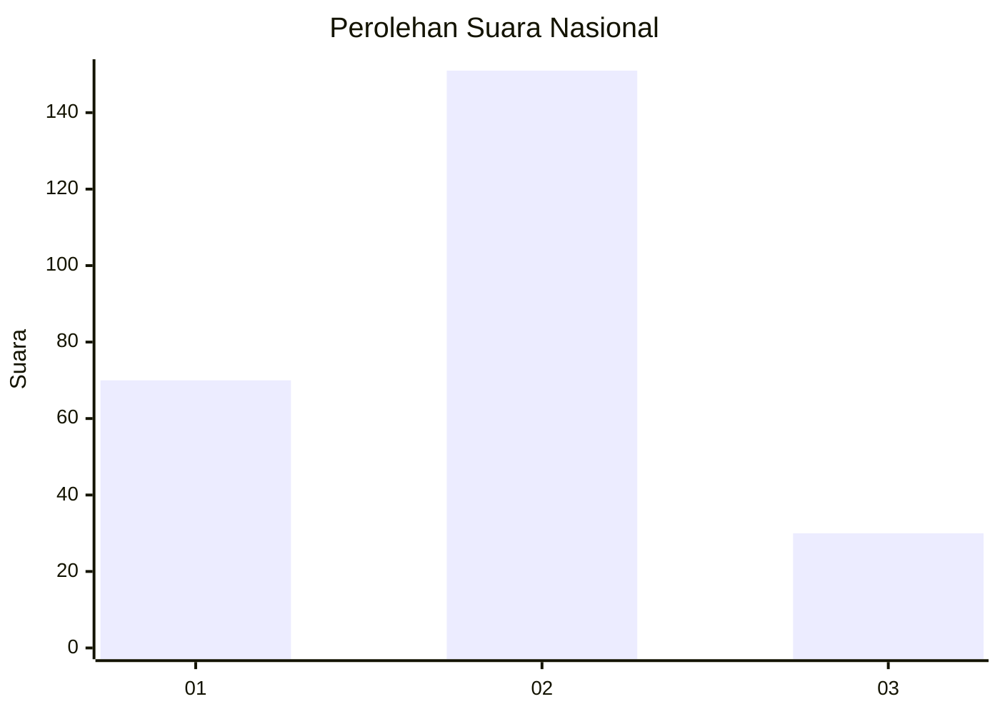
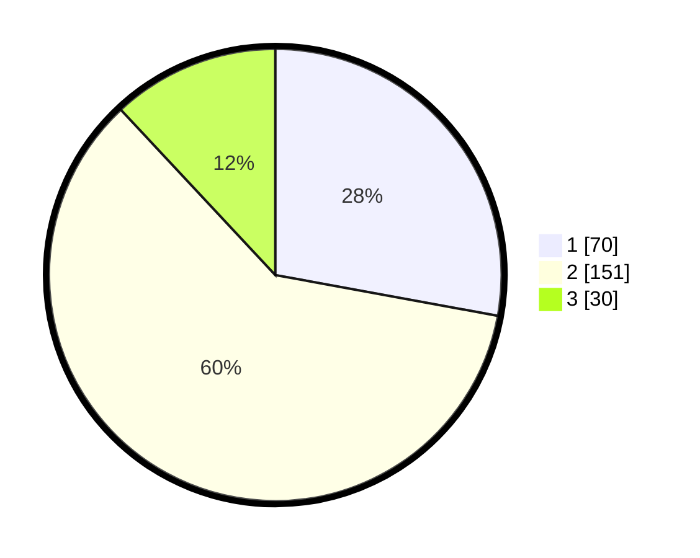

# Hasil

## Grafik

## Tabel

| No.    | Nama Paslon    | Suara | Suara (raw) | Persentase |
|:------ |:-------------- | -----:| -----------:| ----------:|
| 100025 | ANIES MUHAIMIN | 70    | [70][p-1]   | 27,89      |
| 100026 | PRABOWO GIBRAN | 151   | [151][p-2]  | 60,16      |
| 100027 | GANJAR MAHFUD  | 30    | [30][p-3]   | 11,95      |

[p-1]: https://github.com/gigit-pemilu/pemilu-2024/blob/main/pilpres/hitung-suara/sub/31-dki-jakarta/sub/75-jakarta-timur/sub/08-makasar/sub/1004-halim-perdana-kusuma/sub/001-tps/sub/paslon-1.txt
[p-2]: https://github.com/gigit-pemilu/pemilu-2024/blob/main/pilpres/hitung-suara/sub/31-dki-jakarta/sub/75-jakarta-timur/sub/08-makasar/sub/1004-halim-perdana-kusuma/sub/001-tps/sub/paslon-2.txt
[p-3]: https://github.com/gigit-pemilu/pemilu-2024/blob/main/pilpres/hitung-suara/sub/31-dki-jakarta/sub/75-jakarta-timur/sub/08-makasar/sub/1004-halim-perdana-kusuma/sub/001-tps/sub/paslon-3.txt

## Foto C Plano

https://sirekap-obj-formc.kpu.go.id/d008/pemilu/ppwp/31/75/08/10/04/3175081004001-20240216-154425--f87aeb5d-bf3d-44e4-92f2-afd5d6b8dcef.jpg

https://sirekap-obj-formc.kpu.go.id/d008/pemilu/ppwp/31/75/08/10/04/3175081004001-20240216-111705--cc46de04-3acc-4b3b-a3d9-73a211316369.jpg

https://sirekap-obj-formc.kpu.go.id/d008/pemilu/ppwp/31/75/08/10/04/3175081004001-20240216-111836--e0353722-1ebc-4062-b335-1ae1978485ef.jpg

## Metadata

| Key        | Value               |
| ---------- | ------------------- |
| Time Stamp | 2024-02-16 21:01:00 |

