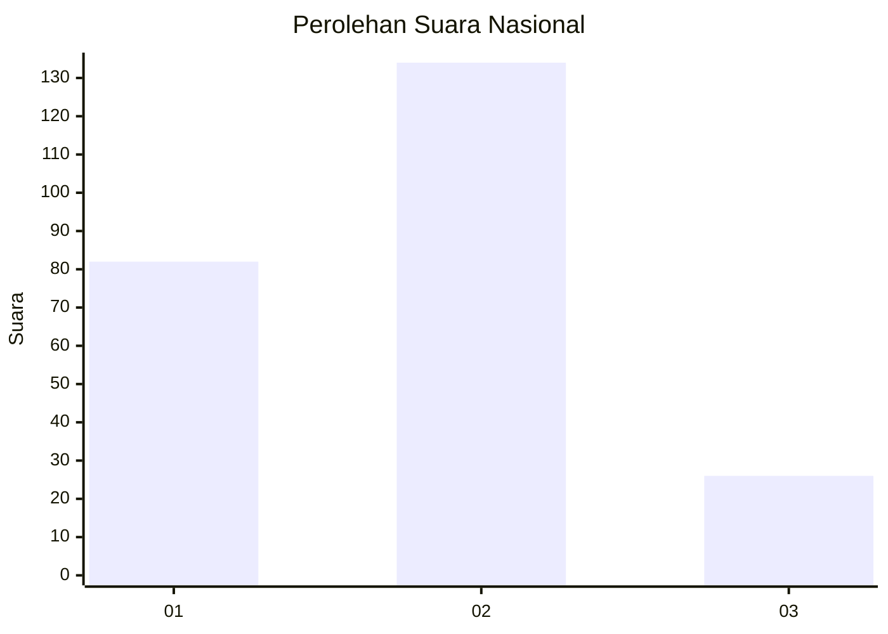
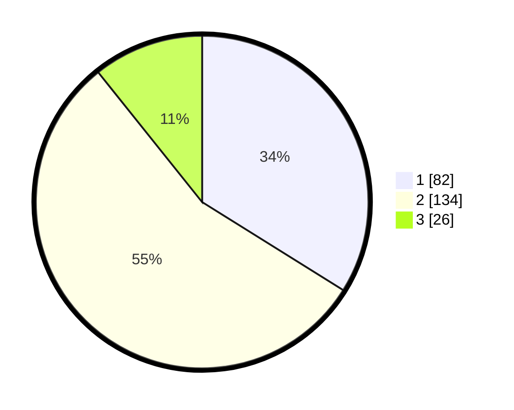

# Hasil

## Grafik

## Tabel

| No.    | Nama Paslon    | Suara | Suara (raw) | Persentase |
|:------ |:-------------- | -----:| -----------:| ----------:|
| 100025 | ANIES MUHAIMIN | 82    | [82][p-1]   | 33,88      |
| 100026 | PRABOWO GIBRAN | 134   | [134][p-2]  | 55,37      |
| 100027 | GANJAR MAHFUD  | 26    | [26][p-3]   | 10,74      |

[p-1]: https://github.com/gigit-pemilu/pemilu-2024/blob/main/pilpres/hitung-suara/sub/31-dki-jakarta/sub/75-jakarta-timur/sub/08-makasar/sub/1004-halim-perdana-kusuma/sub/004-tps/sub/paslon-1.txt
[p-2]: https://github.com/gigit-pemilu/pemilu-2024/blob/main/pilpres/hitung-suara/sub/31-dki-jakarta/sub/75-jakarta-timur/sub/08-makasar/sub/1004-halim-perdana-kusuma/sub/004-tps/sub/paslon-2.txt
[p-3]: https://github.com/gigit-pemilu/pemilu-2024/blob/main/pilpres/hitung-suara/sub/31-dki-jakarta/sub/75-jakarta-timur/sub/08-makasar/sub/1004-halim-perdana-kusuma/sub/004-tps/sub/paslon-3.txt

## Foto C Plano

https://sirekap-obj-formc.kpu.go.id/55db/pemilu/ppwp/31/75/08/10/04/3175081004004-20240215-125315--7c5b9a52-3db3-490c-bae2-d0999c1d9634.jpg

https://sirekap-obj-formc.kpu.go.id/55db/pemilu/ppwp/31/75/08/10/04/3175081004004-20240215-124340--61446120-f6fc-4bb1-8e6f-ed744c384365.jpg

https://sirekap-obj-formc.kpu.go.id/55db/pemilu/ppwp/31/75/08/10/04/3175081004004-20240215-125621--9289a427-23a3-4059-9d58-8249ade23512.jpg

## Metadata

| Key        | Value               |
| ---------- | ------------------- |
| Time Stamp | 2024-02-15 15:00:29 |

