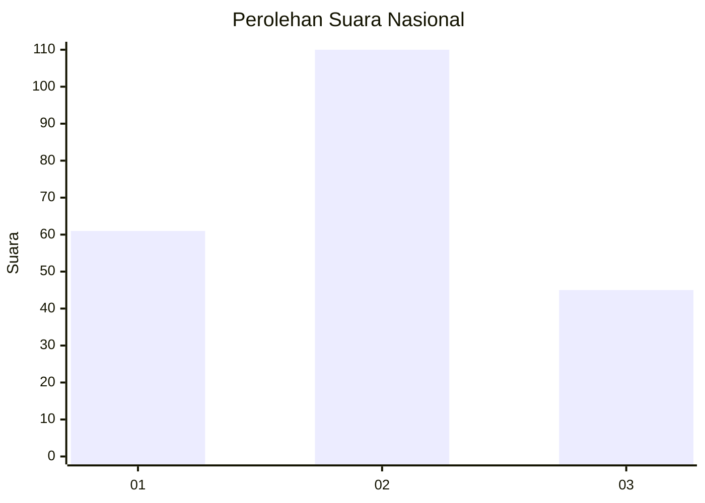
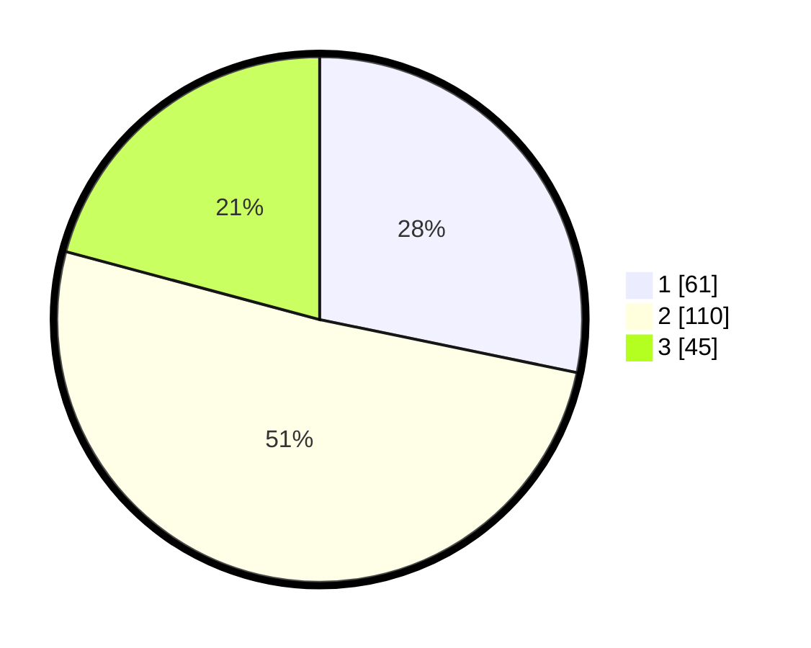

# Hasil

## Grafik

## Tabel

| No.    | Nama Paslon    | Suara | Suara (raw) | Persentase |
|:------ |:-------------- | -----:| -----------:| ----------:|
| 100025 | ANIES MUHAIMIN | 61    | [61][p-1]   | 28,24      |
| 100026 | PRABOWO GIBRAN | 110   | [110][p-2]  | 50,93      |
| 100027 | GANJAR MAHFUD  | 45    | [45][p-3]   | 20,83      |

[p-1]: https://github.com/gigit-pemilu/pemilu-2024/blob/main/pilpres/hitung-suara/sub/31-dki-jakarta/sub/75-jakarta-timur/sub/08-makasar/sub/1004-halim-perdana-kusuma/sub/022-tps/sub/paslon-1.txt
[p-2]: https://github.com/gigit-pemilu/pemilu-2024/blob/main/pilpres/hitung-suara/sub/31-dki-jakarta/sub/75-jakarta-timur/sub/08-makasar/sub/1004-halim-perdana-kusuma/sub/022-tps/sub/paslon-2.txt
[p-3]: https://github.com/gigit-pemilu/pemilu-2024/blob/main/pilpres/hitung-suara/sub/31-dki-jakarta/sub/75-jakarta-timur/sub/08-makasar/sub/1004-halim-perdana-kusuma/sub/022-tps/sub/paslon-3.txt

## Foto C Plano

https://sirekap-obj-formc.kpu.go.id/a0a8/pemilu/ppwp/31/75/08/10/04/3175081004022-20240217-155154--f16181a2-b334-410c-869f-b674d68af258.jpg

https://sirekap-obj-formc.kpu.go.id/a0a8/pemilu/ppwp/31/75/08/10/04/3175081004022-20240217-155236--190578a8-8609-4f3c-a1c6-8fa6a98696db.jpg

https://sirekap-obj-formc.kpu.go.id/a0a8/pemilu/ppwp/31/75/08/10/04/3175081004022-20240216-150902--9ce8f3f2-2207-4b0d-8c3e-c2c59f257940.jpg

## Metadata

| Key        | Value               |
| ---------- | ------------------- |
| Time Stamp | 2024-02-24 22:31:28 |

