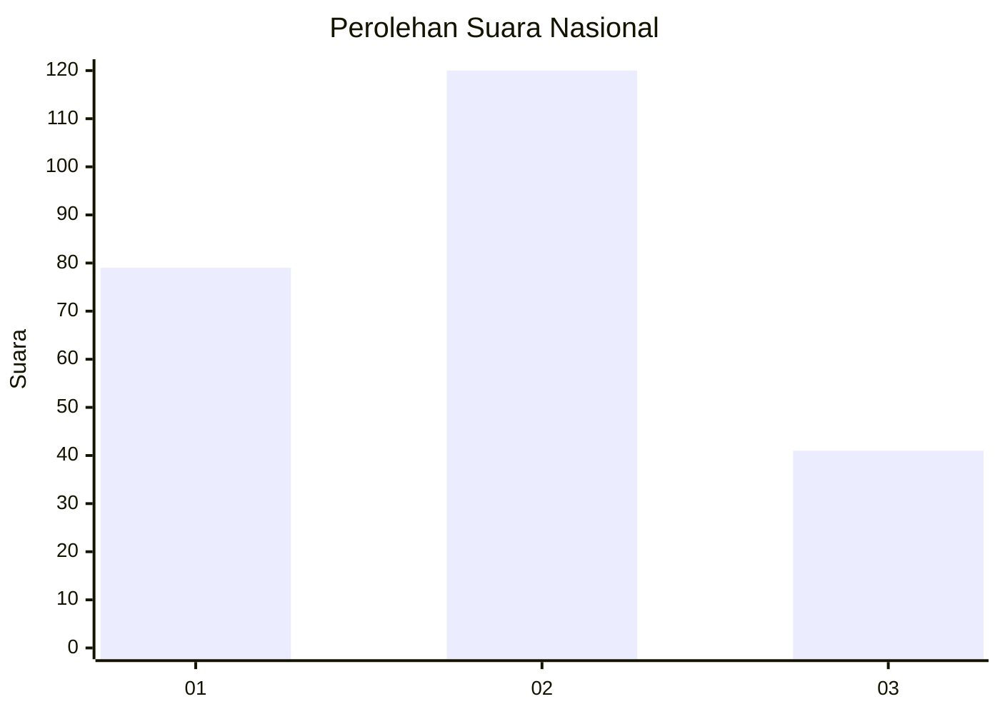
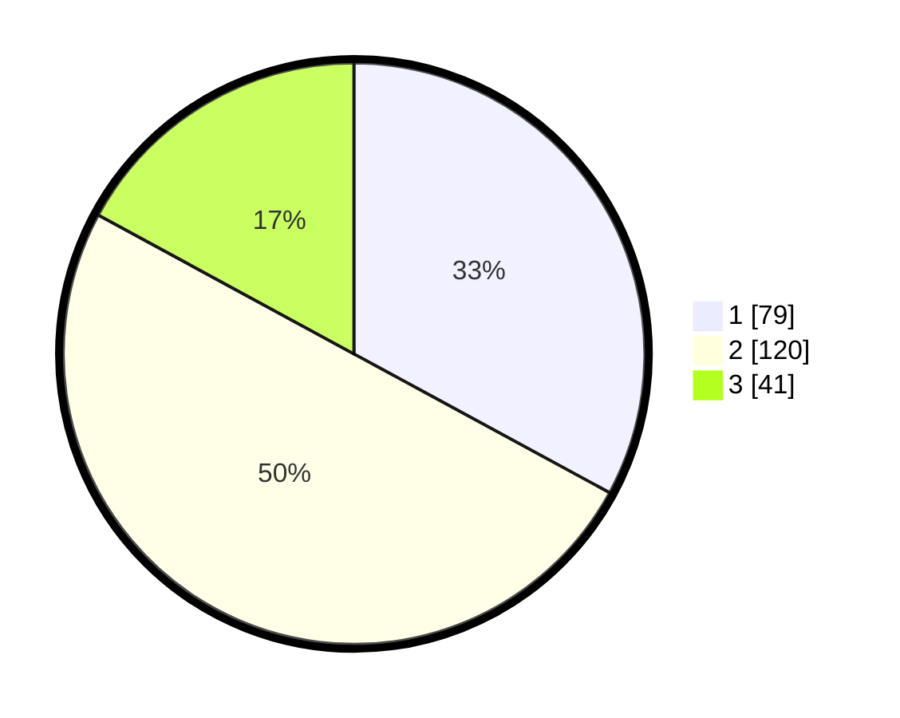

# Hasil

## Grafik

## Tabel

| No.    | Nama Paslon    | Suara | Suara (raw) | Persentase |
|:------ |:-------------- | -----:| -----------:| ----------:|
| 100025 | ANIES MUHAIMIN | 79    | [79][p-1]   | 32,92      |
| 100026 | PRABOWO GIBRAN | 120   | [120][p-2]  | 50,00      |
| 100027 | GANJAR MAHFUD  | 41    | [41][p-3]   | 17,08      |

[p-1]: https://github.com/gigit-pemilu/pemilu-2024/blob/main/pilpres/hitung-suara/sub/31-dki-jakarta/sub/75-jakarta-timur/sub/08-makasar/sub/1004-halim-perdana-kusuma/sub/023-tps/sub/paslon-1.txt
[p-2]: https://github.com/gigit-pemilu/pemilu-2024/blob/main/pilpres/hitung-suara/sub/31-dki-jakarta/sub/75-jakarta-timur/sub/08-makasar/sub/1004-halim-perdana-kusuma/sub/023-tps/sub/paslon-2.txt
[p-3]: https://github.com/gigit-pemilu/pemilu-2024/blob/main/pilpres/hitung-suara/sub/31-dki-jakarta/sub/75-jakarta-timur/sub/08-makasar/sub/1004-halim-perdana-kusuma/sub/023-tps/sub/paslon-3.txt

## Foto C Plano

https://sirekap-obj-formc.kpu.go.id/17d7/pemilu/ppwp/31/75/08/10/04/3175081004023-20240214-203316--96063a1f-f900-4de3-934e-9b9381c04a9e.jpg

https://sirekap-obj-formc.kpu.go.id/17d7/pemilu/ppwp/31/75/08/10/04/3175081004023-20240214-203511--424c3363-291a-441c-a251-19fd101c7bd4.jpg

https://sirekap-obj-formc.kpu.go.id/17d7/pemilu/ppwp/31/75/08/10/04/3175081004023-20240214-203624--fe5ee1fa-f9d2-4b77-b76d-7e7542c58333.jpg

## Metadata

| Key        | Value               |
| ---------- | ------------------- |
| Time Stamp | 2024-02-15 12:00:28 |

