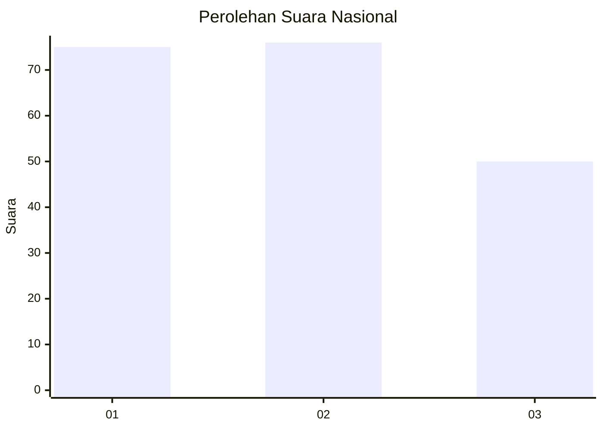
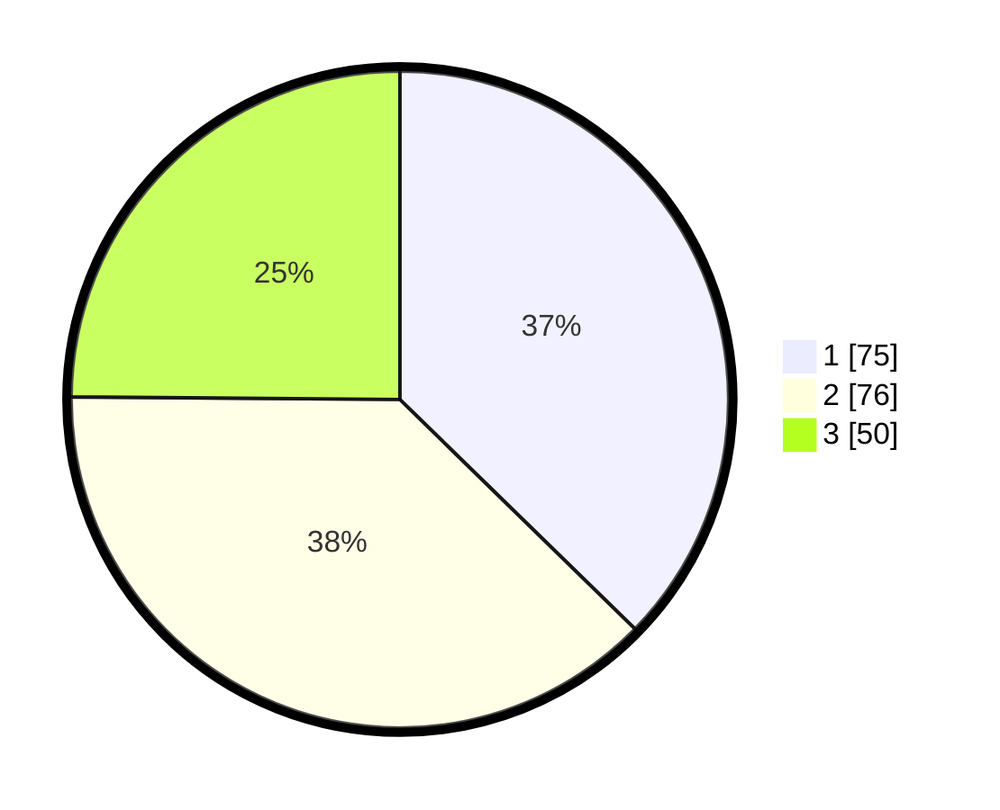

# Hasil

## Grafik

## Tabel

| No.    | Nama Paslon    | Suara | Suara (raw) | Persentase |
|:------ |:-------------- | -----:| -----------:| ----------:|
| 100025 | ANIES MUHAIMIN | 75    | [75][p-1]   | 37,31      |
| 100026 | PRABOWO GIBRAN | 76    | [76][p-2]   | 37,81      |
| 100027 | GANJAR MAHFUD  | 50    | [50][p-3]   | 24,88      |

[p-1]: https://github.com/gigit-pemilu/pemilu-2024/blob/main/pilpres/hitung-suara/sub/31-dki-jakarta/sub/75-jakarta-timur/sub/08-makasar/sub/1004-halim-perdana-kusuma/sub/035-tps/sub/paslon-1.txt
[p-2]: https://github.com/gigit-pemilu/pemilu-2024/blob/main/pilpres/hitung-suara/sub/31-dki-jakarta/sub/75-jakarta-timur/sub/08-makasar/sub/1004-halim-perdana-kusuma/sub/035-tps/sub/paslon-2.txt
[p-3]: https://github.com/gigit-pemilu/pemilu-2024/blob/main/pilpres/hitung-suara/sub/31-dki-jakarta/sub/75-jakarta-timur/sub/08-makasar/sub/1004-halim-perdana-kusuma/sub/035-tps/sub/paslon-3.txt

## Foto C Plano

https://sirekap-obj-formc.kpu.go.id/3ef3/pemilu/ppwp/31/75/08/10/04/3175081004035-20240214-213542--e06dde64-5f48-4562-8a27-e1111a84b971.jpg

https://sirekap-obj-formc.kpu.go.id/3ef3/pemilu/ppwp/31/75/08/10/04/3175081004035-20240214-213650--e4607c1f-d8a9-4314-b283-1414b44a438b.jpg

https://sirekap-obj-formc.kpu.go.id/3ef3/pemilu/ppwp/31/75/08/10/04/3175081004035-20240214-213747--acf30b84-0889-4d56-a95c-02235d9f8ba7.jpg

## Metadata

| Key        | Value               |
| ---------- | ------------------- |
| Time Stamp | 2024-02-15 12:00:28 |

