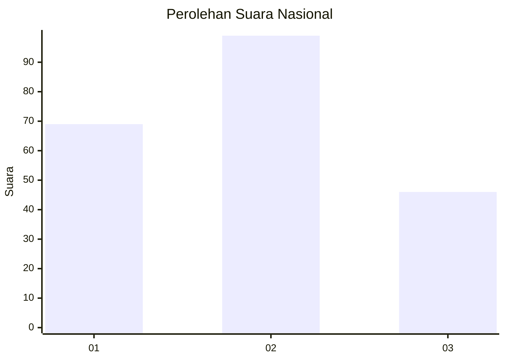
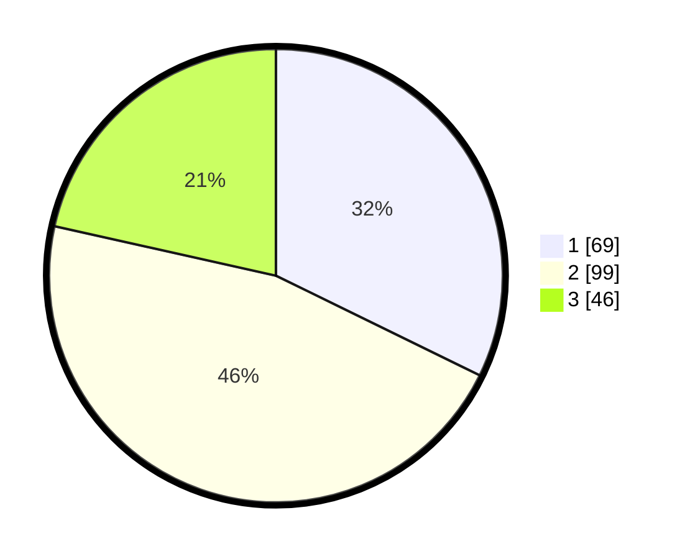

# Hasil

## Grafik

## Tabel

| No.    | Nama Paslon    | Suara | Suara (raw) | Persentase |
|:------ |:-------------- | -----:| -----------:| ----------:|
| 100025 | ANIES MUHAIMIN | 69    | [69][p-1]   | 32,24      |
| 100026 | PRABOWO GIBRAN | 99    | [99][p-2]   | 46,26      |
| 100027 | GANJAR MAHFUD  | 46    | [46][p-3]   | 21,50      |

[p-1]: https://github.com/gigit-pemilu/pemilu-2024/blob/main/pilpres/hitung-suara/sub/31-dki-jakarta/sub/75-jakarta-timur/sub/08-makasar/sub/1004-halim-perdana-kusuma/sub/036-tps/sub/paslon-1.txt
[p-2]: https://github.com/gigit-pemilu/pemilu-2024/blob/main/pilpres/hitung-suara/sub/31-dki-jakarta/sub/75-jakarta-timur/sub/08-makasar/sub/1004-halim-perdana-kusuma/sub/036-tps/sub/paslon-2.txt
[p-3]: https://github.com/gigit-pemilu/pemilu-2024/blob/main/pilpres/hitung-suara/sub/31-dki-jakarta/sub/75-jakarta-timur/sub/08-makasar/sub/1004-halim-perdana-kusuma/sub/036-tps/sub/paslon-3.txt

## Foto C Plano

https://sirekap-obj-formc.kpu.go.id/9712/pemilu/ppwp/31/75/08/10/04/3175081004036-20240215-012323--d00488eb-89ea-49a6-aaf8-b56bafda1146.jpg

https://sirekap-obj-formc.kpu.go.id/9712/pemilu/ppwp/31/75/08/10/04/3175081004036-20240215-012553--0c2518ad-6de7-4b73-921e-c1af00686906.jpg

https://sirekap-obj-formc.kpu.go.id/9712/pemilu/ppwp/31/75/08/10/04/3175081004036-20240215-012721--e1943420-fb45-477b-9e43-5ff307f49d51.jpg

## Metadata

| Key        | Value               |
| ---------- | ------------------- |
| Time Stamp | 2024-02-15 12:00:28 |

