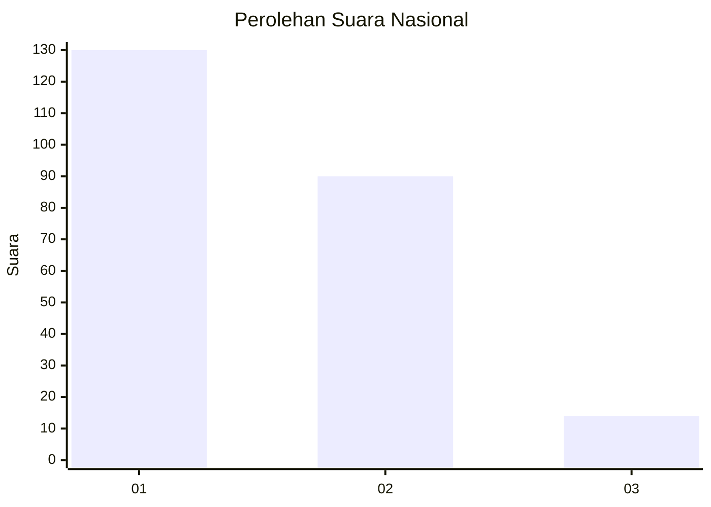
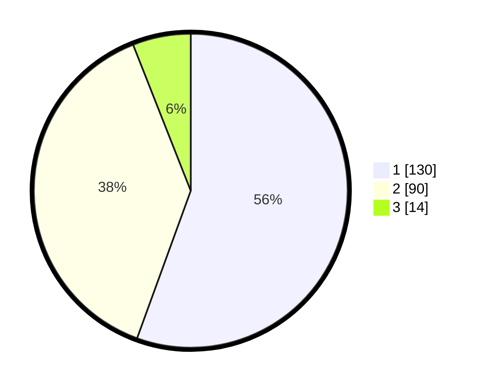

# Hasil

## Grafik

## Tabel

| No.    | Nama Paslon    | Suara | Suara (raw) | Persentase |
|:------ |:-------------- | -----:| -----------:| ----------:|
| 100025 | ANIES MUHAIMIN | 130   | [130][p-1]  | 55,56      |
| 100026 | PRABOWO GIBRAN | 90    | [90][p-2]   | 38,46      |
| 100027 | GANJAR MAHFUD  | 14    | [14][p-3]   | 5,98       |

[p-1]: https://github.com/gigit-pemilu/pemilu-2024/blob/main/pilpres/hitung-suara/sub/31-dki-jakarta/sub/75-jakarta-timur/sub/08-makasar/sub/1004-halim-perdana-kusuma/sub/038-tps/sub/paslon-1.txt
[p-2]: https://github.com/gigit-pemilu/pemilu-2024/blob/main/pilpres/hitung-suara/sub/31-dki-jakarta/sub/75-jakarta-timur/sub/08-makasar/sub/1004-halim-perdana-kusuma/sub/038-tps/sub/paslon-2.txt
[p-3]: https://github.com/gigit-pemilu/pemilu-2024/blob/main/pilpres/hitung-suara/sub/31-dki-jakarta/sub/75-jakarta-timur/sub/08-makasar/sub/1004-halim-perdana-kusuma/sub/038-tps/sub/paslon-3.txt

## Foto C Plano

https://sirekap-obj-formc.kpu.go.id/498a/pemilu/ppwp/31/75/08/10/04/3175081004038-20240214-233529--1c1489d5-e8ae-42cf-b195-4bfef5133207.jpg

https://sirekap-obj-formc.kpu.go.id/498a/pemilu/ppwp/31/75/08/10/04/3175081004038-20240214-233544--0b43239d-0192-497a-9201-6ee00e152451.jpg

https://sirekap-obj-formc.kpu.go.id/498a/pemilu/ppwp/31/75/08/10/04/3175081004038-20240214-233551--09923369-744b-45f3-a01f-27787d5babd6.jpg

## Metadata

| Key        | Value               |
| ---------- | ------------------- |
| Time Stamp | 2024-02-15 15:00:29 |

