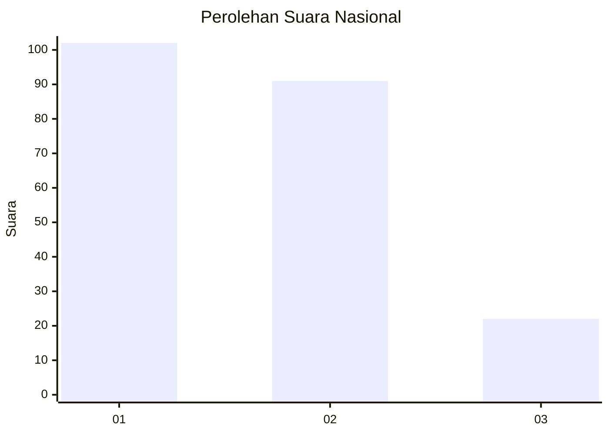
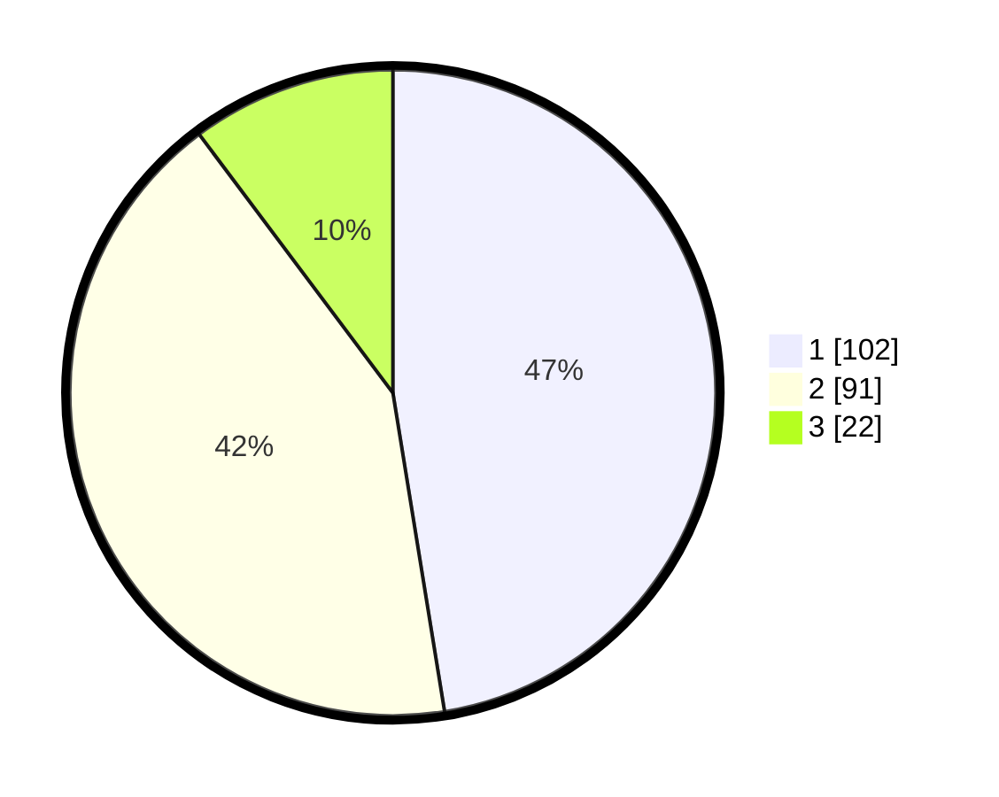

# Hasil

## Grafik

## Tabel

| No.    | Nama Paslon    | Suara | Suara (raw) | Persentase |
|:------ |:-------------- | -----:| -----------:| ----------:|
| 100025 | ANIES MUHAIMIN | 102   | [102][p-1]  | 47,44      |
| 100026 | PRABOWO GIBRAN | 91    | [91][p-2]   | 42,33      |
| 100027 | GANJAR MAHFUD  | 22    | [22][p-3]   | 10,23      |

[p-1]: https://github.com/gigit-pemilu/pemilu-2024/blob/main/pilpres/hitung-suara/sub/31-dki-jakarta/sub/75-jakarta-timur/sub/08-makasar/sub/1004-halim-perdana-kusuma/sub/044-tps/sub/paslon-1.txt
[p-2]: https://github.com/gigit-pemilu/pemilu-2024/blob/main/pilpres/hitung-suara/sub/31-dki-jakarta/sub/75-jakarta-timur/sub/08-makasar/sub/1004-halim-perdana-kusuma/sub/044-tps/sub/paslon-2.txt
[p-3]: https://github.com/gigit-pemilu/pemilu-2024/blob/main/pilpres/hitung-suara/sub/31-dki-jakarta/sub/75-jakarta-timur/sub/08-makasar/sub/1004-halim-perdana-kusuma/sub/044-tps/sub/paslon-3.txt

## Foto C Plano

https://sirekap-obj-formc.kpu.go.id/6679/pemilu/ppwp/31/75/08/10/04/3175081004044-20240217-092155--83376400-4730-4c47-8b57-c6210605c21e.jpg

https://sirekap-obj-formc.kpu.go.id/6679/pemilu/ppwp/31/75/08/10/04/3175081004044-20240217-092723--aa37d90e-5798-4619-ac4c-36da3874714b.jpg

https://sirekap-obj-formc.kpu.go.id/6679/pemilu/ppwp/31/75/08/10/04/3175081004044-20240217-092926--edd6668f-8fd6-4952-8760-5aaaad423693.jpg

## Metadata

| Key        | Value               |
| ---------- | ------------------- |
| Time Stamp | 2024-02-20 12:00:00 |

