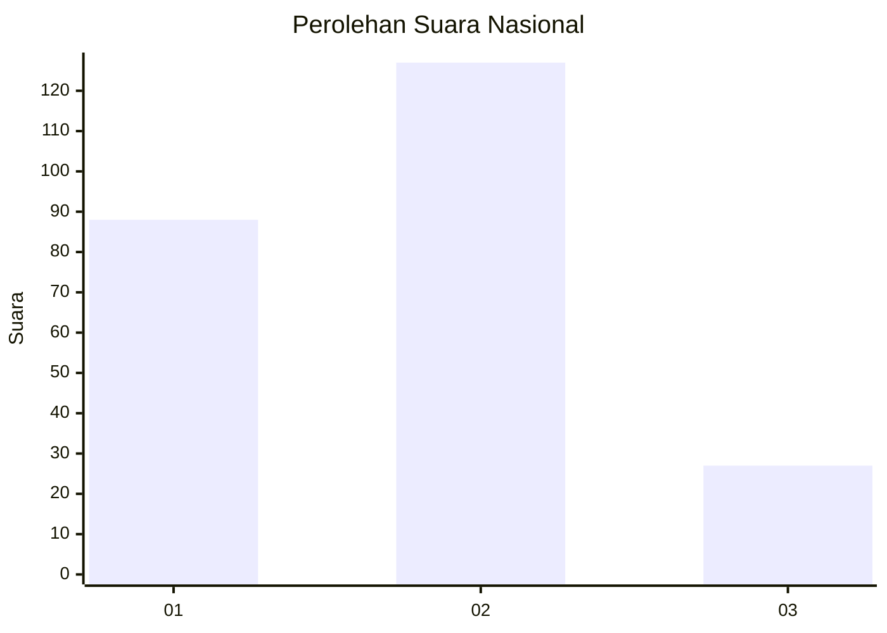
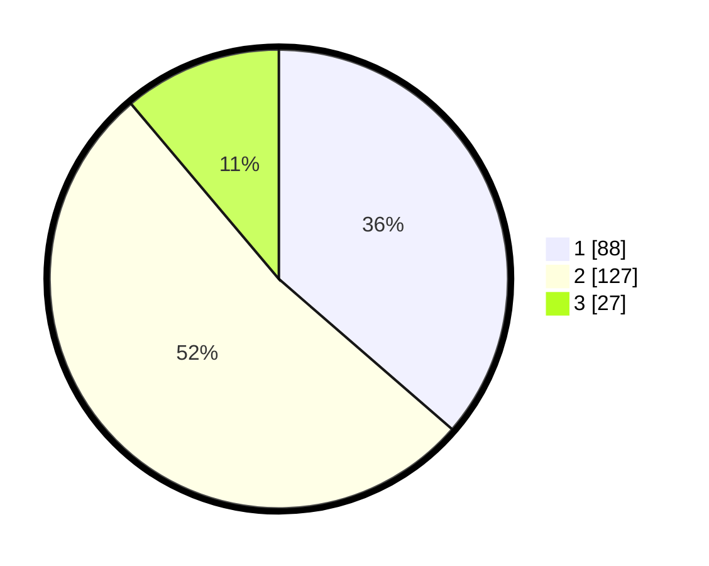

# Hasil

## Grafik

## Tabel

| No.    | Nama Paslon    | Suara | Suara (raw) | Persentase |
|:------ |:-------------- | -----:| -----------:| ----------:|
| 100025 | ANIES MUHAIMIN | 88    | [88][p-1]   | 36,36      |
| 100026 | PRABOWO GIBRAN | 127   | [127][p-2]  | 52,48      |
| 100027 | GANJAR MAHFUD  | 27    | [27][p-3]   | 11,16      |

[p-1]: https://github.com/gigit-pemilu/pemilu-2024/blob/main/pilpres/hitung-suara/sub/31-dki-jakarta/sub/75-jakarta-timur/sub/08-makasar/sub/1004-halim-perdana-kusuma/sub/053-tps/sub/paslon-1.txt
[p-2]: https://github.com/gigit-pemilu/pemilu-2024/blob/main/pilpres/hitung-suara/sub/31-dki-jakarta/sub/75-jakarta-timur/sub/08-makasar/sub/1004-halim-perdana-kusuma/sub/053-tps/sub/paslon-2.txt
[p-3]: https://github.com/gigit-pemilu/pemilu-2024/blob/main/pilpres/hitung-suara/sub/31-dki-jakarta/sub/75-jakarta-timur/sub/08-makasar/sub/1004-halim-perdana-kusuma/sub/053-tps/sub/paslon-3.txt

## Foto C Plano

https://sirekap-obj-formc.kpu.go.id/bc4e/pemilu/ppwp/31/75/08/10/04/3175081004053-20240214-235521--79d8f8c2-0baa-4ecf-87a5-06432dbfa60c.jpg

https://sirekap-obj-formc.kpu.go.id/bc4e/pemilu/ppwp/31/75/08/10/04/3175081004053-20240214-235627--7deb3d93-ff76-416b-880c-450b9bc440f0.jpg

https://sirekap-obj-formc.kpu.go.id/bc4e/pemilu/ppwp/31/75/08/10/04/3175081004053-20240214-235858--80020c91-dd69-4c6f-8d31-c07b3b726ac3.jpg

## Metadata

| Key        | Value               |
| ---------- | ------------------- |
| Time Stamp | 2024-02-15 12:00:28 |

