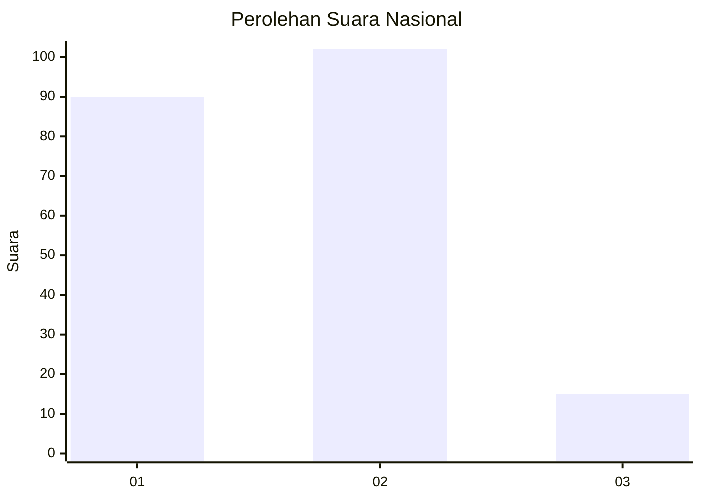
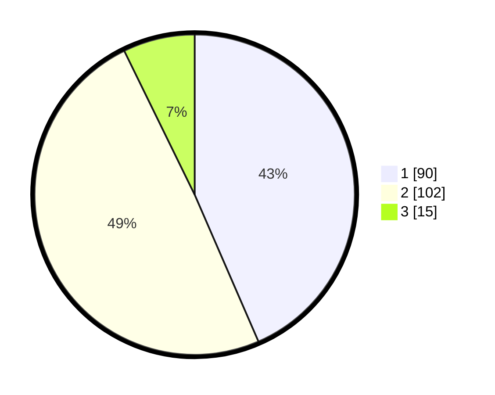

# Hasil

## Grafik

## Tabel

| No.    | Nama Paslon    | Suara | Suara (raw) | Persentase |
|:------ |:-------------- | -----:| -----------:| ----------:|
| 100025 | ANIES MUHAIMIN | 90    | [90][p-1]   | 43,48      |
| 100026 | PRABOWO GIBRAN | 102   | [102][p-2]  | 49,28      |
| 100027 | GANJAR MAHFUD  | 15    | [15][p-3]   | 7,25       |

[p-1]: https://github.com/gigit-pemilu/pemilu-2024/blob/main/pilpres/hitung-suara/sub/31-dki-jakarta/sub/75-jakarta-timur/sub/08-makasar/sub/1004-halim-perdana-kusuma/sub/057-tps/sub/paslon-1.txt
[p-2]: https://github.com/gigit-pemilu/pemilu-2024/blob/main/pilpres/hitung-suara/sub/31-dki-jakarta/sub/75-jakarta-timur/sub/08-makasar/sub/1004-halim-perdana-kusuma/sub/057-tps/sub/paslon-2.txt
[p-3]: https://github.com/gigit-pemilu/pemilu-2024/blob/main/pilpres/hitung-suara/sub/31-dki-jakarta/sub/75-jakarta-timur/sub/08-makasar/sub/1004-halim-perdana-kusuma/sub/057-tps/sub/paslon-3.txt

## Foto C Plano

https://sirekap-obj-formc.kpu.go.id/0eb9/pemilu/ppwp/31/75/08/10/04/3175081004057-20240215-015332--4c6e2913-4873-481e-b49e-96765efa452b.jpg

https://sirekap-obj-formc.kpu.go.id/0eb9/pemilu/ppwp/31/75/08/10/04/3175081004057-20240215-015549--a4278ad0-779b-4c40-b4e0-805c68fd4068.jpg

https://sirekap-obj-formc.kpu.go.id/0eb9/pemilu/ppwp/31/75/08/10/04/3175081004057-20240215-015642--b25db439-dc8c-440b-bbfb-0ca92ce6d035.jpg

## Metadata

| Key        | Value               |
| ---------- | ------------------- |
| Time Stamp | 2024-02-15 15:00:29 |

