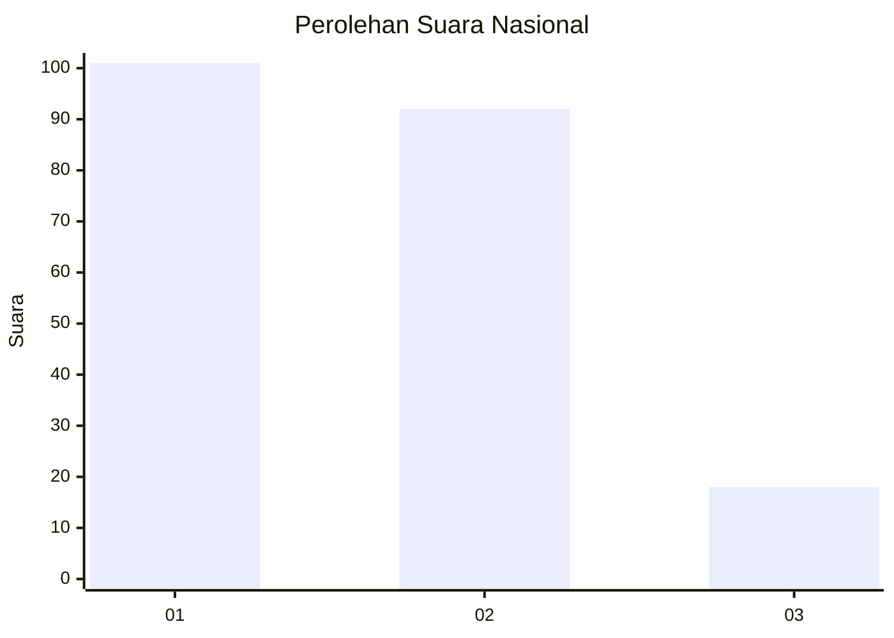
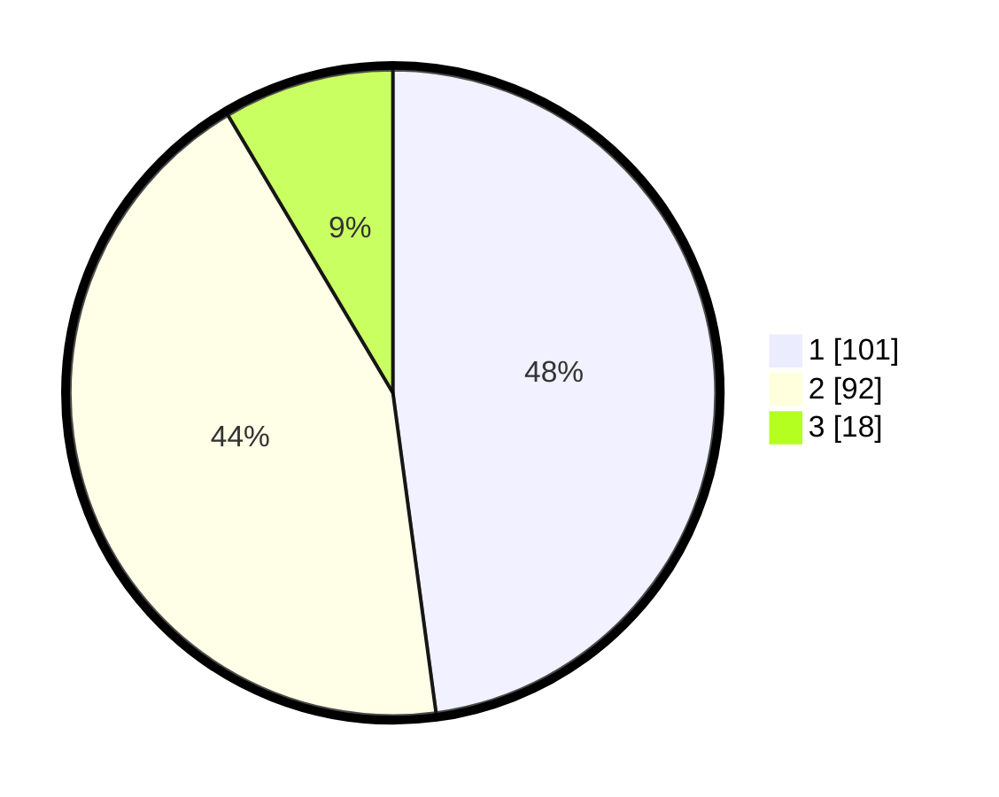

# Hasil

## Grafik

## Tabel

| No.    | Nama Paslon    | Suara | Suara (raw) | Persentase |
|:------ |:-------------- | -----:| -----------:| ----------:|
| 100025 | ANIES MUHAIMIN | 101   | [101][p-1]  | 47,87      |
| 100026 | PRABOWO GIBRAN | 92    | [92][p-2]   | 43,60      |
| 100027 | GANJAR MAHFUD  | 18    | [18][p-3]   | 8,53       |

[p-1]: https://github.com/gigit-pemilu/pemilu-2024/blob/main/pilpres/hitung-suara/sub/31-dki-jakarta/sub/75-jakarta-timur/sub/08-makasar/sub/1004-halim-perdana-kusuma/sub/072-tps/sub/paslon-1.txt
[p-2]: https://github.com/gigit-pemilu/pemilu-2024/blob/main/pilpres/hitung-suara/sub/31-dki-jakarta/sub/75-jakarta-timur/sub/08-makasar/sub/1004-halim-perdana-kusuma/sub/072-tps/sub/paslon-2.txt
[p-3]: https://github.com/gigit-pemilu/pemilu-2024/blob/main/pilpres/hitung-suara/sub/31-dki-jakarta/sub/75-jakarta-timur/sub/08-makasar/sub/1004-halim-perdana-kusuma/sub/072-tps/sub/paslon-3.txt

## Foto C Plano

https://sirekap-obj-formc.kpu.go.id/3135/pemilu/ppwp/31/75/08/10/04/3175081004072-20240214-192255--2c0a8d2c-db5e-41f2-9a49-0cfa41818202.jpg

https://sirekap-obj-formc.kpu.go.id/3135/pemilu/ppwp/31/75/08/10/04/3175081004072-20240214-234729--f3dae625-e707-40c2-b16d-b9e0d21cdd96.jpg

https://sirekap-obj-formc.kpu.go.id/3135/pemilu/ppwp/31/75/08/10/04/3175081004072-20240214-191810--41d632bf-5a1b-495b-96fa-dc6a1f7b5946.jpg

## Metadata

| Key        | Value               |
| ---------- | ------------------- |
| Time Stamp | 2024-02-15 12:00:28 |

