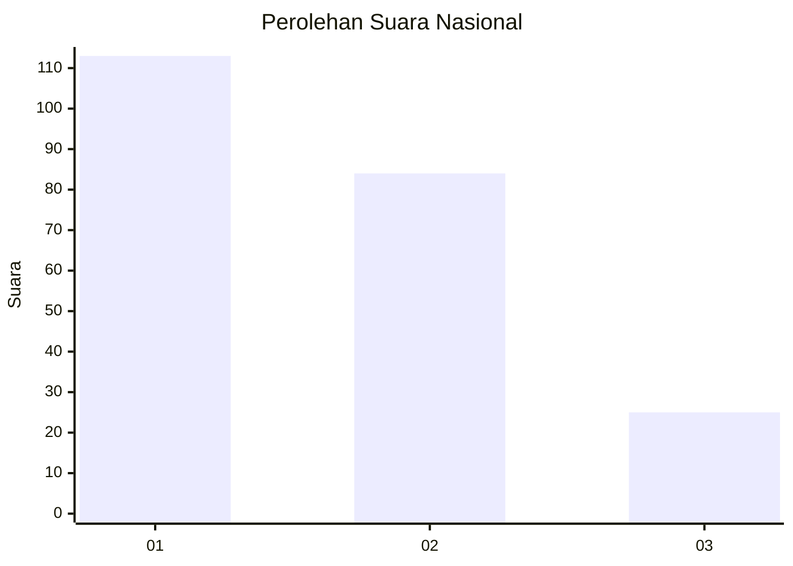
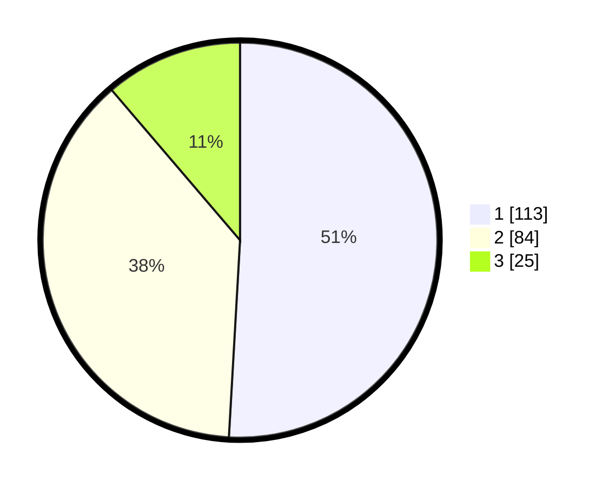

# Hasil

## Grafik

## Tabel

| No.    | Nama Paslon    | Suara | Suara (raw) | Persentase |
|:------ |:-------------- | -----:| -----------:| ----------:|
| 100025 | ANIES MUHAIMIN | 113   | [113][p-1]  | 50,90      |
| 100026 | PRABOWO GIBRAN | 84    | [84][p-2]   | 37,84      |
| 100027 | GANJAR MAHFUD  | 25    | [25][p-3]   | 11,26      |

[p-1]: https://github.com/gigit-pemilu/pemilu-2024/blob/main/pilpres/hitung-suara/sub/31-dki-jakarta/sub/75-jakarta-timur/sub/08-makasar/sub/1005-cipinang-melayu/sub/006-tps/sub/paslon-1.txt
[p-2]: https://github.com/gigit-pemilu/pemilu-2024/blob/main/pilpres/hitung-suara/sub/31-dki-jakarta/sub/75-jakarta-timur/sub/08-makasar/sub/1005-cipinang-melayu/sub/006-tps/sub/paslon-2.txt
[p-3]: https://github.com/gigit-pemilu/pemilu-2024/blob/main/pilpres/hitung-suara/sub/31-dki-jakarta/sub/75-jakarta-timur/sub/08-makasar/sub/1005-cipinang-melayu/sub/006-tps/sub/paslon-3.txt

## Foto C Plano

https://sirekap-obj-formc.kpu.go.id/e48d/pemilu/ppwp/31/75/08/10/05/3175081005006-20240214-155335--ceb7cb65-ba6e-46bf-a164-1c6c2fa36821.jpg

https://sirekap-obj-formc.kpu.go.id/e48d/pemilu/ppwp/31/75/08/10/05/3175081005006-20240214-155329--b0c746fd-c49b-4c22-847e-39292b9cfbdc.jpg

https://sirekap-obj-formc.kpu.go.id/e48d/pemilu/ppwp/31/75/08/10/05/3175081005006-20240214-155322--c1ef8a19-8c5d-45c6-9054-f17a38eb5ef1.jpg

## Metadata

| Key        | Value               |
| ---------- | ------------------- |
| Time Stamp | 2024-02-15 15:00:29 |

