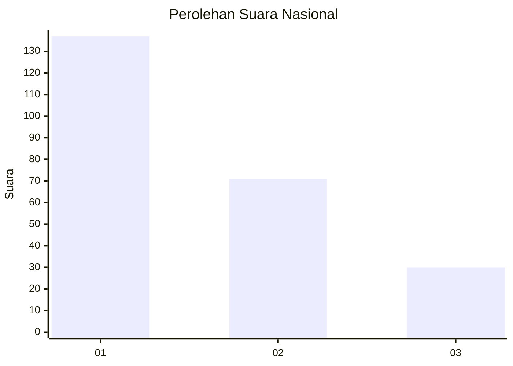
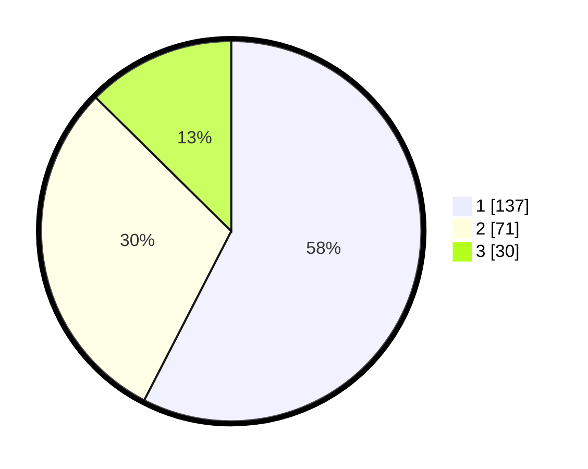

# Hasil

## Grafik

## Tabel

| No.    | Nama Paslon    | Suara | Suara (raw) | Persentase |
|:------ |:-------------- | -----:| -----------:| ----------:|
| 100025 | ANIES MUHAIMIN | 137   | [137][p-1]  | 57,56      |
| 100026 | PRABOWO GIBRAN | 71    | [71][p-2]   | 29,83      |
| 100027 | GANJAR MAHFUD  | 30    | [30][p-3]   | 12,61      |

[p-1]: https://github.com/gigit-pemilu/pemilu-2024/blob/main/pilpres/hitung-suara/sub/31-dki-jakarta/sub/75-jakarta-timur/sub/08-makasar/sub/1005-cipinang-melayu/sub/008-tps/sub/paslon-1.txt
[p-2]: https://github.com/gigit-pemilu/pemilu-2024/blob/main/pilpres/hitung-suara/sub/31-dki-jakarta/sub/75-jakarta-timur/sub/08-makasar/sub/1005-cipinang-melayu/sub/008-tps/sub/paslon-2.txt
[p-3]: https://github.com/gigit-pemilu/pemilu-2024/blob/main/pilpres/hitung-suara/sub/31-dki-jakarta/sub/75-jakarta-timur/sub/08-makasar/sub/1005-cipinang-melayu/sub/008-tps/sub/paslon-3.txt

## Foto C Plano

https://sirekap-obj-formc.kpu.go.id/1daf/pemilu/ppwp/31/75/08/10/05/3175081005008-20240214-220459--2efd81b2-8e36-49b2-aa27-59bdd5408cf2.jpg

https://sirekap-obj-formc.kpu.go.id/1daf/pemilu/ppwp/31/75/08/10/05/3175081005008-20240214-220654--585bfca1-1258-48e3-a83f-ec77cf65ff31.jpg

https://sirekap-obj-formc.kpu.go.id/1daf/pemilu/ppwp/31/75/08/10/05/3175081005008-20240214-220617--beea34e0-020e-401a-93fa-4796c52c98d6.jpg

## Metadata

| Key        | Value               |
| ---------- | ------------------- |
| Time Stamp | 2024-02-15 12:00:28 |

