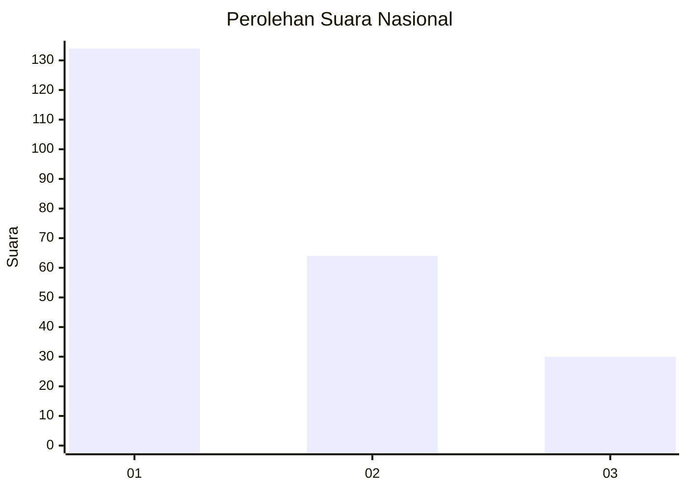
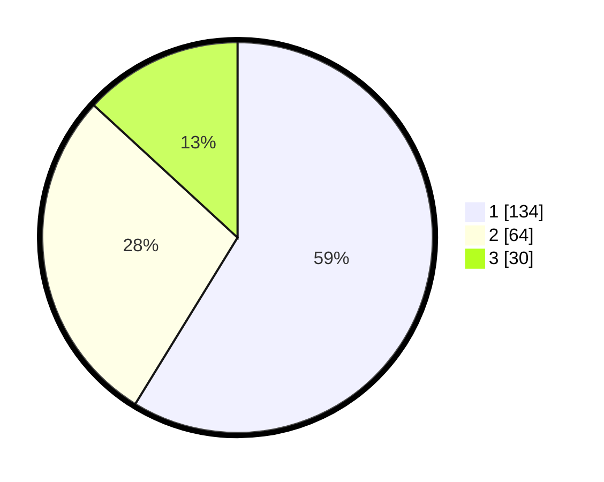

# Hasil

## Grafik

## Tabel

| No.    | Nama Paslon    | Suara | Suara (raw) | Persentase |
|:------ |:-------------- | -----:| -----------:| ----------:|
| 100025 | ANIES MUHAIMIN | 134   | [134][p-1]  | 58,77      |
| 100026 | PRABOWO GIBRAN | 64    | [64][p-2]   | 28,07      |
| 100027 | GANJAR MAHFUD  | 30    | [30][p-3]   | 13,16      |

[p-1]: https://github.com/gigit-pemilu/pemilu-2024/blob/main/pilpres/hitung-suara/sub/31-dki-jakarta/sub/75-jakarta-timur/sub/08-makasar/sub/1005-cipinang-melayu/sub/010-tps/sub/paslon-1.txt
[p-2]: https://github.com/gigit-pemilu/pemilu-2024/blob/main/pilpres/hitung-suara/sub/31-dki-jakarta/sub/75-jakarta-timur/sub/08-makasar/sub/1005-cipinang-melayu/sub/010-tps/sub/paslon-2.txt
[p-3]: https://github.com/gigit-pemilu/pemilu-2024/blob/main/pilpres/hitung-suara/sub/31-dki-jakarta/sub/75-jakarta-timur/sub/08-makasar/sub/1005-cipinang-melayu/sub/010-tps/sub/paslon-3.txt

## Foto C Plano

https://sirekap-obj-formc.kpu.go.id/a83b/pemilu/ppwp/31/75/08/10/05/3175081005010-20240215-000809--4a99dca0-d0aa-4e02-8f58-db4bc2131b95.jpg

https://sirekap-obj-formc.kpu.go.id/a83b/pemilu/ppwp/31/75/08/10/05/3175081005010-20240215-001011--82b6a639-2a5b-4098-aa18-0aae28a83167.jpg

https://sirekap-obj-formc.kpu.go.id/a83b/pemilu/ppwp/31/75/08/10/05/3175081005010-20240215-001059--16e8ba60-2c3a-4512-b6e5-e41b2aade6d6.jpg

## Metadata

| Key        | Value               |
| ---------- | ------------------- |
| Time Stamp | 2024-02-15 12:00:28 |

