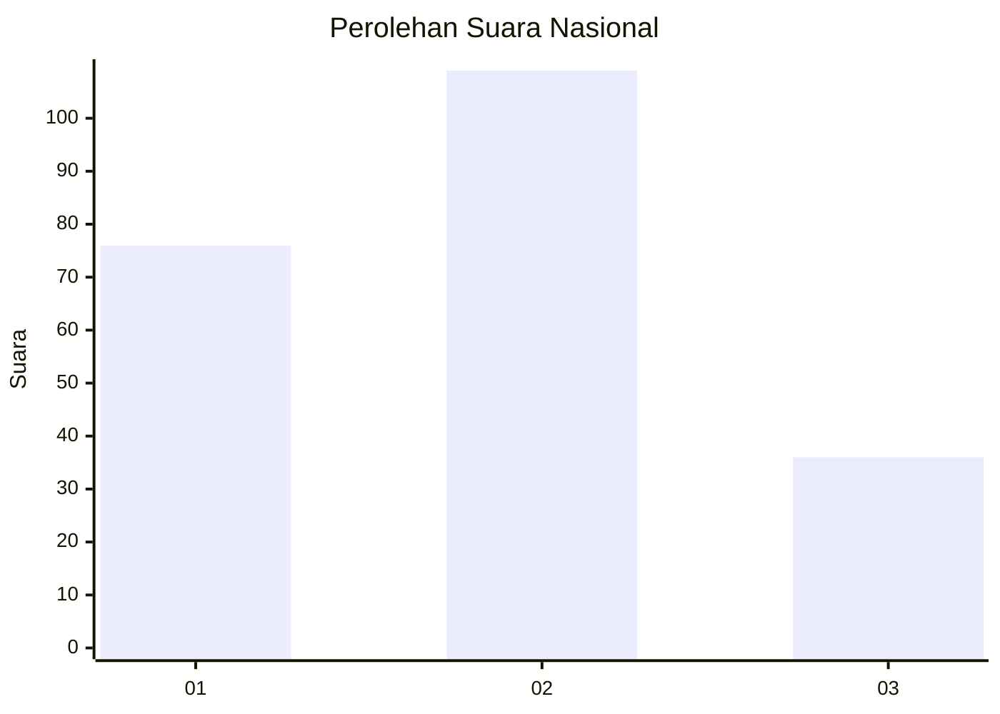
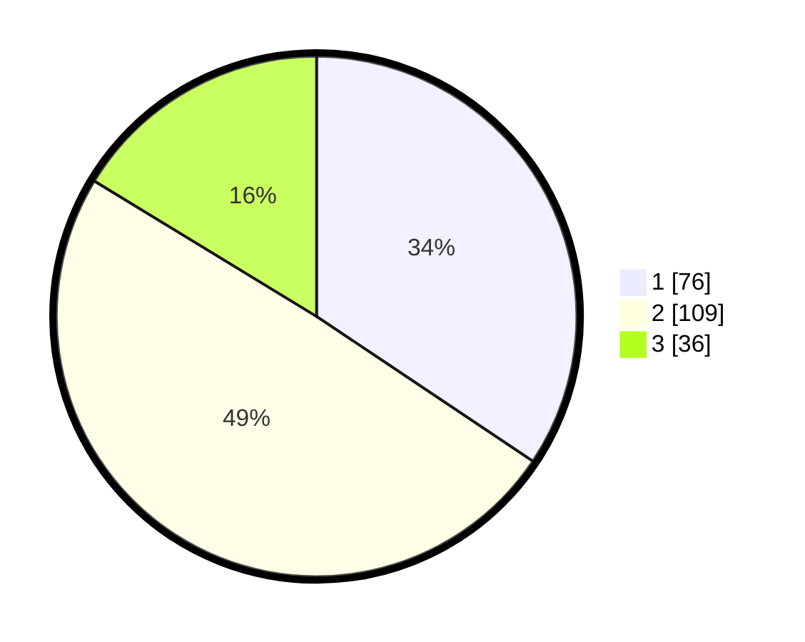

# Hasil

## Grafik

## Tabel

| No.    | Nama Paslon    | Suara | Suara (raw) | Persentase |
|:------ |:-------------- | -----:| -----------:| ----------:|
| 100025 | ANIES MUHAIMIN | 76    | [76][p-1]   | 34,39      |
| 100026 | PRABOWO GIBRAN | 109   | [109][p-2]  | 49,32      |
| 100027 | GANJAR MAHFUD  | 36    | [36][p-3]   | 16,29      |

[p-1]: https://github.com/gigit-pemilu/pemilu-2024/blob/main/pilpres/hitung-suara/sub/31-dki-jakarta/sub/75-jakarta-timur/sub/08-makasar/sub/1005-cipinang-melayu/sub/031-tps/sub/paslon-1.txt
[p-2]: https://github.com/gigit-pemilu/pemilu-2024/blob/main/pilpres/hitung-suara/sub/31-dki-jakarta/sub/75-jakarta-timur/sub/08-makasar/sub/1005-cipinang-melayu/sub/031-tps/sub/paslon-2.txt
[p-3]: https://github.com/gigit-pemilu/pemilu-2024/blob/main/pilpres/hitung-suara/sub/31-dki-jakarta/sub/75-jakarta-timur/sub/08-makasar/sub/1005-cipinang-melayu/sub/031-tps/sub/paslon-3.txt

## Foto C Plano

https://sirekap-obj-formc.kpu.go.id/9c57/pemilu/ppwp/31/75/08/10/05/3175081005031-20240215-002743--f10b6dfb-6518-4a66-8c26-f60ba1297ef2.jpg

https://sirekap-obj-formc.kpu.go.id/9c57/pemilu/ppwp/31/75/08/10/05/3175081005031-20240215-024035--484d72f4-7ec5-4c3b-bcae-8de8441ac235.jpg

https://sirekap-obj-formc.kpu.go.id/9c57/pemilu/ppwp/31/75/08/10/05/3175081005031-20240215-003055--0613451b-aa49-426b-9392-c9ec71fd9ebe.jpg

## Metadata

| Key        | Value               |
| ---------- | ------------------- |
| Time Stamp | 2024-02-15 12:00:28 |

