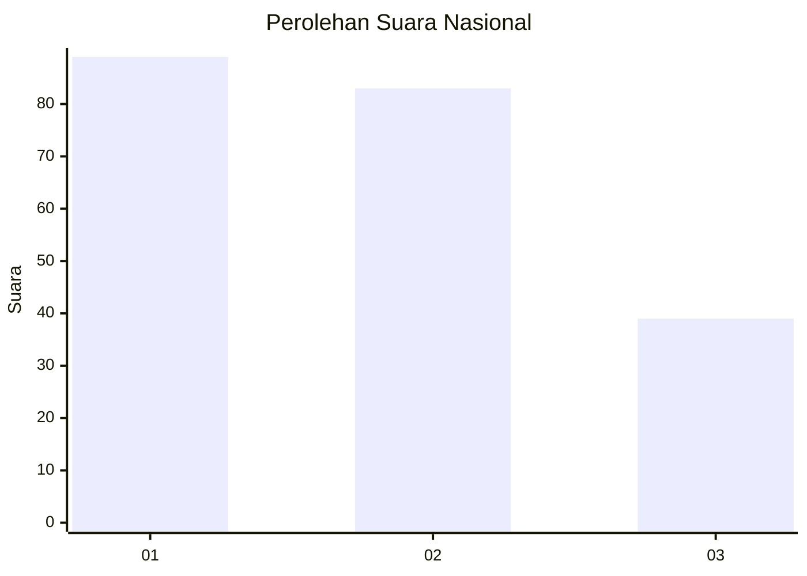
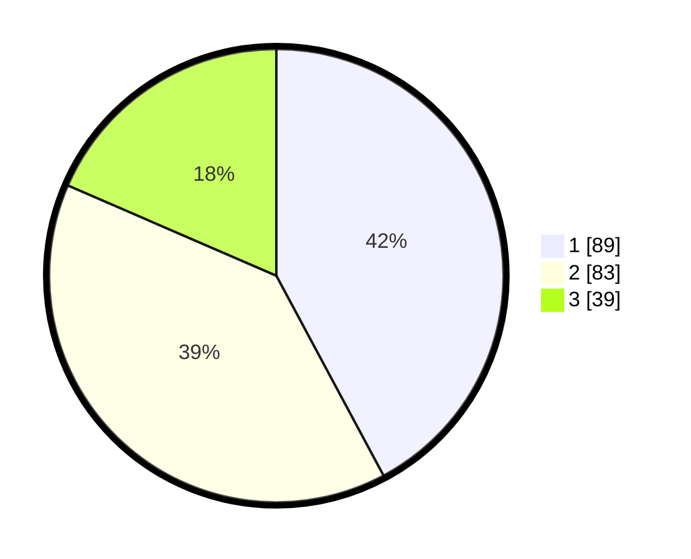

# Hasil

## Grafik

## Tabel

| No.    | Nama Paslon    | Suara | Suara (raw) | Persentase |
|:------ |:-------------- | -----:| -----------:| ----------:|
| 100025 | ANIES MUHAIMIN | 89    | [89][p-1]   | 42,18      |
| 100026 | PRABOWO GIBRAN | 83    | [83][p-2]   | 39,34      |
| 100027 | GANJAR MAHFUD  | 39    | [39][p-3]   | 18,48      |

[p-1]: https://github.com/gigit-pemilu/pemilu-2024/blob/main/pilpres/hitung-suara/sub/31-dki-jakarta/sub/75-jakarta-timur/sub/08-makasar/sub/1005-cipinang-melayu/sub/040-tps/sub/paslon-1.txt
[p-2]: https://github.com/gigit-pemilu/pemilu-2024/blob/main/pilpres/hitung-suara/sub/31-dki-jakarta/sub/75-jakarta-timur/sub/08-makasar/sub/1005-cipinang-melayu/sub/040-tps/sub/paslon-2.txt
[p-3]: https://github.com/gigit-pemilu/pemilu-2024/blob/main/pilpres/hitung-suara/sub/31-dki-jakarta/sub/75-jakarta-timur/sub/08-makasar/sub/1005-cipinang-melayu/sub/040-tps/sub/paslon-3.txt

## Foto C Plano

https://sirekap-obj-formc.kpu.go.id/7cab/pemilu/ppwp/31/75/08/10/05/3175081005040-20240214-212757--57b8a210-9384-4653-afc5-6a3f6360be96.jpg

https://sirekap-obj-formc.kpu.go.id/7cab/pemilu/ppwp/31/75/08/10/05/3175081005040-20240214-212849--a8eeb6c5-b811-40c5-a1c0-e66d782c160c.jpg

https://sirekap-obj-formc.kpu.go.id/7cab/pemilu/ppwp/31/75/08/10/05/3175081005040-20240214-212932--2730a07f-a7e2-48b5-aee2-f02ffc82cd5a.jpg

## Metadata

| Key        | Value               |
| ---------- | ------------------- |
| Time Stamp | 2024-02-15 12:00:28 |

