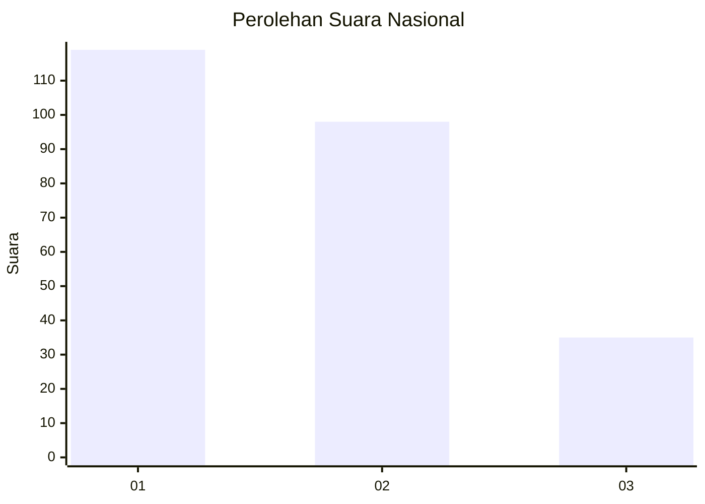
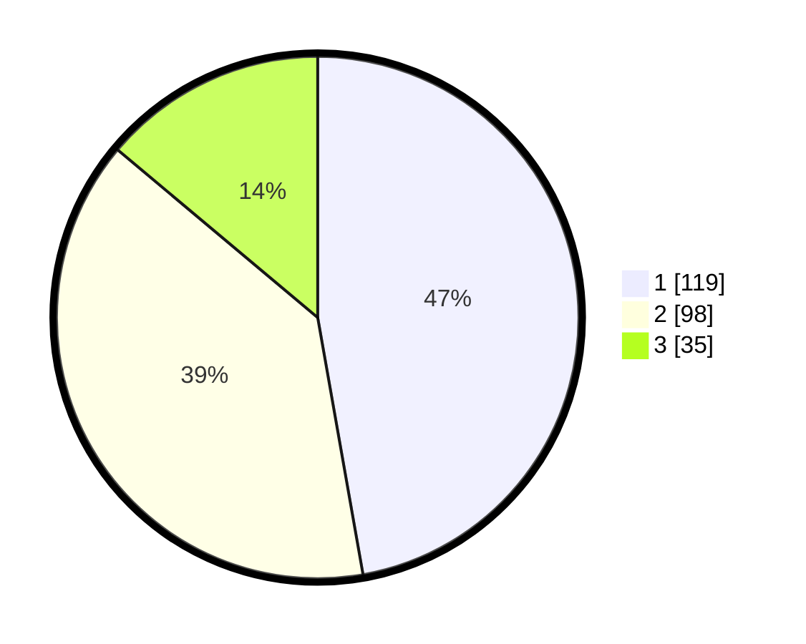

# Hasil

## Grafik

## Tabel

| No.    | Nama Paslon    | Suara | Suara (raw) | Persentase |
|:------ |:-------------- | -----:| -----------:| ----------:|
| 100025 | ANIES MUHAIMIN | 119   | [119][p-1]  | 47,22      |
| 100026 | PRABOWO GIBRAN | 98    | [98][p-2]   | 38,89      |
| 100027 | GANJAR MAHFUD  | 35    | [35][p-3]   | 13,89      |

[p-1]: https://github.com/gigit-pemilu/pemilu-2024/blob/main/pilpres/hitung-suara/sub/31-dki-jakarta/sub/75-jakarta-timur/sub/08-makasar/sub/1005-cipinang-melayu/sub/065-tps/sub/paslon-1.txt
[p-2]: https://github.com/gigit-pemilu/pemilu-2024/blob/main/pilpres/hitung-suara/sub/31-dki-jakarta/sub/75-jakarta-timur/sub/08-makasar/sub/1005-cipinang-melayu/sub/065-tps/sub/paslon-2.txt
[p-3]: https://github.com/gigit-pemilu/pemilu-2024/blob/main/pilpres/hitung-suara/sub/31-dki-jakarta/sub/75-jakarta-timur/sub/08-makasar/sub/1005-cipinang-melayu/sub/065-tps/sub/paslon-3.txt

## Foto C Plano

https://sirekap-obj-formc.kpu.go.id/b3ea/pemilu/ppwp/31/75/08/10/05/3175081005065-20240214-225238--d2abf702-c29d-4431-a1a5-745f07acfb44.jpg

https://sirekap-obj-formc.kpu.go.id/b3ea/pemilu/ppwp/31/75/08/10/05/3175081005065-20240214-225433--a03673db-df28-4ffe-8760-fee65f28c320.jpg

https://sirekap-obj-formc.kpu.go.id/b3ea/pemilu/ppwp/31/75/08/10/05/3175081005065-20240214-225557--1d2f96b1-6e2b-4a85-938a-9355429baecb.jpg

## Metadata

| Key        | Value               |
| ---------- | ------------------- |
| Time Stamp | 2024-02-15 12:00:28 |

