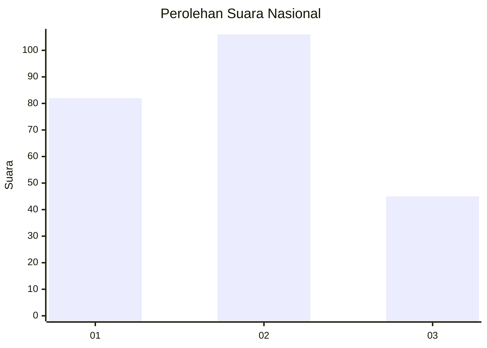
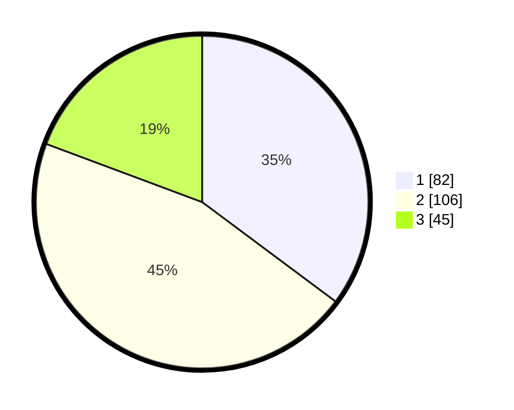

# Hasil

## Grafik

## Tabel

| No.    | Nama Paslon    | Suara | Suara (raw) | Persentase |
|:------ |:-------------- | -----:| -----------:| ----------:|
| 100025 | ANIES MUHAIMIN | 82    | [82][p-1]   | 35,19      |
| 100026 | PRABOWO GIBRAN | 106   | [106][p-2]  | 45,49      |
| 100027 | GANJAR MAHFUD  | 45    | [45][p-3]   | 19,31      |

[p-1]: https://github.com/gigit-pemilu/pemilu-2024/blob/main/pilpres/hitung-suara/sub/31-dki-jakarta/sub/75-jakarta-timur/sub/08-makasar/sub/1005-cipinang-melayu/sub/070-tps/sub/paslon-1.txt
[p-2]: https://github.com/gigit-pemilu/pemilu-2024/blob/main/pilpres/hitung-suara/sub/31-dki-jakarta/sub/75-jakarta-timur/sub/08-makasar/sub/1005-cipinang-melayu/sub/070-tps/sub/paslon-2.txt
[p-3]: https://github.com/gigit-pemilu/pemilu-2024/blob/main/pilpres/hitung-suara/sub/31-dki-jakarta/sub/75-jakarta-timur/sub/08-makasar/sub/1005-cipinang-melayu/sub/070-tps/sub/paslon-3.txt

## Foto C Plano

https://sirekap-obj-formc.kpu.go.id/4452/pemilu/ppwp/31/75/08/10/05/3175081005070-20240218-123140--13e67724-dab6-485b-ad69-5f566784307c.jpg

https://sirekap-obj-formc.kpu.go.id/4452/pemilu/ppwp/31/75/08/10/05/3175081005070-20240218-114438--ec7429e6-a274-46e4-84db-88b845c219c4.jpg

https://sirekap-obj-formc.kpu.go.id/4452/pemilu/ppwp/31/75/08/10/05/3175081005070-20240218-123420--60e00fef-4109-4f7a-8496-e1196c5d2090.jpg

## Metadata

| Key        | Value               |
| ---------- | ------------------- |
| Time Stamp | 2024-02-26 14:00:00 |

