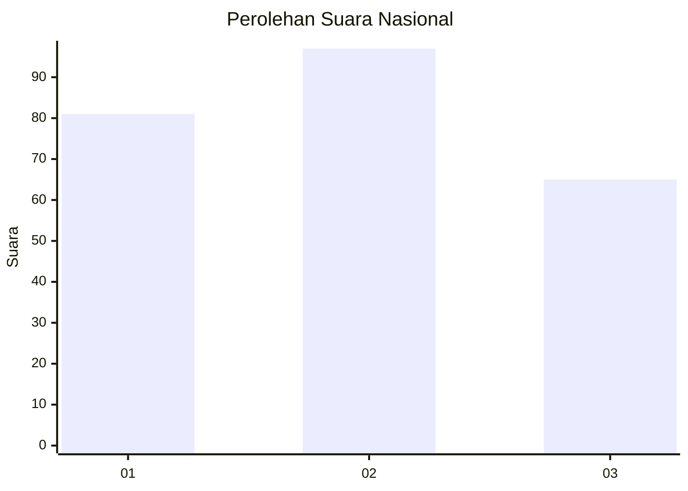
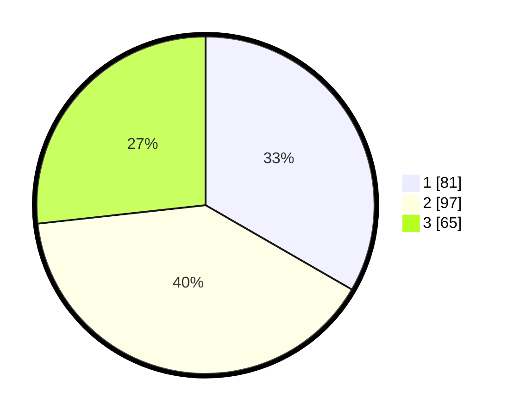

# Hasil

## Grafik

## Tabel

| No.    | Nama Paslon    | Suara | Suara (raw) | Persentase |
|:------ |:-------------- | -----:| -----------:| ----------:|
| 100025 | ANIES MUHAIMIN | 81    | [81][p-1]   | 33,33      |
| 100026 | PRABOWO GIBRAN | 97    | [97][p-2]   | 39,92      |
| 100027 | GANJAR MAHFUD  | 65    | [65][p-3]   | 26,75      |

[p-1]: https://github.com/gigit-pemilu/pemilu-2024/blob/main/pilpres/hitung-suara/sub/31-dki-jakarta/sub/75-jakarta-timur/sub/08-makasar/sub/1005-cipinang-melayu/sub/072-tps/sub/paslon-1.txt
[p-2]: https://github.com/gigit-pemilu/pemilu-2024/blob/main/pilpres/hitung-suara/sub/31-dki-jakarta/sub/75-jakarta-timur/sub/08-makasar/sub/1005-cipinang-melayu/sub/072-tps/sub/paslon-2.txt
[p-3]: https://github.com/gigit-pemilu/pemilu-2024/blob/main/pilpres/hitung-suara/sub/31-dki-jakarta/sub/75-jakarta-timur/sub/08-makasar/sub/1005-cipinang-melayu/sub/072-tps/sub/paslon-3.txt

## Foto C Plano

https://sirekap-obj-formc.kpu.go.id/8748/pemilu/ppwp/31/75/08/10/05/3175081005072-20240214-202003--94cb56ce-4703-4eaf-b872-6e9f8a7dc5ff.jpg

https://sirekap-obj-formc.kpu.go.id/8748/pemilu/ppwp/31/75/08/10/05/3175081005072-20240214-202252--44812968-c647-4364-b642-8e83f43a6322.jpg

https://sirekap-obj-formc.kpu.go.id/8748/pemilu/ppwp/31/75/08/10/05/3175081005072-20240214-202358--09aaa8d2-c3fc-42c3-8887-ab19b415734a.jpg

## Metadata

| Key        | Value               |
| ---------- | ------------------- |
| Time Stamp | 2024-02-15 12:00:28 |

