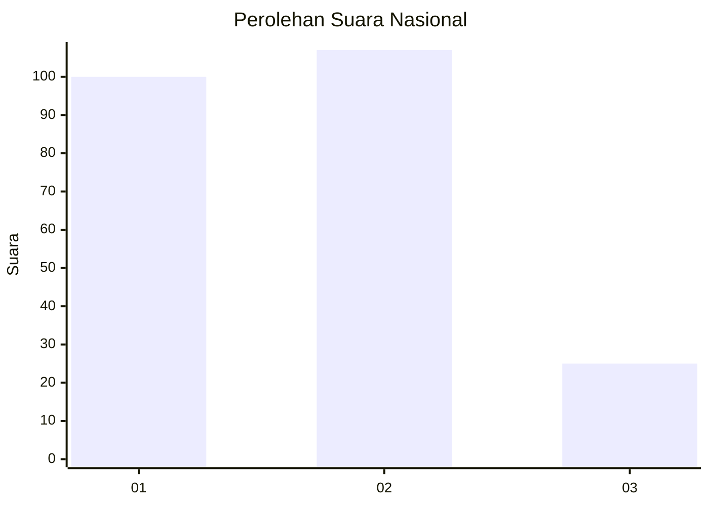
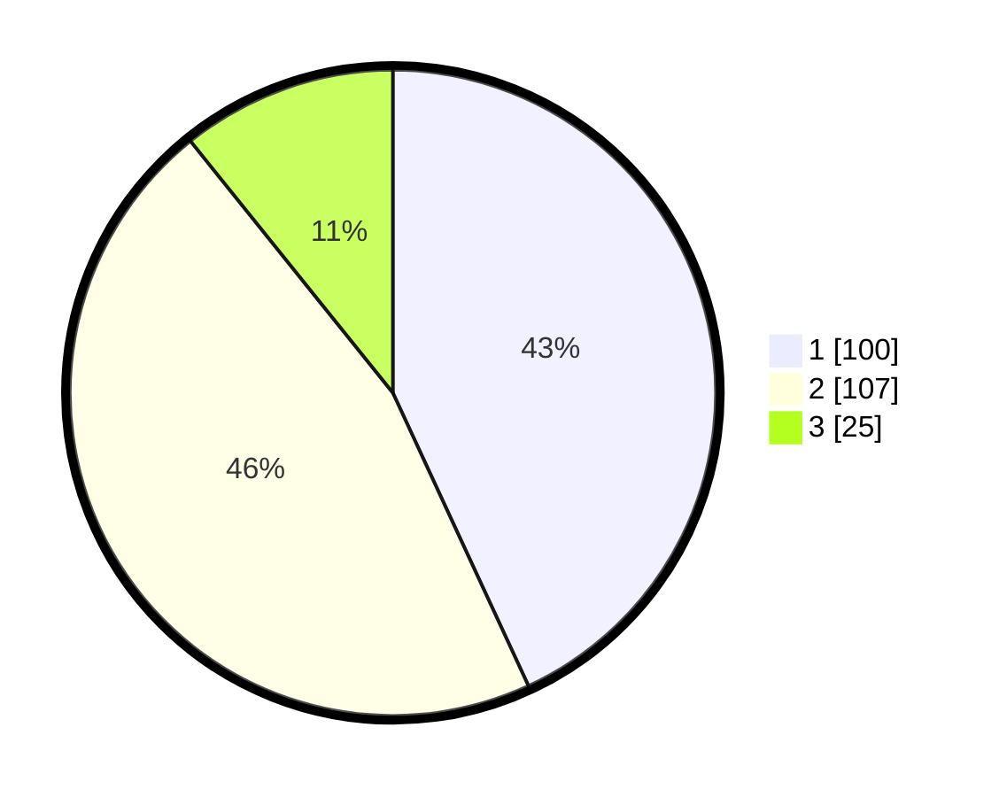

# Hasil

## Grafik

## Tabel

| No.    | Nama Paslon    | Suara | Suara (raw) | Persentase |
|:------ |:-------------- | -----:| -----------:| ----------:|
| 100025 | ANIES MUHAIMIN | 100   | [100][p-1]  | 43,10      |
| 100026 | PRABOWO GIBRAN | 107   | [107][p-2]  | 46,12      |
| 100027 | GANJAR MAHFUD  | 25    | [25][p-3]   | 10,78      |

[p-1]: https://github.com/gigit-pemilu/pemilu-2024/blob/main/pilpres/hitung-suara/sub/31-dki-jakarta/sub/75-jakarta-timur/sub/08-makasar/sub/1005-cipinang-melayu/sub/094-tps/sub/paslon-1.txt
[p-2]: https://github.com/gigit-pemilu/pemilu-2024/blob/main/pilpres/hitung-suara/sub/31-dki-jakarta/sub/75-jakarta-timur/sub/08-makasar/sub/1005-cipinang-melayu/sub/094-tps/sub/paslon-2.txt
[p-3]: https://github.com/gigit-pemilu/pemilu-2024/blob/main/pilpres/hitung-suara/sub/31-dki-jakarta/sub/75-jakarta-timur/sub/08-makasar/sub/1005-cipinang-melayu/sub/094-tps/sub/paslon-3.txt

## Foto C Plano

https://sirekap-obj-formc.kpu.go.id/82c2/pemilu/ppwp/31/75/08/10/05/3175081005094-20240214-221820--9001c88f-66e2-4779-a75b-47b964c2560d.jpg

https://sirekap-obj-formc.kpu.go.id/82c2/pemilu/ppwp/31/75/08/10/05/3175081005094-20240214-221914--5509880a-ddc0-426a-90b1-0dc2b36506d5.jpg

https://sirekap-obj-formc.kpu.go.id/82c2/pemilu/ppwp/31/75/08/10/05/3175081005094-20240214-222318--99c34d51-4bb5-4f83-aa5e-5349c9f45cf2.jpg

## Metadata

| Key        | Value               |
| ---------- | ------------------- |
| Time Stamp | 2024-02-15 12:00:28 |

