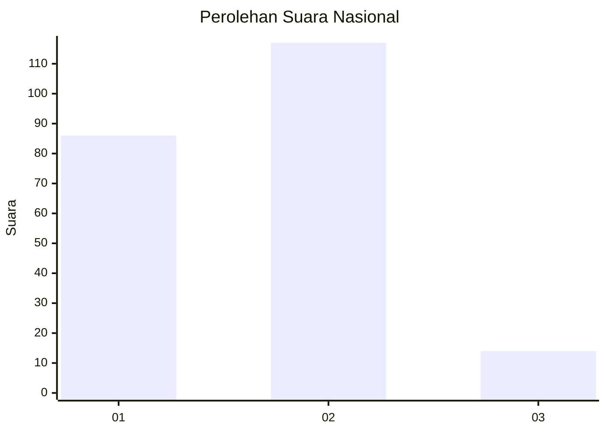

# Hasil

## Grafik

## Tabel

| No.    | Nama Paslon    | Suara | Suara (raw) | Persentase |
|:------ |:-------------- | -----:| -----------:| ----------:|
| 100025 | ANIES MUHAIMIN | 86    | [86][p-1]   | 39,63      |
| 100026 | PRABOWO GIBRAN | 117   | [117][p-2]  | 53,92      |
| 100027 | GANJAR MAHFUD  | 14    | [14][p-3]   | 6,45       |

[p-1]: https://github.com/gigit-pemilu/pemilu-2024/blob/main/pilpres/hitung-suara/sub/31-dki-jakarta/sub/75-jakarta-timur/sub/08-makasar/sub/1005-cipinang-melayu/sub/108-tps/sub/paslon-1.txt
[p-2]: https://github.com/gigit-pemilu/pemilu-2024/blob/main/pilpres/hitung-suara/sub/31-dki-jakarta/sub/75-jakarta-timur/sub/08-makasar/sub/1005-cipinang-melayu/sub/108-tps/sub/paslon-2.txt
[p-3]: https://github.com/gigit-pemilu/pemilu-2024/blob/main/pilpres/hitung-suara/sub/31-dki-jakarta/sub/75-jakarta-timur/sub/08-makasar/sub/1005-cipinang-melayu/sub/108-tps/sub/paslon-3.txt

## Foto C Plano

https://sirekap-obj-formc.kpu.go.id/449c/pemilu/ppwp/31/75/08/10/05/3175081005108-20240214-220508--fcfeecb3-6893-430d-ac99-0d1de4338749.jpg

https://sirekap-obj-formc.kpu.go.id/449c/pemilu/ppwp/31/75/08/10/05/3175081005108-20240214-214836--e1cb329b-eb4c-4368-a46d-8ff859a4507f.jpg

https://sirekap-obj-formc.kpu.go.id/449c/pemilu/ppwp/31/75/08/10/05/3175081005108-20240214-215454--ba6ac496-23c7-4312-a476-ae3e3b70b132.jpg

## Metadata

| Key        | Value               |
| ---------- | ------------------- |
| Time Stamp | 2024-02-16 21:01:00 |

