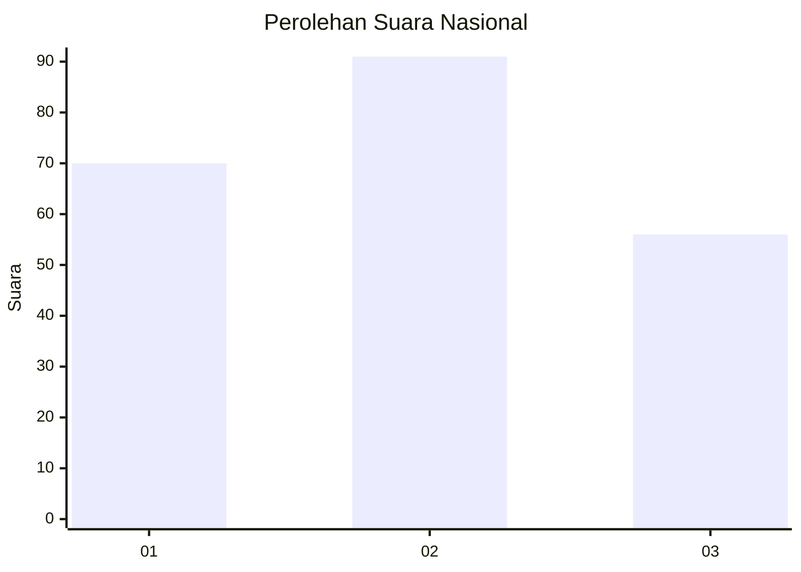
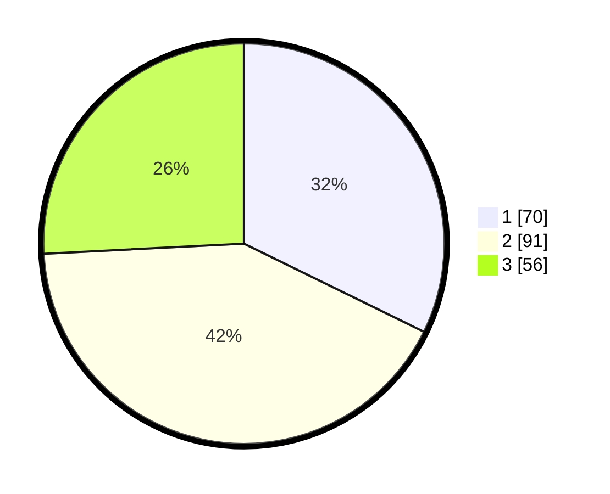

# Hasil

## Grafik

## Tabel

| No.    | Nama Paslon    | Suara | Suara (raw) | Persentase |
|:------ |:-------------- | -----:| -----------:| ----------:|
| 100025 | ANIES MUHAIMIN | 70    | [70][p-1]   | 32,26      |
| 100026 | PRABOWO GIBRAN | 91    | [91][p-2]   | 41,94      |
| 100027 | GANJAR MAHFUD  | 56    | [56][p-3]   | 25,81      |

[p-1]: https://github.com/gigit-pemilu/pemilu-2024/blob/main/pilpres/hitung-suara/sub/31-dki-jakarta/sub/75-jakarta-timur/sub/08-makasar/sub/1005-cipinang-melayu/sub/112-tps/sub/paslon-1.txt
[p-2]: https://github.com/gigit-pemilu/pemilu-2024/blob/main/pilpres/hitung-suara/sub/31-dki-jakarta/sub/75-jakarta-timur/sub/08-makasar/sub/1005-cipinang-melayu/sub/112-tps/sub/paslon-2.txt
[p-3]: https://github.com/gigit-pemilu/pemilu-2024/blob/main/pilpres/hitung-suara/sub/31-dki-jakarta/sub/75-jakarta-timur/sub/08-makasar/sub/1005-cipinang-melayu/sub/112-tps/sub/paslon-3.txt

## Foto C Plano

https://sirekap-obj-formc.kpu.go.id/02f1/pemilu/ppwp/31/75/08/10/05/3175081005112-20240214-201423--46d883f7-d98e-4c03-af56-0475fa103c99.jpg

https://sirekap-obj-formc.kpu.go.id/02f1/pemilu/ppwp/31/75/08/10/05/3175081005112-20240214-201412--0e6e7e32-e1d6-412d-8703-af689ff11889.jpg

https://sirekap-obj-formc.kpu.go.id/02f1/pemilu/ppwp/31/75/08/10/05/3175081005112-20240214-201506--32748426-3bf0-4fbc-aed8-18dc614f7af8.jpg

## Metadata

| Key        | Value               |
| ---------- | ------------------- |
| Time Stamp | 2024-02-15 12:00:28 |

