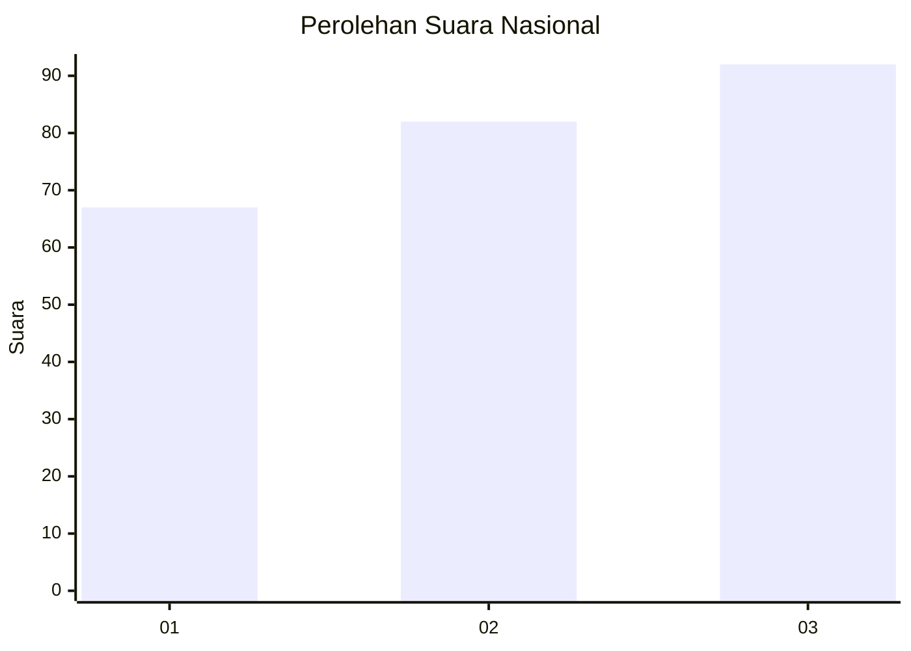
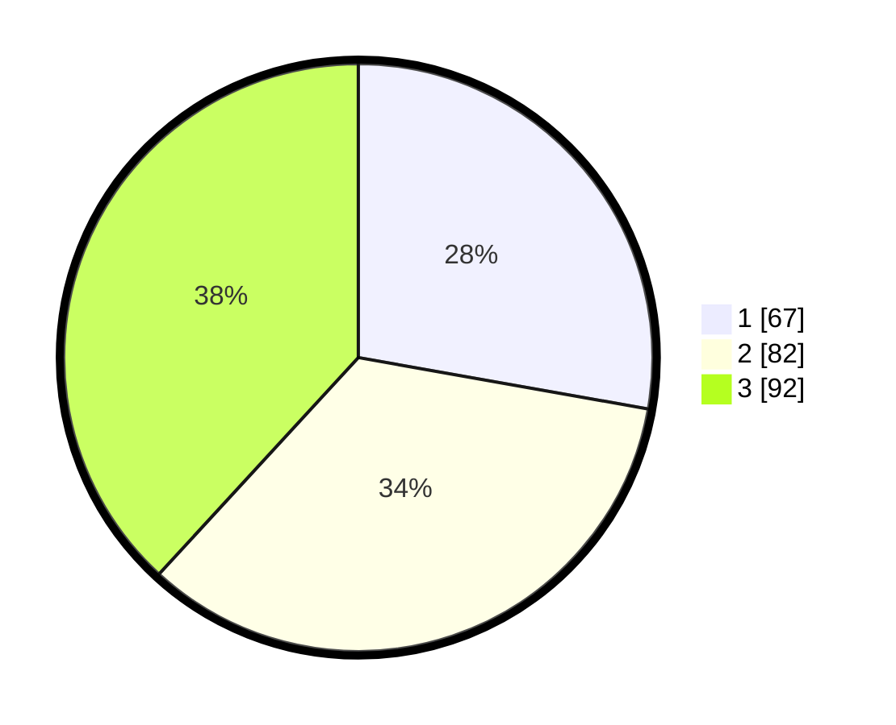

# Hasil

## Grafik

## Tabel

| No.    | Nama Paslon    | Suara | Suara (raw) | Persentase |
|:------ |:-------------- | -----:| -----------:| ----------:|
| 100025 | ANIES MUHAIMIN | 67    | [67][p-1]   | 27,80      |
| 100026 | PRABOWO GIBRAN | 82    | [82][p-2]   | 34,02      |
| 100027 | GANJAR MAHFUD  | 92    | [92][p-3]   | 38,17      |

[p-1]: https://github.com/gigit-pemilu/pemilu-2024/blob/main/pilpres/hitung-suara/sub/31-dki-jakarta/sub/75-jakarta-timur/sub/08-makasar/sub/1005-cipinang-melayu/sub/117-tps/sub/paslon-1.txt
[p-2]: https://github.com/gigit-pemilu/pemilu-2024/blob/main/pilpres/hitung-suara/sub/31-dki-jakarta/sub/75-jakarta-timur/sub/08-makasar/sub/1005-cipinang-melayu/sub/117-tps/sub/paslon-2.txt
[p-3]: https://github.com/gigit-pemilu/pemilu-2024/blob/main/pilpres/hitung-suara/sub/31-dki-jakarta/sub/75-jakarta-timur/sub/08-makasar/sub/1005-cipinang-melayu/sub/117-tps/sub/paslon-3.txt

## Foto C Plano

https://sirekap-obj-formc.kpu.go.id/613d/pemilu/ppwp/31/75/08/10/05/3175081005117-20240214-220816--a248f8ee-392d-4f00-a928-79dddc2ad299.jpg

https://sirekap-obj-formc.kpu.go.id/613d/pemilu/ppwp/31/75/08/10/05/3175081005117-20240214-211603--70864a4f-a00c-494f-b305-0a67d85b907f.jpg

https://sirekap-obj-formc.kpu.go.id/613d/pemilu/ppwp/31/75/08/10/05/3175081005117-20240214-220936--020ac73b-d116-4fde-abfb-04350f11e893.jpg

## Metadata

| Key        | Value               |
| ---------- | ------------------- |
| Time Stamp | 2024-02-19 06:16:00 |

