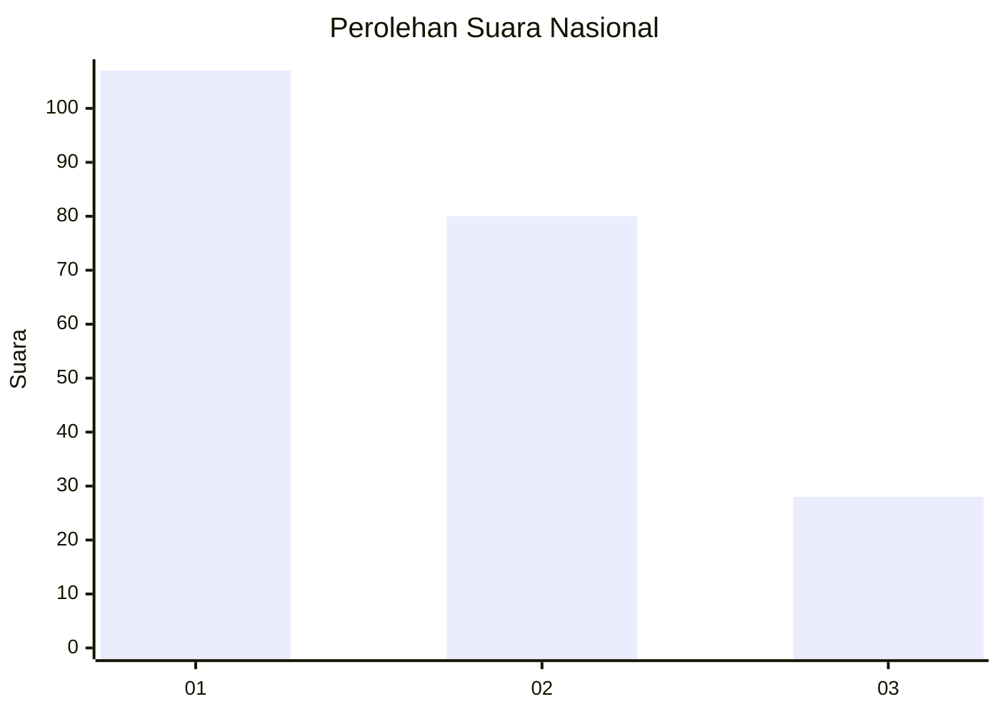
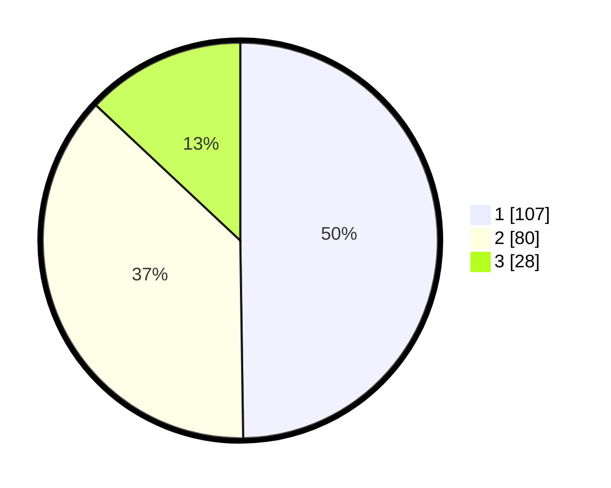

# Hasil

## Grafik

## Tabel

| No.    | Nama Paslon    | Suara | Suara (raw) | Persentase |
|:------ |:-------------- | -----:| -----------:| ----------:|
| 100025 | ANIES MUHAIMIN | 107   | [107][p-1]  | 49,77      |
| 100026 | PRABOWO GIBRAN | 80    | [80][p-2]   | 37,21      |
| 100027 | GANJAR MAHFUD  | 28    | [28][p-3]   | 13,02      |

[p-1]: https://github.com/gigit-pemilu/pemilu-2024/blob/main/pilpres/hitung-suara/sub/31-dki-jakarta/sub/75-jakarta-timur/sub/08-makasar/sub/1005-cipinang-melayu/sub/119-tps/sub/paslon-1.txt
[p-2]: https://github.com/gigit-pemilu/pemilu-2024/blob/main/pilpres/hitung-suara/sub/31-dki-jakarta/sub/75-jakarta-timur/sub/08-makasar/sub/1005-cipinang-melayu/sub/119-tps/sub/paslon-2.txt
[p-3]: https://github.com/gigit-pemilu/pemilu-2024/blob/main/pilpres/hitung-suara/sub/31-dki-jakarta/sub/75-jakarta-timur/sub/08-makasar/sub/1005-cipinang-melayu/sub/119-tps/sub/paslon-3.txt

## Foto C Plano

https://sirekap-obj-formc.kpu.go.id/b92b/pemilu/ppwp/31/75/08/10/05/3175081005119-20240215-020129--f4ad92d2-f819-4513-8f41-48549c754b63.jpg

https://sirekap-obj-formc.kpu.go.id/b92b/pemilu/ppwp/31/75/08/10/05/3175081005119-20240215-020253--22fbb60d-1bee-4bd8-976e-b844a8b0620f.jpg

https://sirekap-obj-formc.kpu.go.id/b92b/pemilu/ppwp/31/75/08/10/05/3175081005119-20240215-020340--824e43a1-a0f0-4b3d-b8be-b07999ef654d.jpg

## Metadata

| Key        | Value               |
| ---------- | ------------------- |
| Time Stamp | 2024-02-15 15:00:29 |

