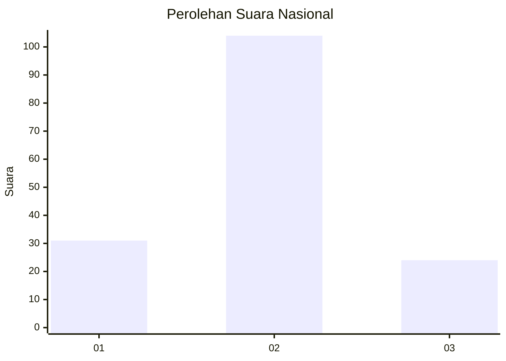
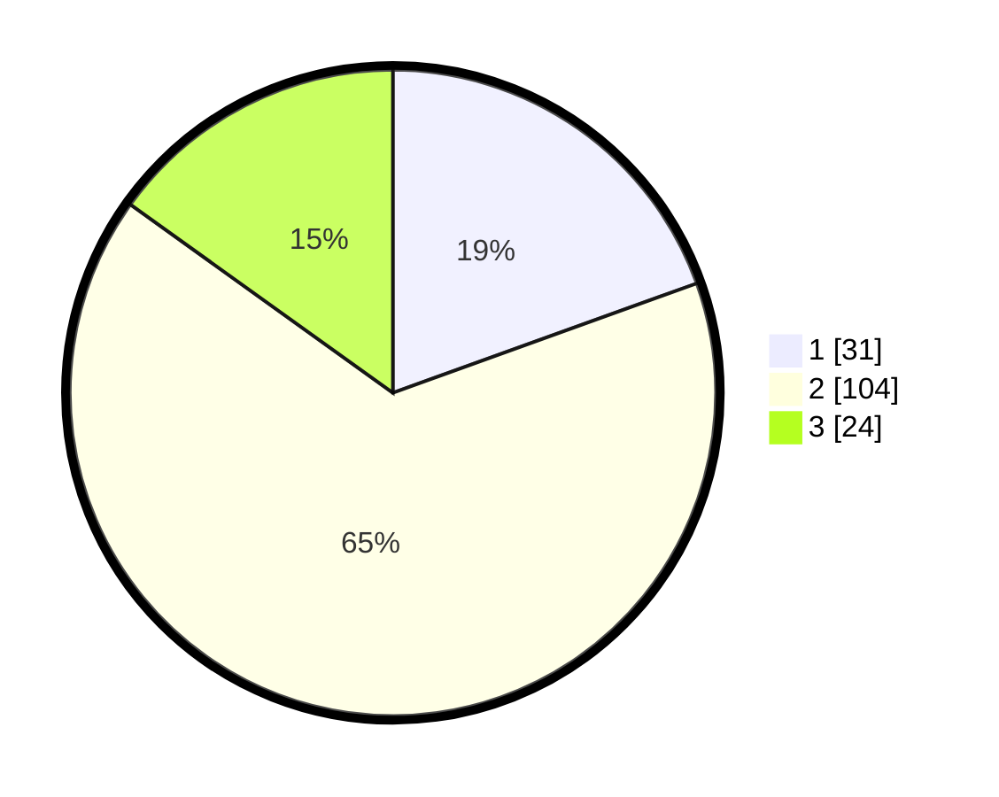

# Hasil

## Grafik

## Tabel

| No.    | Nama Paslon    | Suara | Suara (raw) | Persentase |
|:------ |:-------------- | -----:| -----------:| ----------:|
| 100025 | ANIES MUHAIMIN | 31    | [31][p-1]   | 19,50      |
| 100026 | PRABOWO GIBRAN | 104   | [104][p-2]  | 65,41      |
| 100027 | GANJAR MAHFUD  | 24    | [24][p-3]   | 15,09      |

[p-1]: https://github.com/gigit-pemilu/pemilu-2024/blob/main/pilpres/hitung-suara/sub/31-dki-jakarta/sub/75-jakarta-timur/sub/09-ciracas/sub/1001-ciracas/sub/004-tps/sub/paslon-1.txt
[p-2]: https://github.com/gigit-pemilu/pemilu-2024/blob/main/pilpres/hitung-suara/sub/31-dki-jakarta/sub/75-jakarta-timur/sub/09-ciracas/sub/1001-ciracas/sub/004-tps/sub/paslon-2.txt
[p-3]: https://github.com/gigit-pemilu/pemilu-2024/blob/main/pilpres/hitung-suara/sub/31-dki-jakarta/sub/75-jakarta-timur/sub/09-ciracas/sub/1001-ciracas/sub/004-tps/sub/paslon-3.txt

## Foto C Plano

https://sirekap-obj-formc.kpu.go.id/7b6e/pemilu/ppwp/31/75/09/10/01/3175091001004-20240214-221401--28bde513-14ff-49fa-862b-9ff2e8b85db4.jpg

https://sirekap-obj-formc.kpu.go.id/7b6e/pemilu/ppwp/31/75/09/10/01/3175091001004-20240214-221444--db7fe9d8-32d0-4988-9efa-e888bf2e5677.jpg

https://sirekap-obj-formc.kpu.go.id/7b6e/pemilu/ppwp/31/75/09/10/01/3175091001004-20240214-221523--119b9db2-ba8d-4ce8-8e11-d0a42cbb5a92.jpg

## Metadata

| Key        | Value               |
| ---------- | ------------------- |
| Time Stamp | 2024-02-15 12:00:28 |

