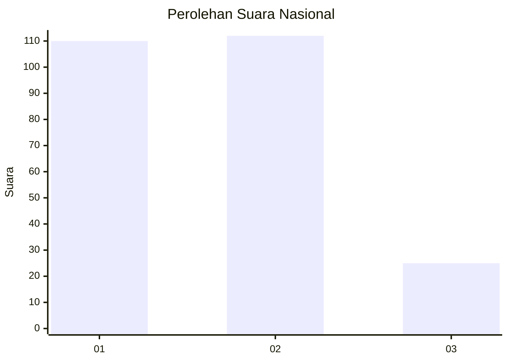
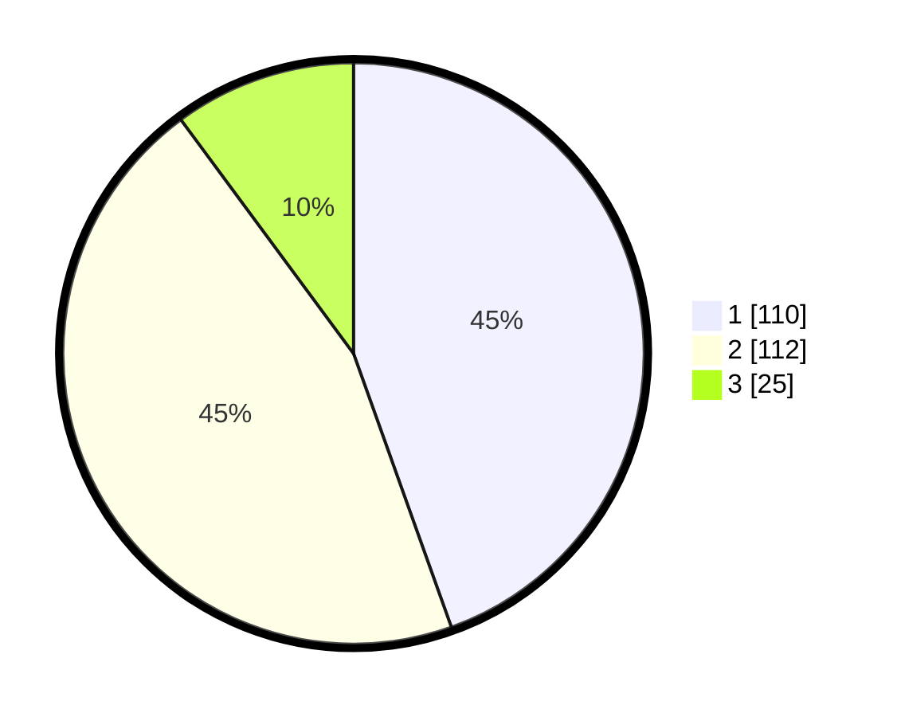

# Hasil

## Grafik

## Tabel

| No.    | Nama Paslon    | Suara | Suara (raw) | Persentase |
|:------ |:-------------- | -----:| -----------:| ----------:|
| 100025 | ANIES MUHAIMIN | 110   | [110][p-1]  | 44,53      |
| 100026 | PRABOWO GIBRAN | 112   | [112][p-2]  | 45,34      |
| 100027 | GANJAR MAHFUD  | 25    | [25][p-3]   | 10,12      |

[p-1]: https://github.com/gigit-pemilu/pemilu-2024/blob/main/pilpres/hitung-suara/sub/31-dki-jakarta/sub/75-jakarta-timur/sub/09-ciracas/sub/1001-ciracas/sub/011-tps/sub/paslon-1.txt
[p-2]: https://github.com/gigit-pemilu/pemilu-2024/blob/main/pilpres/hitung-suara/sub/31-dki-jakarta/sub/75-jakarta-timur/sub/09-ciracas/sub/1001-ciracas/sub/011-tps/sub/paslon-2.txt
[p-3]: https://github.com/gigit-pemilu/pemilu-2024/blob/main/pilpres/hitung-suara/sub/31-dki-jakarta/sub/75-jakarta-timur/sub/09-ciracas/sub/1001-ciracas/sub/011-tps/sub/paslon-3.txt

## Foto C Plano

https://sirekap-obj-formc.kpu.go.id/94d0/pemilu/ppwp/31/75/09/10/01/3175091001011-20240214-160058--7241e30b-861b-4a3d-b4db-b55c0ab79cb4.jpg

https://sirekap-obj-formc.kpu.go.id/94d0/pemilu/ppwp/31/75/09/10/01/3175091001011-20240214-155846--44cb95cd-d04a-4bf3-8ee5-7ee34186006b.jpg

https://sirekap-obj-formc.kpu.go.id/94d0/pemilu/ppwp/31/75/09/10/01/3175091001011-20240214-160107--e54c65fb-32e7-48dc-8af1-6e5257d9151a.jpg

## Metadata

| Key        | Value               |
| ---------- | ------------------- |
| Time Stamp | 2024-02-15 16:30:25 |

