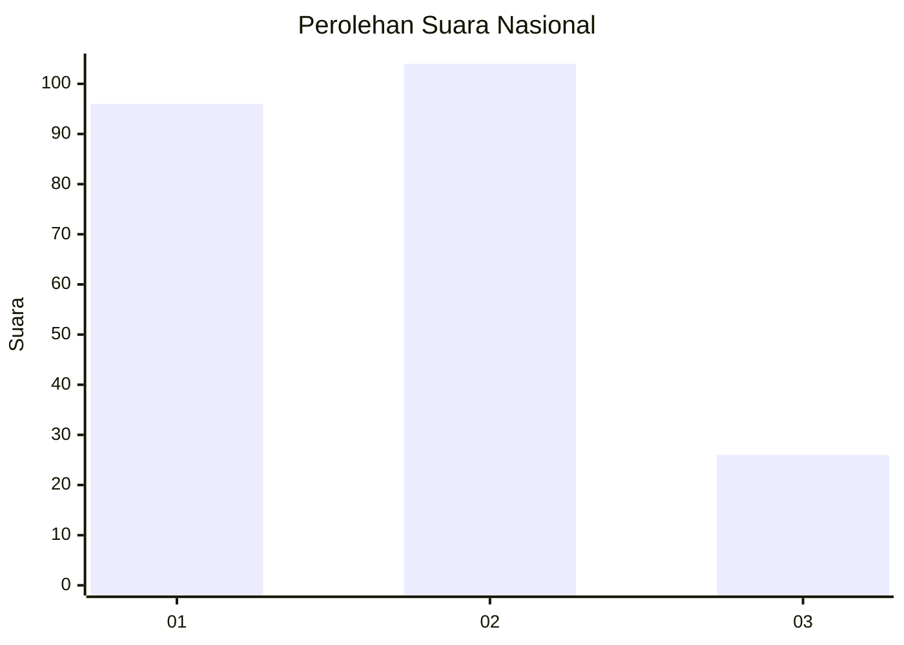
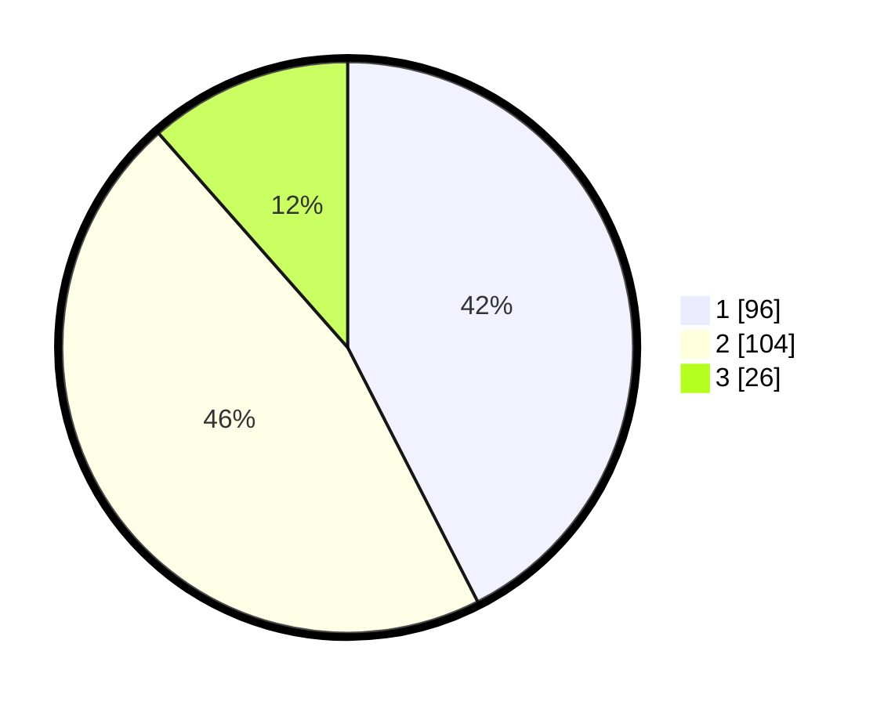

# Hasil

## Grafik

## Tabel

| No.    | Nama Paslon    | Suara | Suara (raw) | Persentase |
|:------ |:-------------- | -----:| -----------:| ----------:|
| 100025 | ANIES MUHAIMIN | 96    | [96][p-1]   | 42,48      |
| 100026 | PRABOWO GIBRAN | 104   | [104][p-2]  | 46,02      |
| 100027 | GANJAR MAHFUD  | 26    | [26][p-3]   | 11,50      |

[p-1]: https://github.com/gigit-pemilu/pemilu-2024/blob/main/pilpres/hitung-suara/sub/31-dki-jakarta/sub/75-jakarta-timur/sub/09-ciracas/sub/1001-ciracas/sub/012-tps/sub/paslon-1.txt
[p-2]: https://github.com/gigit-pemilu/pemilu-2024/blob/main/pilpres/hitung-suara/sub/31-dki-jakarta/sub/75-jakarta-timur/sub/09-ciracas/sub/1001-ciracas/sub/012-tps/sub/paslon-2.txt
[p-3]: https://github.com/gigit-pemilu/pemilu-2024/blob/main/pilpres/hitung-suara/sub/31-dki-jakarta/sub/75-jakarta-timur/sub/09-ciracas/sub/1001-ciracas/sub/012-tps/sub/paslon-3.txt

## Foto C Plano

https://sirekap-obj-formc.kpu.go.id/c4c6/pemilu/ppwp/31/75/09/10/01/3175091001012-20240215-000223--abd60254-0c23-4bfb-93da-a9dc1b01afcd.jpg

https://sirekap-obj-formc.kpu.go.id/c4c6/pemilu/ppwp/31/75/09/10/01/3175091001012-20240215-000535--05e707b1-2ab8-45d1-a2cb-0a237adb00d9.jpg

https://sirekap-obj-formc.kpu.go.id/c4c6/pemilu/ppwp/31/75/09/10/01/3175091001012-20240221-200428--cb313156-d15c-4e91-8770-e44e2957ddb9.jpg

## Metadata

| Key        | Value               |
| ---------- | ------------------- |
| Time Stamp | 2024-02-21 21:00:04 |

