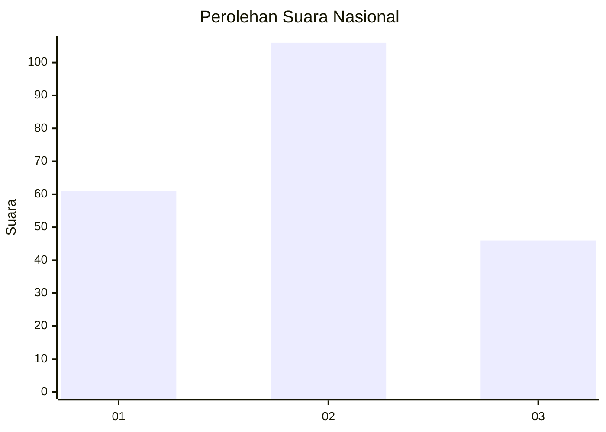
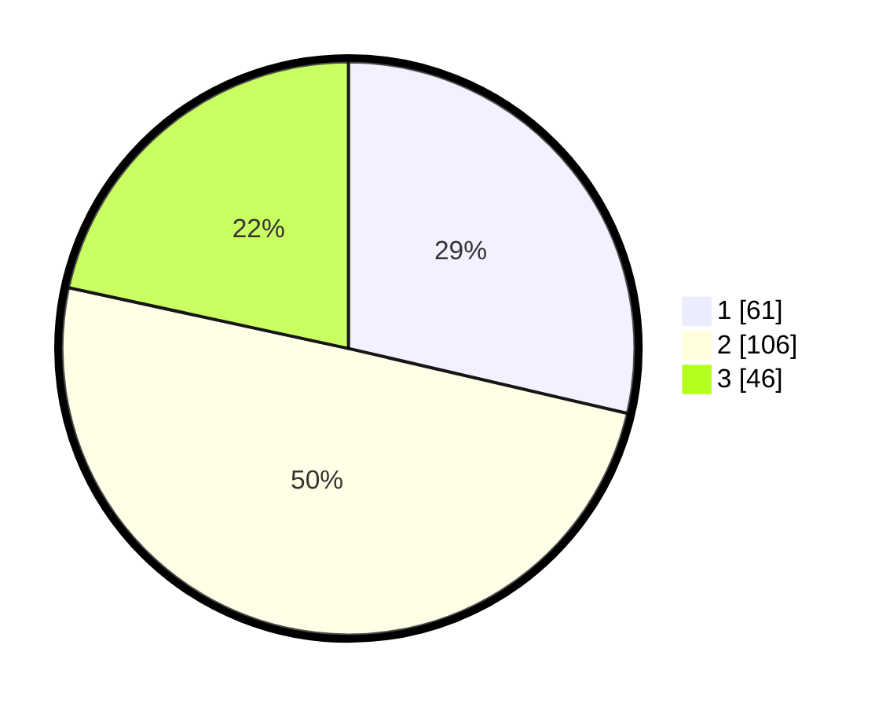

# Hasil

## Grafik

## Tabel

| No.    | Nama Paslon    | Suara | Suara (raw) | Persentase |
|:------ |:-------------- | -----:| -----------:| ----------:|
| 100025 | ANIES MUHAIMIN | 61    | [61][p-1]   | 28,64      |
| 100026 | PRABOWO GIBRAN | 106   | [106][p-2]  | 49,77      |
| 100027 | GANJAR MAHFUD  | 46    | [46][p-3]   | 21,60      |

[p-1]: https://github.com/gigit-pemilu/pemilu-2024/blob/main/pilpres/hitung-suara/sub/31-dki-jakarta/sub/75-jakarta-timur/sub/09-ciracas/sub/1001-ciracas/sub/021-tps/sub/paslon-1.txt
[p-2]: https://github.com/gigit-pemilu/pemilu-2024/blob/main/pilpres/hitung-suara/sub/31-dki-jakarta/sub/75-jakarta-timur/sub/09-ciracas/sub/1001-ciracas/sub/021-tps/sub/paslon-2.txt
[p-3]: https://github.com/gigit-pemilu/pemilu-2024/blob/main/pilpres/hitung-suara/sub/31-dki-jakarta/sub/75-jakarta-timur/sub/09-ciracas/sub/1001-ciracas/sub/021-tps/sub/paslon-3.txt

## Foto C Plano

https://sirekap-obj-formc.kpu.go.id/3267/pemilu/ppwp/31/75/09/10/01/3175091001021-20240214-205006--1e07e68d-40fc-43e1-9c06-578f544602de.jpg

https://sirekap-obj-formc.kpu.go.id/3267/pemilu/ppwp/31/75/09/10/01/3175091001021-20240214-205135--99a13f7d-84fb-4c3b-b9d3-d47613eb6b56.jpg

https://sirekap-obj-formc.kpu.go.id/3267/pemilu/ppwp/31/75/09/10/01/3175091001021-20240214-205850--74625680-3289-45db-823e-f70229b2a653.jpg

## Metadata

| Key        | Value               |
| ---------- | ------------------- |
| Time Stamp | 2024-02-25 17:00:00 |

