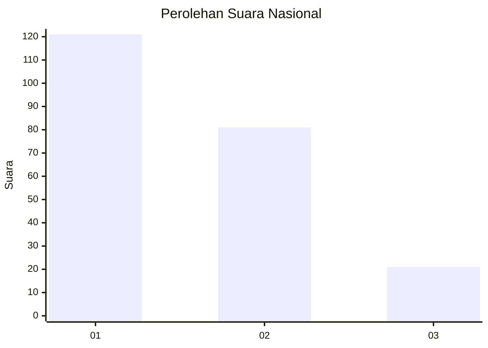
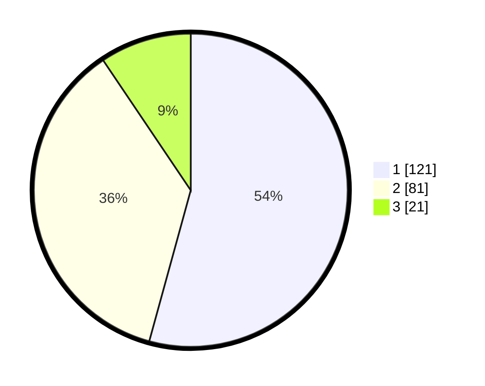

# Hasil

## Grafik

## Tabel

| No.    | Nama Paslon    | Suara | Suara (raw) | Persentase |
|:------ |:-------------- | -----:| -----------:| ----------:|
| 100025 | ANIES MUHAIMIN | 121   | [121][p-1]  | 54,26      |
| 100026 | PRABOWO GIBRAN | 81    | [81][p-2]   | 36,32      |
| 100027 | GANJAR MAHFUD  | 21    | [21][p-3]   | 9,42       |

[p-1]: https://github.com/gigit-pemilu/pemilu-2024/blob/main/pilpres/hitung-suara/sub/31-dki-jakarta/sub/75-jakarta-timur/sub/09-ciracas/sub/1001-ciracas/sub/042-tps/sub/paslon-1.txt
[p-2]: https://github.com/gigit-pemilu/pemilu-2024/blob/main/pilpres/hitung-suara/sub/31-dki-jakarta/sub/75-jakarta-timur/sub/09-ciracas/sub/1001-ciracas/sub/042-tps/sub/paslon-2.txt
[p-3]: https://github.com/gigit-pemilu/pemilu-2024/blob/main/pilpres/hitung-suara/sub/31-dki-jakarta/sub/75-jakarta-timur/sub/09-ciracas/sub/1001-ciracas/sub/042-tps/sub/paslon-3.txt

## Foto C Plano

https://sirekap-obj-formc.kpu.go.id/142d/pemilu/ppwp/31/75/09/10/01/3175091001042-20240217-105604--d393b662-7da8-457c-ae8f-c5745c28ac81.jpg

https://sirekap-obj-formc.kpu.go.id/142d/pemilu/ppwp/31/75/09/10/01/3175091001042-20240216-105158--5e43cd6d-ecc0-4337-9b9e-d69bfc72fb50.jpg

https://sirekap-obj-formc.kpu.go.id/142d/pemilu/ppwp/31/75/09/10/01/3175091001042-20240216-203408--18103841-c547-41d3-89f3-40e98aa7b14e.jpg

## Metadata

| Key        | Value               |
| ---------- | ------------------- |
| Time Stamp | 2024-02-17 11:00:02 |

