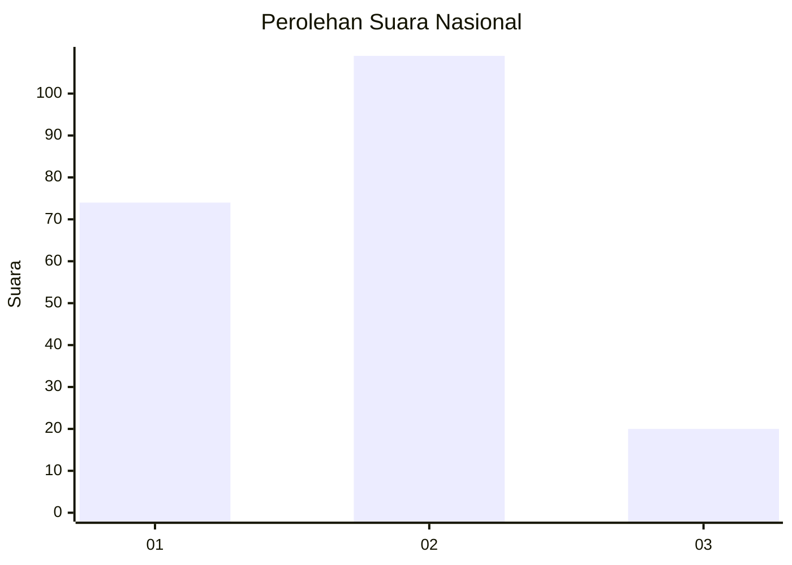

# Hasil

## Grafik

## Tabel

| No.    | Nama Paslon    | Suara | Suara (raw) | Persentase |
|:------ |:-------------- | -----:| -----------:| ----------:|
| 100025 | ANIES MUHAIMIN | 74    | [74][p-1]   | 36,45      |
| 100026 | PRABOWO GIBRAN | 109   | [109][p-2]  | 53,69      |
| 100027 | GANJAR MAHFUD  | 20    | [20][p-3]   | 9,85       |

[p-1]: https://github.com/gigit-pemilu/pemilu-2024/blob/main/pilpres/hitung-suara/sub/31-dki-jakarta/sub/75-jakarta-timur/sub/09-ciracas/sub/1001-ciracas/sub/059-tps/sub/paslon-1.txt
[p-2]: https://github.com/gigit-pemilu/pemilu-2024/blob/main/pilpres/hitung-suara/sub/31-dki-jakarta/sub/75-jakarta-timur/sub/09-ciracas/sub/1001-ciracas/sub/059-tps/sub/paslon-2.txt
[p-3]: https://github.com/gigit-pemilu/pemilu-2024/blob/main/pilpres/hitung-suara/sub/31-dki-jakarta/sub/75-jakarta-timur/sub/09-ciracas/sub/1001-ciracas/sub/059-tps/sub/paslon-3.txt

## Foto C Plano

https://sirekap-obj-formc.kpu.go.id/6cc3/pemilu/ppwp/31/75/09/10/01/3175091001059-20240214-195656--857706c9-ea1c-44d2-a61c-f9bcd09a3973.jpg

https://sirekap-obj-formc.kpu.go.id/6cc3/pemilu/ppwp/31/75/09/10/01/3175091001059-20240214-195820--cc771db2-c152-4ab1-8b5f-50f6e9fb3eb3.jpg

https://sirekap-obj-formc.kpu.go.id/6cc3/pemilu/ppwp/31/75/09/10/01/3175091001059-20240214-200241--b0033881-4623-44a3-806b-99bc2cdd5a39.jpg

## Metadata

| Key        | Value               |
| ---------- | ------------------- |
| Time Stamp | 2024-02-19 06:16:00 |

