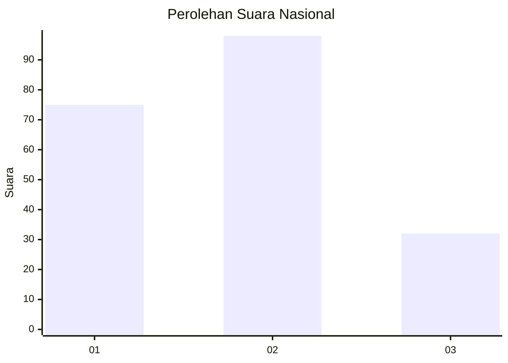
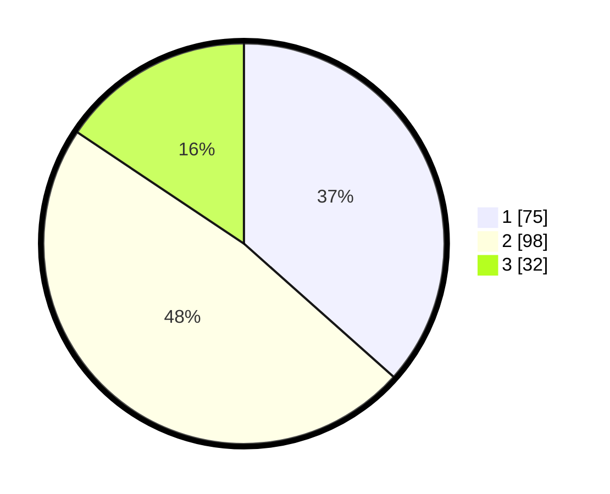

# Hasil

## Grafik

## Tabel

| No.    | Nama Paslon    | Suara | Suara (raw) | Persentase |
|:------ |:-------------- | -----:| -----------:| ----------:|
| 100025 | ANIES MUHAIMIN | 75    | [75][p-1]   | 36,59      |
| 100026 | PRABOWO GIBRAN | 98    | [98][p-2]   | 47,80      |
| 100027 | GANJAR MAHFUD  | 32    | [32][p-3]   | 15,61      |

[p-1]: https://github.com/gigit-pemilu/pemilu-2024/blob/main/pilpres/hitung-suara/sub/31-dki-jakarta/sub/75-jakarta-timur/sub/09-ciracas/sub/1001-ciracas/sub/065-tps/sub/paslon-1.txt
[p-2]: https://github.com/gigit-pemilu/pemilu-2024/blob/main/pilpres/hitung-suara/sub/31-dki-jakarta/sub/75-jakarta-timur/sub/09-ciracas/sub/1001-ciracas/sub/065-tps/sub/paslon-2.txt
[p-3]: https://github.com/gigit-pemilu/pemilu-2024/blob/main/pilpres/hitung-suara/sub/31-dki-jakarta/sub/75-jakarta-timur/sub/09-ciracas/sub/1001-ciracas/sub/065-tps/sub/paslon-3.txt

## Foto C Plano

https://sirekap-obj-formc.kpu.go.id/5eea/pemilu/ppwp/31/75/09/10/01/3175091001065-20240216-065128--e27bb949-4db8-4eb3-8d9a-b9cf5d554ce9.jpg

https://sirekap-obj-formc.kpu.go.id/5eea/pemilu/ppwp/31/75/09/10/01/3175091001065-20240216-114527--72835eb8-f85e-4da5-abfc-41e133c745cd.jpg

https://sirekap-obj-formc.kpu.go.id/5eea/pemilu/ppwp/31/75/09/10/01/3175091001065-20240217-210251--2a983b6b-98e4-4678-9276-f7d0188591d4.jpg

## Metadata

| Key        | Value               |
| ---------- | ------------------- |
| Time Stamp | 2024-02-19 06:16:00 |

