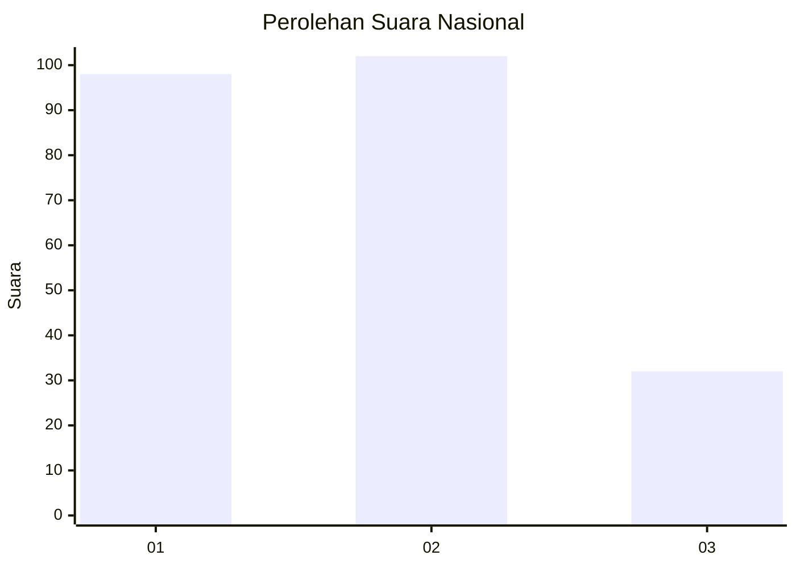
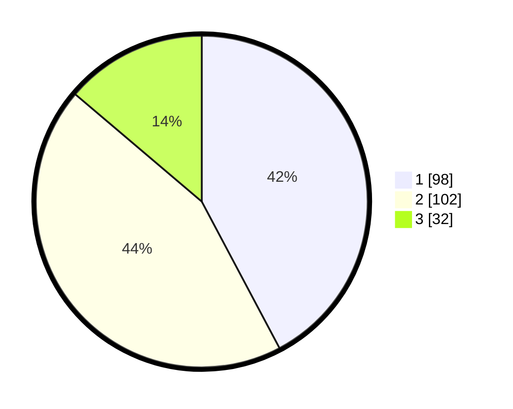

# Hasil

## Grafik

## Tabel

| No. | Nama Paslon    | Suara | Suara (raw) | Persentase |
|:--- |:-------------- | -----:| -----------:| ----------:|
| 1   | ANIES MUHAIMIN | 98    | [98][p-1]   | 42,24      |
| 2   | PRABOWO GIBRAN | 102   | [102][p-2]  | 43,97      |
| 3   | GANJAR MAHFUD  | 32    | [32][p-3]   | 13,79      |

[p-1]: https://github.com/gigit-pemilu/pemilu-2024/blob/main/pilpres/hitung-suara/sub/31-dki-jakarta/sub/75-jakarta-timur/sub/09-ciracas/sub/1001-ciracas/sub/073-tps/sub/paslon-1.txt
[p-2]: https://github.com/gigit-pemilu/pemilu-2024/blob/main/pilpres/hitung-suara/sub/31-dki-jakarta/sub/75-jakarta-timur/sub/09-ciracas/sub/1001-ciracas/sub/073-tps/sub/paslon-2.txt
[p-3]: https://github.com/gigit-pemilu/pemilu-2024/blob/main/pilpres/hitung-suara/sub/31-dki-jakarta/sub/75-jakarta-timur/sub/09-ciracas/sub/1001-ciracas/sub/073-tps/sub/paslon-3.txt

## Foto C Plano

https://sirekap-obj-formc.kpu.go.id/5a9c/pemilu/ppwp/31/75/09/10/01/3175091001073-20240214-190454--27c52362-2263-49be-ab2d-ebdd46ee3bd5.jpg

https://sirekap-obj-formc.kpu.go.id/5a9c/pemilu/ppwp/31/75/09/10/01/3175091001073-20240214-190507--799f7297-94aa-4bbd-863f-7b2245cb7719.jpg

https://sirekap-obj-formc.kpu.go.id/5a9c/pemilu/ppwp/31/75/09/10/01/3175091001073-20240214-190511--b8c3a8a1-d9fa-4372-8641-940bfa9d3efe.jpg

## Metadata

| Key        | Value               |
| ---------- | ------------------- |
| Time Stamp | 2024-02-15 09:00:24 |

## DATA PEMILIH TETAP

Jumlah pemilih dalam DPT: **276**.
 * L: **330**.
 * P: **546**.

## DATA PENGGUNA HAK PILIH

Jumlah pengguna hak pilih dalam DPT: **235**.
 * L: **620**.
 * P: **626**.

Jumlah pengguna hak pilih dalam DPTb: **805**.
 * L: **808**.
 * P: **88**.

Jumlah pengguna hak pilih dalam DPK: **808**.
 * L: **800**.
 * P: **88**.

Jumlah pengguna hak pilih: **236**.
 * L: **320**.
 * P: **335**.

## JUMLAH SUARA SAH DAN TIDAK SAH

JUMLAH SELURUH SUARA SAH: **232**.

JUMLAH SUARA TIDAK SAH: **4**.

JUMLAH SELURUH SUARA SAH DAN SUARA TIDAK SAH: **236**.

