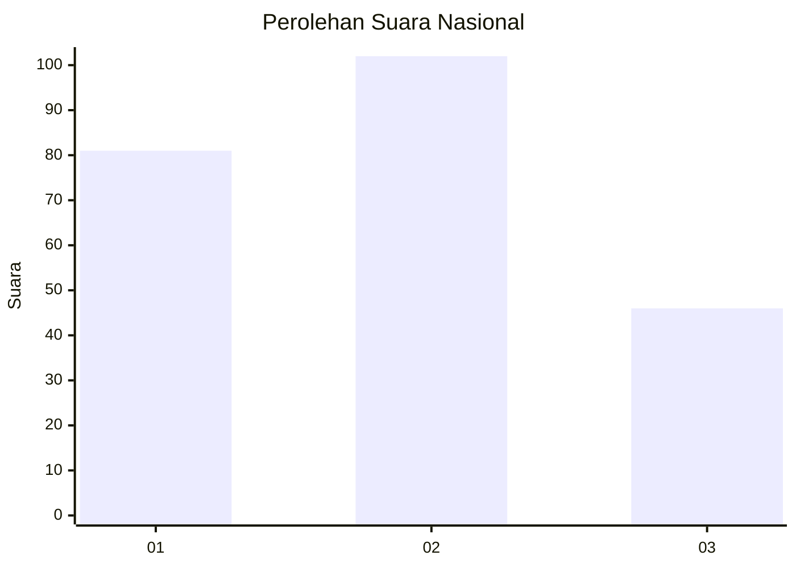
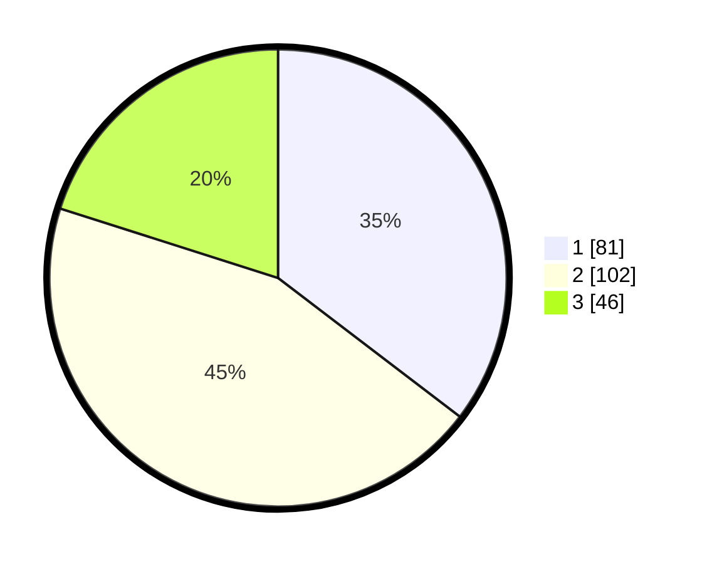

# Hasil

## Grafik

## Tabel

| No.    | Nama Paslon    | Suara | Suara (raw) | Persentase |
|:------ |:-------------- | -----:| -----------:| ----------:|
| 100025 | ANIES MUHAIMIN | 81    | [81][p-1]   | 35,37      |
| 100026 | PRABOWO GIBRAN | 102   | [102][p-2]  | 44,54      |
| 100027 | GANJAR MAHFUD  | 46    | [46][p-3]   | 20,09      |

[p-1]: https://github.com/gigit-pemilu/pemilu-2024/blob/main/pilpres/hitung-suara/sub/31-dki-jakarta/sub/75-jakarta-timur/sub/09-ciracas/sub/1001-ciracas/sub/104-tps/sub/paslon-1.txt
[p-2]: https://github.com/gigit-pemilu/pemilu-2024/blob/main/pilpres/hitung-suara/sub/31-dki-jakarta/sub/75-jakarta-timur/sub/09-ciracas/sub/1001-ciracas/sub/104-tps/sub/paslon-2.txt
[p-3]: https://github.com/gigit-pemilu/pemilu-2024/blob/main/pilpres/hitung-suara/sub/31-dki-jakarta/sub/75-jakarta-timur/sub/09-ciracas/sub/1001-ciracas/sub/104-tps/sub/paslon-3.txt

## Foto C Plano

https://sirekap-obj-formc.kpu.go.id/3985/pemilu/ppwp/31/75/09/10/01/3175091001104-20240216-154857--48a51633-56ef-4c92-af37-8997dec0f222.jpg

https://sirekap-obj-formc.kpu.go.id/3985/pemilu/ppwp/31/75/09/10/01/3175091001104-20240216-155148--a6293b2a-aa2e-4306-884f-5961b426ac51.jpg

https://sirekap-obj-formc.kpu.go.id/3985/pemilu/ppwp/31/75/09/10/01/3175091001104-20240216-155301--4a13374e-65ec-4e51-bf74-69edaaee6b49.jpg

## Metadata

| Key        | Value               |
| ---------- | ------------------- |
| Time Stamp | 2024-02-20 12:00:00 |

