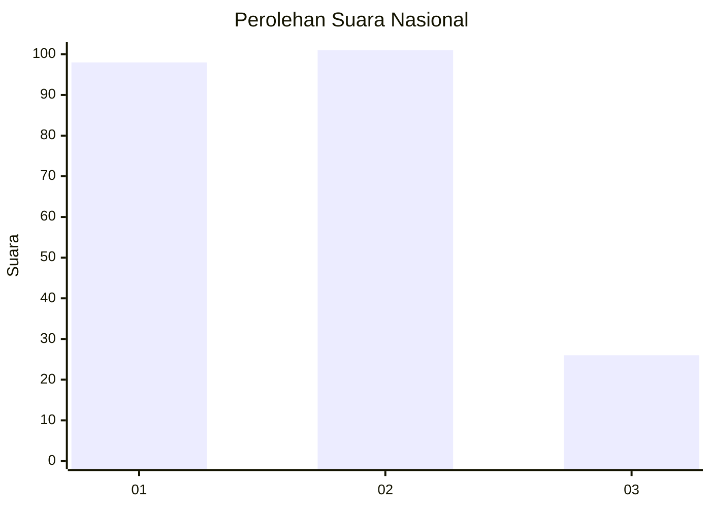
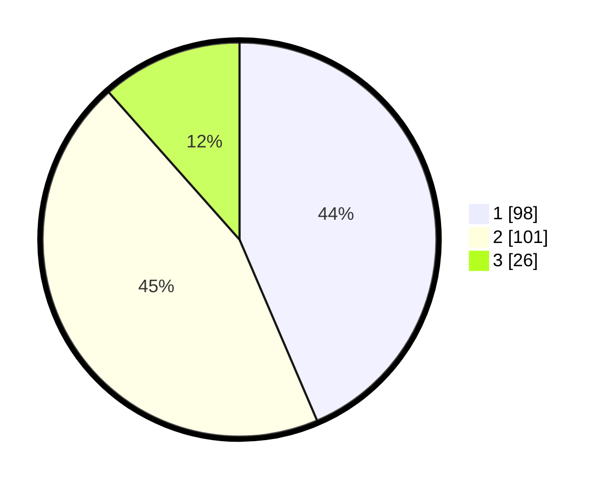

# Hasil

## Grafik

## Tabel

| No.    | Nama Paslon    | Suara | Suara (raw) | Persentase |
|:------ |:-------------- | -----:| -----------:| ----------:|
| 100025 | ANIES MUHAIMIN | 98    | [98][p-1]   | 43,56      |
| 100026 | PRABOWO GIBRAN | 101   | [101][p-2]  | 44,89      |
| 100027 | GANJAR MAHFUD  | 26    | [26][p-3]   | 11,56      |

[p-1]: https://github.com/gigit-pemilu/pemilu-2024/blob/main/pilpres/hitung-suara/sub/31-dki-jakarta/sub/75-jakarta-timur/sub/09-ciracas/sub/1001-ciracas/sub/112-tps/sub/paslon-1.txt
[p-2]: https://github.com/gigit-pemilu/pemilu-2024/blob/main/pilpres/hitung-suara/sub/31-dki-jakarta/sub/75-jakarta-timur/sub/09-ciracas/sub/1001-ciracas/sub/112-tps/sub/paslon-2.txt
[p-3]: https://github.com/gigit-pemilu/pemilu-2024/blob/main/pilpres/hitung-suara/sub/31-dki-jakarta/sub/75-jakarta-timur/sub/09-ciracas/sub/1001-ciracas/sub/112-tps/sub/paslon-3.txt

## Foto C Plano

https://sirekap-obj-formc.kpu.go.id/69be/pemilu/ppwp/31/75/09/10/01/3175091001112-20240214-230534--43e3236a-0fdb-4c08-943c-c7653f6d847f.jpg

https://sirekap-obj-formc.kpu.go.id/69be/pemilu/ppwp/31/75/09/10/01/3175091001112-20240214-230726--aa27de7a-6087-4355-b6ce-b28d1708bea6.jpg

https://sirekap-obj-formc.kpu.go.id/69be/pemilu/ppwp/31/75/09/10/01/3175091001112-20240214-230832--62ffb3b6-f533-409b-8bb1-745baf654c29.jpg

## Metadata

| Key        | Value               |
| ---------- | ------------------- |
| Time Stamp | 2024-02-15 12:00:28 |

