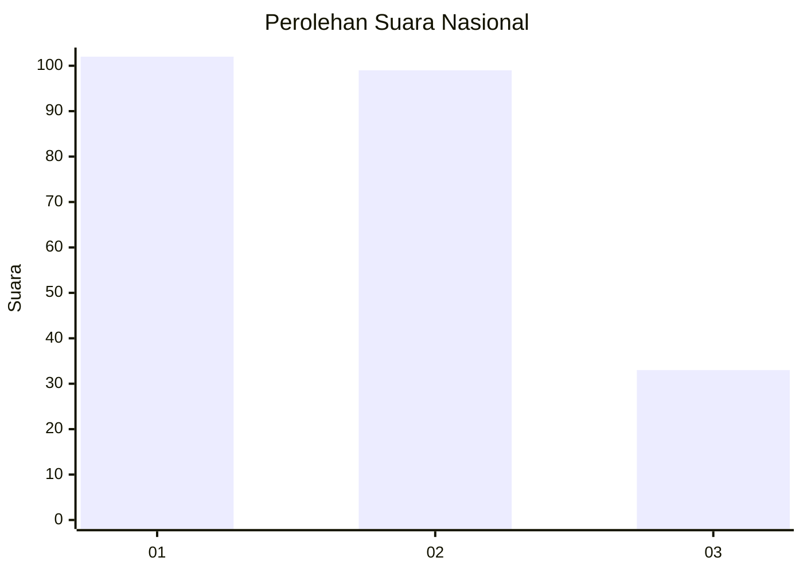
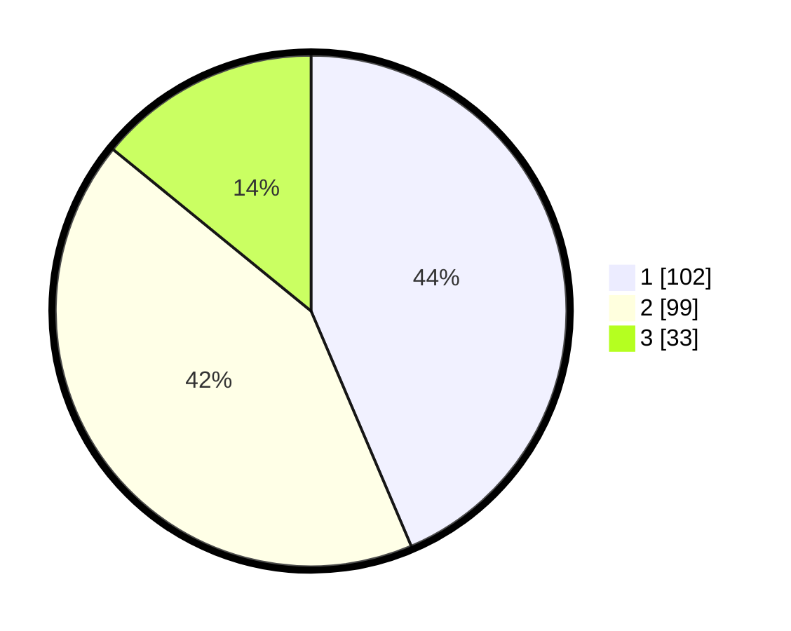

# Hasil

## Grafik

## Tabel

| No.    | Nama Paslon    | Suara | Suara (raw) | Persentase |
|:------ |:-------------- | -----:| -----------:| ----------:|
| 100025 | ANIES MUHAIMIN | 102   | [102][p-1]  | 43,59      |
| 100026 | PRABOWO GIBRAN | 99    | [99][p-2]   | 42,31      |
| 100027 | GANJAR MAHFUD  | 33    | [33][p-3]   | 14,10      |

[p-1]: https://github.com/gigit-pemilu/pemilu-2024/blob/main/pilpres/hitung-suara/sub/31-dki-jakarta/sub/75-jakarta-timur/sub/09-ciracas/sub/1001-ciracas/sub/117-tps/sub/paslon-1.txt
[p-2]: https://github.com/gigit-pemilu/pemilu-2024/blob/main/pilpres/hitung-suara/sub/31-dki-jakarta/sub/75-jakarta-timur/sub/09-ciracas/sub/1001-ciracas/sub/117-tps/sub/paslon-2.txt
[p-3]: https://github.com/gigit-pemilu/pemilu-2024/blob/main/pilpres/hitung-suara/sub/31-dki-jakarta/sub/75-jakarta-timur/sub/09-ciracas/sub/1001-ciracas/sub/117-tps/sub/paslon-3.txt

## Foto C Plano

https://sirekap-obj-formc.kpu.go.id/4c9a/pemilu/ppwp/31/75/09/10/01/3175091001117-20240215-000557--8081dd68-58cf-4275-9d14-5336ffeab228.jpg

https://sirekap-obj-formc.kpu.go.id/4c9a/pemilu/ppwp/31/75/09/10/01/3175091001117-20240215-000648--c9ccaab1-417c-4eef-86c0-4e502b9145ed.jpg

https://sirekap-obj-formc.kpu.go.id/4c9a/pemilu/ppwp/31/75/09/10/01/3175091001117-20240215-000751--c4b05a2f-6ba3-45b5-9fa5-508bab542736.jpg

## Metadata

| Key        | Value               |
| ---------- | ------------------- |
| Time Stamp | 2024-02-24 22:31:28 |

